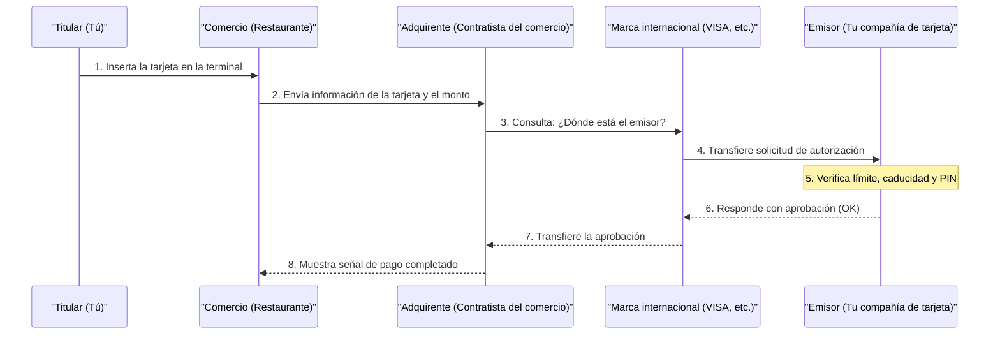

## 1. ¿Qué sucede en esos pocos segundos de "bip"?

Después de cenar en un restaurante, cuando insertas tu tarjeta de crédito en la terminal e ingresas tu PIN, la señal de "aprobado (pago completado)" aparece en unos segundos.
Para nosotros, esta es una escena cotidiana y común, pero en estos breves segundos, se lleva a cabo una comunicación de datos compleja a nivel mundial, desde la terminal de la tienda hasta la empresa emisora de la tarjeta (que podría estar al otro lado del mundo).

Si esta red se detuviera incluso por una hora, la actividad económica mundial caería en un gran caos. Echemos un vistazo detrás de escena de la "red de pagos con tarjeta de crédito", que requiere la infraestructura más robusta del mundo y la respuesta más rápida.

## 2. Los Personajes (Modelo de 4 Partes)

Para comprender el mecanismo de los pagos con tarjeta de crédito, es necesario conocer a los "**4 personajes básicos (4 partes)**".

1. **Tarjetahabiente (Cardholder)**: Eres tú. La persona que usa la tarjeta para hacer compras.
2. **Comercio (Merchant)**: Tiendas que aceptan pagos con tarjeta, como un restaurante o Amazon.
3. **Adquirente (Acquirer)**: La empresa que afilia comercios y les proporciona terminales de pago (empresa contratista de comercios). Paga por adelantado las ventas de la tienda.
4. **Emisor (Issuer)**: La empresa que te emite la tarjeta de crédito y establece tu límite de crédito (compañía emisora de la tarjeta).

Y actuando como un "puente gigante" que conecta al adquirente y al emisor, se encuentran las **marcas internacionales (redes de pago)** como VISA y Mastercard.

## 3. El Proceso de Autorización

En el instante en que insertas tu tarjeta en la tienda, se ejecuta el proceso de "**Autorización (Authorization: aprobación de crédito)**". Este es el proceso de verificar en tiempo real si "esta tarjeta no es falsificada y tiene suficiente límite de crédito".

1. **Lectura de la tarjeta**: La terminal de la tienda (terminal CAT/CCT) lee los datos cifrados del chip IC de la tarjeta.
2. **Redes como CAFIS**: En el caso de Japón, los datos de la tienda llegan al adquirente a través de redes de retransmisión nacionales como "CAFIS" o "CARDNET".
3. **Recorriendo la red de la marca**: El adquirente mira los primeros dígitos del número de tarjeta (código BIN) para determinar que "esta es una tarjeta VISA", y envía los datos a la red internacional de VISA (como VisaNet).
4. **Decisión del emisor**: Los datos llegan a la computadora central de la empresa que emitió tu tarjeta (el emisor). Aquí, calcula instantáneamente cosas como "¿Se ha excedido el límite de crédito?", "¿Ha sido reportada como robada?" y "¿Activa el sistema de detección de fraudes (IA)?", y devuelve un código de aprobación.
5. **Respuesta a la tienda**: El código de aprobación regresa a gran velocidad por el mismo camino, y "Aprobado (OK)" aparece en la terminal de la tienda.

Este complejo relevo se lleva a cabo en solo unos pocos segundos.

## 4. Compensación (Clearing) y Liquidación (Settlement)

En el momento en que se completa la autorización, **en realidad todavía no se ha movido ni un solo centavo.** Solo se ha hecho una "promesa de pago posterior (reserva de límite)".
El trabajo de mover el dinero real se realiza de forma masiva en "procesamiento por lotes (batch)", generalmente a altas horas de la noche, después de que la tienda ha cerrado. A esto se le llama **compensación (clearing)** y **liquidación (settlement)**.

1. **Envío de datos de ventas**: La tienda envía los datos de ventas de ese día (datos ya autorizados) de forma colectiva al adquirente.
2. **Compensación (Clearing)**: El adquirente envía datos de liquidación (datos de compensación) a cada emisor a través de la red de la marca internacional, diciendo: "Estas son las ventas de hoy, así que facturaremos el dinero".
3. **Liquidación (Settlement)**: A partir del día siguiente, la red interbancaria opera a través de las marcas internacionales, y fondos en unidades de cientos de millones se mueven de forma masiva desde las cuentas bancarias de los emisores a las cuentas bancarias de los adquirentes (se deducen las tarifas aplicables).
4. **Depósito a la tienda y facturación a ti**: Posteriormente, los ingresos de las ventas se transfieren del adquirente a la tienda y, al mes siguiente, el emisor debita el monto de uso de tu cuenta bancaria.

## 5. Seguridad y Sistemas de Detección de Fraude

En el mundo de las tarjetas de crédito, hay una batalla constante contra el uso fraudulento (como el robo de números por parte de piratas informáticos).

Las antiguas tarjetas de banda magnética eran fáciles de "clonar (skimming)", pero las tarjetas actuales con "**chip IC (especificación EMV)**" contienen una computadora diminuta en el interior del chip. Debido a que genera una "contraseña de un solo uso (criptograma)" para cada pago, la falsificación es prácticamente imposible.

Además, una potente **IA (sistema de detección de fraude)** opera en el lado del emisor.
Detecta instantáneamente comportamientos anormales que se desvían de los patrones de compra anteriores, como "Alguien que generalmente solo usa la tarjeta para comprar en el supermercado en Tokio, de repente intenta comprar tres computadoras caras de forma consecutiva en un sitio extranjero a altas horas de la noche". Esto bloquea automáticamente la autorización y previene el daño.

## 6. Resumen

La red de pago con tarjeta de crédito es una infraestructura de "crédito" donde innumerables empresas, incluyendo instituciones financieras, redes de retransmisión y marcas internacionales, colaboran bajo reglas sólidas.

Detrás de nuestra acción casual de pasar o insertar la tarjeta, se esconde la tecnología de comunicación que logra un tiempo de respuesta de 0.1 segundos, el complejo procesamiento por lotes para la compensación de fondos, y la mirada vigilante de la IA que continúa luchando contra criminales invisibles.
