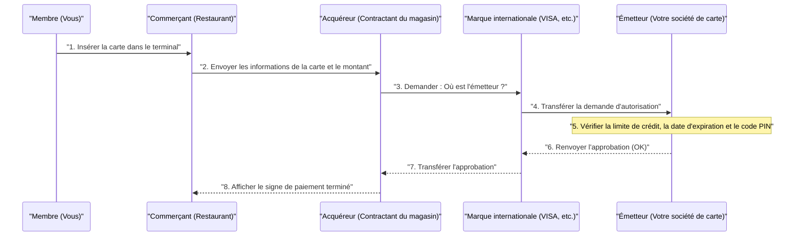

## 1. Que se passe-t-il pendant les quelques secondes du « bip » ?

Après un repas au restaurant, lorsque vous insérez votre carte de crédit dans le terminal et entrez votre code PIN, le signe « Approuvé (Paiement terminé) » apparaît en quelques secondes.
C'est une scène quotidienne tout à fait banale pour nous, mais pendant ces quelques secondes, une communication de données complexe a lieu à l'échelle mondiale, depuis le terminal du magasin jusqu'à la société émettrice de la carte (qui se trouve peut-être de l'autre côté du globe).

Si ce réseau s'arrêtait ne serait-ce qu'une heure, l'activité économique mondiale plongerait dans le chaos. Jetons un coup d'œil dans les coulisses du « réseau de paiement par carte de crédit », qui exige la robustesse la plus élevée au monde et la réponse la plus rapide.

## 2. Les acteurs (Modèle à 4 parties)

Pour comprendre le fonctionnement des paiements par carte de crédit, vous devez connaître les « **4 acteurs (4 parties)** » fondamentaux.

1. **Titulaire de la carte (Cardholder)** : C'est vous. La personne qui fait des achats avec la carte.
2. **Commerçant (Merchant)** : Le magasin, comme un restaurant ou Amazon, qui accepte les paiements par carte.
3. **Acquéreur (Acquirer)** : L'entreprise qui recrute les commerçants et leur fournit les terminaux de paiement (société contractante des commerçants). Elle avance le paiement des ventes du magasin.
4. **Émetteur (Issuer)** : L'entreprise qui vous a délivré la carte de crédit et défini votre limite de crédit (société émettrice de la carte).

Et c'est la **marque internationale (réseau de paiement)**, comme VISA ou Mastercard, qui joue le rôle de « pont géant » reliant l'acquéreur et l'émetteur.

## 3. Le processus d'autorisation (Approbation de crédit)

Au moment où vous insérez votre carte dans le magasin, le processus d'« **autorisation (Authorization : approbation de crédit)** » s'enclenche. Il s'agit de l'opération qui vérifie en temps réel « si cette carte n'est pas contrefaite et dispose d'une limite de crédit suffisante ».

1. **Lecture de la carte** : Le terminal du magasin (terminal CAT/CCT) lit les données cryptées depuis la puce IC de la carte.
2. **Réseaux comme CAFIS** : Dans le cas du Japon, les données du magasin parviennent à l'acquéreur via des réseaux de relais nationaux tels que « CAFIS » ou « CARDNET ».
3. **Parcours du réseau de la marque** : L'acquéreur examine les premiers chiffres du numéro de carte (code BIN), détermine que « c'est une carte VISA », et envoie les données au réseau international de VISA (VisaNet, etc.).
4. **Décision par l'émetteur** : Les données atteignent l'ordinateur central de la société qui a émis votre carte (l'émetteur). Ici, il calcule instantanément « si la limite de crédit est dépassée », « s'il y a une déclaration de vol », et « s'il ne déclenche pas le système de détection des fraudes (IA) », puis renvoie un code d'approbation.
5. **Réponse au magasin** : Le code d'approbation rebrousse chemin à toute vitesse et « Approuvé (OK) » s'affiche sur le terminal du magasin.

Ce relais complexe s'effectue en quelques secondes seulement.

## 4. Compensation (Clearing) et Règlement (Settlement)

Au moment où l'autorisation est terminée, **en réalité, pas un seul centime n'a encore bougé.** Seule « la promesse de payer plus tard (réservation de la limite) » a été faite.
L'opération de transfert effectif de l'argent est effectuée par lots, tard dans la nuit après la fermeture des magasins, sous forme de « traitement par lots ». Cela s'appelle la **compensation (Clearing)** et le **règlement (Settlement)**.

1. **Envoi des données de vente** : Le magasin regroupe les données de vente de la journée (données autorisées) et les envoie à l'acquéreur.
2. **Compensation (Clearing)** : Via le réseau de la marque internationale, l'acquéreur envoie à chaque émetteur des données de règlement (données de compensation) indiquant : « Les ventes d'aujourd'hui s'élèvent à tant, je vous réclame donc l'argent ».
3. **Règlement (Settlement)** : À partir du lendemain, le réseau interbancaire se met en marche via la marque internationale, et des fonds s'élevant à plusieurs centaines de millions sont transférés en une seule fois du compte bancaire de l'émetteur vers celui de l'acquéreur (après déduction des frais).
4. **Paiement au magasin et facturation pour vous** : Ensuite, l'acquéreur transfère l'argent des ventes au magasin, et le mois suivant, l'émetteur prélève le montant de l'achat sur votre compte bancaire.

## 5. Sécurité et système de détection des fraudes

Dans le monde des cartes de crédit, la lutte contre l'utilisation frauduleuse (comme le vol de numéros par des pirates) est constante.

Les anciennes cartes à bande magnétique étaient faciles à « écumer » (copier les informations), mais les actuelles cartes à « **puce IC (norme EMV)** » intègrent un ordinateur minuscule. Étant donné qu'il génère un « cryptogramme unique » à chaque paiement, la contrefaçon est virtuellement impossible.

De plus, une **IA (système de détection des fraudes)** puissante fonctionne en coulisses chez l'émetteur.
Elle détecte instantanément les comportements anormaux qui s'écartent des habitudes d'achat passées, comme « une personne qui n'utilise normalement sa carte que pour faire des courses au supermarché à Tokyo et qui tente soudainement d'acheter 3 ordinateurs portables coûteux d'affilée sur un site étranger au milieu de la nuit », bloquant automatiquement l'autorisation pour prévenir les dommages.

## 6. Résumé

Le réseau de paiement par carte de crédit est une infrastructure de « crédit » où d'innombrables entreprises, telles que les institutions financières, les réseaux de relais et les marques internationales, coopèrent selon des règles strictes.

Derrière notre geste banal de passer une carte, se cachent des technologies de communication conçues pour gagner une réponse de 0,1 seconde, un traitement par lots complexe pour la compensation des fonds, et le regard vigilant d'une IA luttant en permanence contre des criminels invisibles.
