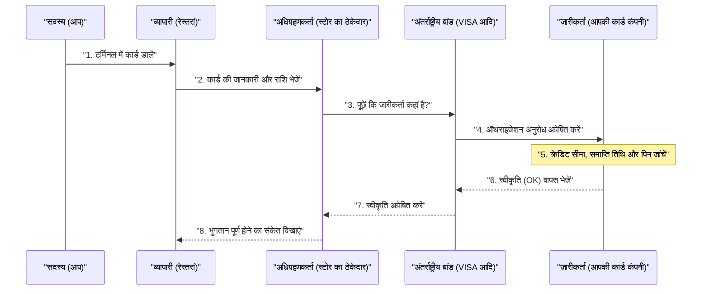

## 1. "बीप" की उन कुछ सेकंडों में क्या होता है

रेस्तरां में खाने के बाद, जब आप टर्मिनल में अपना क्रेडिट कार्ड डालते हैं और अपना पिन दर्ज करते हैं, तो कुछ ही सेकंड में "स्वीकृत (भुगतान पूर्ण)" का संकेत दिखाई देता है।
हमारे लिए यह रोज़मर्रा का एक सामान्य दृश्य है, लेकिन इन कुछ ही सेकंडों में, स्टोर के टर्मिनल से लेकर कार्ड जारी करने वाली कंपनी (जो शायद दुनिया के दूसरे छोर पर हो) तक, दुनिया भर में जटिल डेटा संचार होता है।

यदि यह नेटवर्क एक घंटे के लिए भी बंद हो जाए, तो दुनिया भर की आर्थिक गतिविधियां अस्त-व्यस्त हो जाएंगी। आइए "क्रेडिट कार्ड भुगतान नेटवर्क" के पीछे के दृश्यों पर एक नज़र डालें, जिसे दुनिया में सबसे मजबूत और सबसे तेज़ प्रतिक्रिया की आवश्यकता होती है।

## 2. पात्र (4-पार्टी मॉडल)

क्रेडिट कार्ड भुगतान कैसे काम करता है, यह समझने के लिए आपको बुनियादी **4 पात्रों (4-पार्टी)** को जानना होगा।

1. **कार्डधारक (Cardholder)**: आप। वह व्यक्ति जो खरीदारी करने के लिए कार्ड का उपयोग करता है।
2. **व्यापारी (Merchant)**: रेस्तरां या Amazon जैसे स्टोर जो कार्ड से भुगतान स्वीकार करते हैं।
3. **अधिग्रहणकर्ता (Acquirer)**: वह कंपनी जो व्यापारियों को जोड़ती है और उन्हें भुगतान टर्मिनल प्रदान करती है (व्यापारी अनुबंध कंपनी)। वे स्टोर की बिक्री का अग्रिम भुगतान करते हैं।
4. **जारीकर्ता (Issuer)**: वह कंपनी जो आपको क्रेडिट कार्ड जारी करती है और आपकी क्रेडिट सीमा निर्धारित करती है (कार्ड जारी करने वाली कंपनी)।

और, अधिग्रहणकर्ता और जारीकर्ता को जोड़ने वाले "विशाल पुल" की भूमिका VISA या Mastercard जैसे **अंतर्राष्ट्रीय ब्रांड (भुगतान नेटवर्क)** निभाते हैं।

## 3. ऑथराइजेशन (क्रेडिट स्वीकृति) की प्रक्रिया

जिस क्षण आप स्टोर में अपना कार्ड डालते हैं, **ऑथराइजेशन (Authorization: क्रेडिट स्वीकृति)** नामक प्रक्रिया शुरू हो जाती है। यह वास्तविक समय में जांच करने की प्रक्रिया है कि "क्या यह कार्ड नकली तो नहीं है और क्या इसमें पर्याप्त क्रेडिट सीमा उपलब्ध है?"।

1. **कार्ड पढ़ना**: स्टोर का टर्मिनल (CAT/CCT टर्मिनल) कार्ड की IC चिप से एन्क्रिप्टेड डेटा पढ़ता है।
2. **CAFIS जैसे नेटवर्क**: जापान के मामले में, स्टोर से डेटा "CAFIS" और "CARDNET" जैसे घरेलू रिले नेटवर्क के माध्यम से अधिग्रहणकर्ता तक पहुंचता है।
3. **ब्रांड नेटवर्क के माध्यम से दौड़ना**: अधिग्रहणकर्ता कार्ड नंबर (BIN कोड) के पहले अंक को देखता है, यह निर्धारित करता है कि "यह VISA कार्ड है", और डेटा को VISA के अंतर्राष्ट्रीय नेटवर्क (VisaNet आदि) पर भेजता है।
4. **जारीकर्ता पर निर्णय**: डेटा उस कंपनी (जारीकर्ता) के होस्ट कंप्यूटर तक पहुंचता है जिसने आपका कार्ड जारी किया है। यहां, यह तुरंत गणना करता है कि "क्या क्रेडिट सीमा पार हो गई है?", "क्या कार्ड चोरी होने की सूचना दी गई है?", और "क्या यह धोखाधड़ी का पता लगाने वाले सिस्टम (AI) द्वारा पकड़ा गया है?", और फिर एक स्वीकृति कोड लौटाता है।
5. **स्टोर को प्रतिक्रिया**: स्वीकृति कोड वापस उसी रास्ते से बहुत तेज़ गति से लौटता है और स्टोर के टर्मिनल पर "स्वीकृत (OK)" प्रदर्शित होता है।

यह इतना जटिल रिले केवल कुछ ही सेकंड में होता है।

## 4. क्लियरिंग (समाशोधन) और सेटलमेंट (निपटान)

जिस समय ऑथराइजेशन पूरा होता है, **वास्तव में एक भी पैसा नहीं गया होता है।** केवल "बाद में भुगतान करने का वादा (फंड सुरक्षित करना)" किया गया है।
पैसे ट्रांसफर करने का वास्तविक काम स्टोर बंद होने के बाद देर रात "बैच प्रोसेसिंग" के रूप में एक साथ किया जाता है। इसे **क्लियरिंग (समाशोधन)** और **सेटलमेंट (निपटान)** कहा जाता है।

1. **बिक्री डेटा भेजना**: स्टोर उस दिन के सभी बिक्री डेटा (ऑथराइज्ड डेटा) को एक साथ अधिग्रहणकर्ता को भेजता है।
2. **क्लियरिंग (समाशोधन)**: अंतर्राष्ट्रीय ब्रांड के नेटवर्क के माध्यम से, अधिग्रहणकर्ता प्रत्येक जारीकर्ता को सेटलमेंट डेटा (क्लियरिंग डेटा) भेजता है जिसमें कहा जाता है, "आज की बिक्री इतनी है, इसलिए मैं आपको बिल भेज रहा हूं।"
3. **सेटलमेंट (निपटान)**: अगले दिन से, अंतर्राष्ट्रीय ब्रांडों के माध्यम से इंटरबैंक नेटवर्क काम करता है, और जारीकर्ता के बैंक खाते से अधिग्रहणकर्ता के बैंक खाते में करोड़ों की धनराशि एक साथ स्थानांतरित की जाती है (और शुल्क काट लिया जाता है)।
4. **स्टोर में जमा करना और आपको बिल भेजना**: उसके बाद, बिक्री की आय अधिग्रहणकर्ता से स्टोर में स्थानांतरित कर दी जाती है, और अगले महीने, उपयोग शुल्क जारीकर्ता द्वारा आपके बैंक खाते से काट लिया जाता है।

## 5. सुरक्षा और धोखाधड़ी का पता लगाने वाली प्रणाली

क्रेडिट कार्ड की दुनिया में, हमेशा अनधिकृत उपयोग (जैसे हैकर्स द्वारा नंबर चुराना) के खिलाफ लड़ाई चलती रहती है।

अतीत में मैग्नेटिक स्ट्राइप कार्ड को "स्किम" (डेटा कॉपी करना) करना आसान था, लेकिन वर्तमान **IC चिप (EMV विनिर्देश)** कार्ड के चिप में एक छोटा कंप्यूटर होता है। यह प्रत्येक भुगतान के लिए एक "वन-टाइम पासवर्ड (क्रिप्टोग्राम)" बनाता है, जिससे जालसाजी लगभग असंभव हो जाती है।

साथ ही, जारीकर्ता के बैकएंड में एक शक्तिशाली **AI (धोखाधड़ी पहचान प्रणाली)** काम कर रहा है।
यह तुरंत उन असामान्य व्यवहारों का पता लगाता है जो पिछले खरीदारी पैटर्न से अलग होते हैं, जैसे "कोई व्यक्ति जो आमतौर पर केवल टोक्यो में सुपरमार्केट की खरीदारी के लिए कार्ड का उपयोग करता है, अचानक देर रात किसी विदेशी साइट पर लगातार 3 महंगे कंप्यूटर खरीदने की कोशिश कर रहा है।" यह नुकसान को रोकने के लिए ऑथराइजेशन को स्वचालित रूप से ब्लॉक कर देता है।

## 6. निष्कर्ष

क्रेडिट कार्ड भुगतान का नेटवर्क एक "क्रेडिट" इंफ्रास्ट्रक्चर है जहां वित्तीय संस्थान, रिले नेटवर्क और अंतर्राष्ट्रीय ब्रांड जैसी अनगिनत कंपनियां सख्त नियमों के तहत एक साथ काम करती हैं।

जब हम लापरवाही से अपना कार्ड स्वाइप करते हैं, तो उसके पीछे 0.1 सेकंड का रिस्पांस टाइम हासिल करने वाली संचार तकनीक, जटिल फंड क्लियरिंग के लिए बैच प्रोसेसिंग, और अदृश्य अपराधियों से लगातार लड़ने वाले AI की निगरानी काम कर रही होती है।
