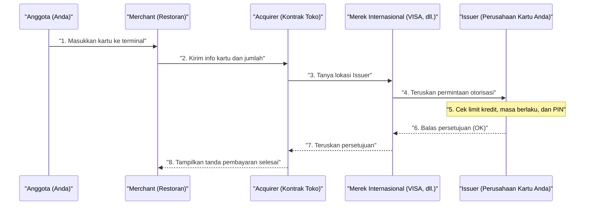

## 1. Apa yang Terjadi dalam Beberapa Detik Saat Bunyi "Bip"

Setelah makan di restoran, saat Anda memasukkan kartu kredit ke terminal dan memasukkan PIN, tanda "disetujui (pembayaran selesai)" akan muncul dalam beberapa detik.
Bagi kita, ini adalah pemandangan sehari-hari yang biasa, namun dalam beberapa detik yang singkat ini, dari terminal toko hingga penerbit kartu (yang mungkin berada di sisi lain bumi), terjadi komunikasi data kompleks yang melintasi dunia.

Jika jaringan ini berhenti selama satu jam saja, aktivitas ekonomi di seluruh dunia akan jatuh ke dalam kekacauan besar. Mari kita intip di balik layar "jaringan pembayaran kartu kredit" yang paling tangguh di dunia, yang menuntut respons paling cepat.

## 2. Para Pelaku (Model 4 Pihak)

Untuk memahami cara kerja pembayaran kartu kredit, Anda perlu mengetahui dasar dari "**4 pelaku (4 Pihak)**".

1. **Pemegang Kartu (Cardholder)**: Anda. Orang yang berbelanja menggunakan kartu.
2. **Merchant (Toko/Mitra)**: Restoran, Amazon, dan toko lain yang menerima pembayaran dengan kartu.
3. **Acquirer (Pemeroleh)**: Perusahaan yang mencari merchant dan menyediakan terminal pembayaran ke toko (perusahaan kontrak merchant). Mereka menalangi pembayaran penjualan toko.
4. **Issuer (Penerbit)**: Perusahaan yang menerbitkan kartu kredit untuk Anda dan menetapkan batas penggunaan kredit (perusahaan penerbit kartu).

Dan yang berperan sebagai "jembatan raksasa" yang menghubungkan acquirer dan issuer adalah **merek internasional (jaringan pembayaran)** seperti VISA dan Mastercard.

## 3. Proses Otorisasi (Persetujuan Kredit)

Proses yang berjalan pada saat kartu dimasukkan di toko disebut "**Otorisasi (Authorization: Persetujuan Kredit)**". Ini adalah proses untuk memeriksa secara real-time "apakah kartu ini tidak palsu dan memiliki limit kredit yang cukup".

1. **Pembacaan kartu**: Terminal toko (terminal CAT/CCT) membaca data terenkripsi dari chip IC kartu.
2. **Jaringan seperti CAFIS**: Di Jepang, data dari toko diteruskan ke acquirer melalui jaringan perantara domestik seperti "CAFIS" atau "CARDNET".
3. **Menjelajahi jaringan merek**: Acquirer melihat digit pertama nomor kartu (kode BIN) untuk menentukan "Ini adalah kartu VISA", lalu mengirimkan data ke jaringan internasional VISA (seperti VisaNet).
4. **Penilaian oleh Issuer**: Data mencapai komputer host perusahaan yang menerbitkan kartu Anda (issuer). Di sini, komputer secara instan menghitung "apakah melebihi limit kredit", "apakah ada laporan pencurian", dan "apakah tertangkap oleh sistem deteksi penipuan (AI)", kemudian mengembalikan kode persetujuan.
5. **Jawaban ke toko**: Kode persetujuan kembali dengan kecepatan tinggi melalui jalur asal, dan tanda "disetujui (OK)" ditampilkan di terminal toko.

Estafet kompleks ini terjadi hanya dalam beberapa detik.

## 4. Kliring (Penyelesaian) dan Setelmen (Pemindahan Dana)

Pada saat otorisasi selesai, **sebenarnya belum ada 1 Yen pun yang berpindah.** Hanya "janji untuk membayar nanti (pengamanan limit)" yang telah dibuat.
Pekerjaan pemindahan uang yang sebenarnya dilakukan secara bersama-sama sebagai "pemrosesan batch", biasanya pada tengah malam setelah toko tutup. Ini disebut **Kliring (Penyelesaian)** dan **Setelmen (Pemindahan Dana)**.

1. **Pengiriman data penjualan**: Toko mengirimkan data penjualan hari itu (data yang telah diotorisasi) secara sekaligus ke acquirer.
2. **Kliring (Penyelesaian)**: Melalui jaringan merek internasional, acquirer saling mengirim data penyelesaian (data kliring) ke setiap issuer yang menyatakan "Ini adalah penjualan hari ini, jadi saya menagih uangnya".
3. **Setelmen (Pemindahan Dana)**: Mulai hari berikutnya, jaringan antar bank bergerak melalui merek internasional, memindahkan dana (dikurangi biaya) secara sekaligus dalam jumlah hingga ratusan juta Yen dari rekening bank issuer ke rekening bank acquirer.
4. **Penyetoran ke toko dan tagihan ke Anda**: Setelah itu, uang hasil penjualan ditransfer dari acquirer ke toko, dan pada bulan berikutnya, issuer akan memotong jumlah tagihan dari rekening bank Anda.

## 5. Keamanan dan Sistem Deteksi Penipuan

Di dunia kartu kredit, pertempuran melawan penggunaan curang (seperti pencurian nomor oleh peretas) terus berlanjut.

Kartu strip magnetik di masa lalu sangat mudah mengalami "skimming (penyalinan informasi)", tetapi kartu "**Chip IC (Spesifikasi EMV)**" saat ini memiliki komputer mikro di dalam chip. Komputer ini menghasilkan "kode sandi sekali pakai (kriptogram)" untuk setiap pembayaran, sehingga pemalsuan pada dasarnya tidak mungkin terjadi.

Selain itu, di balik layar issuer, **AI (sistem deteksi penipuan)** yang kuat sedang beroperasi.
Sistem ini secara instan mendeteksi perilaku tidak normal yang menyimpang dari pola pembelian di masa lalu—seperti "seseorang yang biasanya hanya menggunakan kartunya untuk berbelanja di supermarket di Tokyo, tiba-tiba mencoba membeli 3 buah komputer mahal secara berturut-turut di situs luar negeri pada tengah malam"—lalu secara otomatis memblokir otorisasi untuk mencegah kerugian.

## 6. Kesimpulan

Jaringan pembayaran kartu kredit adalah infrastruktur "kredit (kepercayaan)" di mana banyak perusahaan bekerja sama di bawah aturan yang sangat ketat, seperti lembaga keuangan, jaringan perantara, dan merek internasional.

Di balik aksi kita yang dengan santai menempelkan kartu, terdapat teknologi komunikasi yang mengukir waktu respons 0,1 detik, pemrosesan batch penyelesaian dana yang rumit, dan mata pengawasan AI yang terus bertarung melawan penjahat yang tak terlihat.
