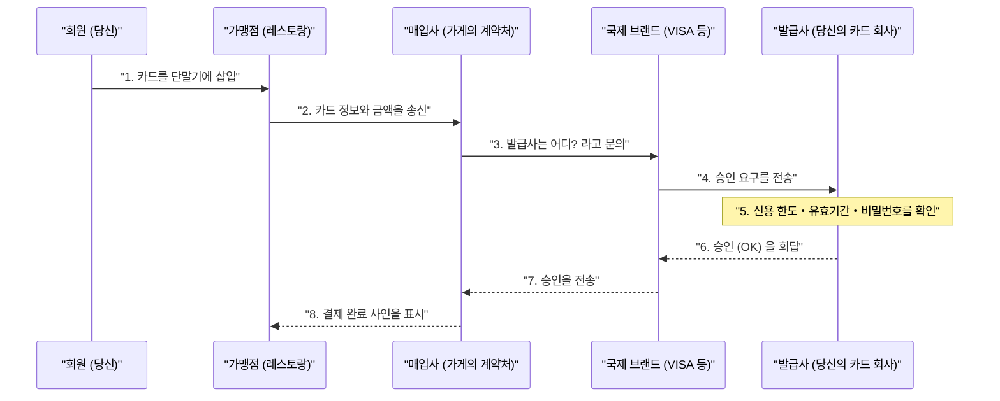

## 1. '삑' 하는 몇 초 동안 무슨 일이 일어나는가

레스토랑에서 식사 후, 신용카드를 단말기에 꽂고 비밀번호를 입력하면, 몇 초 안에 '승인(결제 완료)' 사인이 나옵니다.
우리에게는 일상적이고 흔한 광경이지만, 이 불과 몇 초 사이에 매장의 단말기부터 카드 발급사(지구 반대편에 있을지도 모릅니다)까지, 세계를 넘나드는 복잡한 데이터 통신이 이루어지고 있습니다.

만약 이 네트워크가 1시간이라도 정지된다면, 전 세계의 경제 활동은 대혼란에 빠질 것입니다. 세계에서 가장 견고하고, 가장 빠른 응답을 요구하는 '신용카드 결제 네트워크'의 이면을 들여다봅시다.

## 2. 등장인물(4파티 모델)

신용카드 결제의 원리를 이해하려면, 기본이 되는 「 **4가지 등장인물(4파티)** 」를 알 필요가 있습니다.

1. **카드 회원 (Cardholder)** : 당신입니다. 카드를 사용하여 물건을 사는 사람.
2. **가맹점 (Merchant)** : 레스토랑이나 Amazon 등, 카드 결제를 받는 가게.
3. **매입사 (Acquirer)** : 가맹점을 개척하고, 가게에 결제 단말기를 제공하는 회사(가맹점 계약 회사). 가게의 매출을 대신 지급해 줍니다.
4. **발급사 (Issuer)** : 당신에게 신용카드를 발급하고, 이용 한도액을 설정하고 있는 회사(카드 발급사).

그리고 매입사와 발급사를 연결하는 '거대한 다리' 역할을 하는 것이, VISA나 Mastercard 등의  **국제 브랜드(결제 네트워크)** 입니다.

## 3. 오소리제이션(신용 승인) 프로세스

가게에서 카드를 꽂는 순간 실행되는 것이 「 **오소리제이션 (Authorization: 신용 승인)** 」이라는 프로세스입니다. 이것은 '이 카드는 위조되지 않았으며, 충분한 이용 한도가 있는가'를 실시간으로 확인하는 작업입니다.

1. **카드 판독**: 가게의 단말기(CAT/CCT 단말기)가 카드의 IC 칩에서 암호화된 데이터를 읽어 들입니다.
2. **CAFIS 등의 네트워크**: 일본의 경우, 가게에서 보낸 데이터는 'CAFIS'나 'CARDNET'과 같은 국내 중계 네트워크를 통해 매입사에 도착합니다.
3. **브랜드 네트워크를 누빈다**: 매입사는 카드 번호의 첫 자리(BIN 코드)를 보고 '이것은 VISA 카드다'라고 판단하여, VISA의 국제 네트워크(VisaNet 등)에 데이터를 전송합니다.
4. **발급사에서의 판정**: 데이터는 당신의 카드를 발급한 회사(발급사)의 호스트 컴퓨터에 도달합니다. 여기서 '이용 한도액을 초과하지 않았는가', '도난 신고가 접수되지 않았는가', '부정 탐지 시스템(AI)에 걸리지 않는가'를 순식간에 계산하여, 승인 코드를 반환합니다.
5. **가게로의 회답**: 승인 코드가 원래 왔던 길을 맹렬한 속도로 되돌아가, 가게의 단말기에 '승인(OK)'이라고 표시됩니다.

이토록 복잡한 릴레이가 단 몇 초 만에 이루어지고 있는 것입니다.

## 4. 클리어링(청산)과 세틀먼트(결제)

오소리제이션이 완료된 시점에서는  **사실 아직 돈은 1원도 움직이지 않았습니다.**  '나중에 지불하겠다는 약속(한도 확보)'이 이루어진 것뿐입니다.
실제로 돈을 움직이는 작업은 가게가 문을 닫은 후 심야 등에 '배치 처리'로서 일괄적으로 이루어집니다. 이를  **클리어링(청산)** 과  **세틀먼트(자금 이동)** 라고 부릅니다.

1. **매출 데이터 송신**: 가게는 그날의 매출 데이터(승인 완료된 데이터)를 모아 매입사에 송신합니다.
2. **클리어링(청산)** : 매입사는 국제 브랜드의 네트워크를 통해 각 발급사에게 '오늘의 매출은 이만큼이니, 돈을 청구할게'라는 정산 데이터(클리어링 데이터)를 서로 보냅니다.
3. **세틀먼트(자금 이동)** : 다음 날 이후, 국제 브랜드를 매개로 은행 간 네트워크가 움직이며, 발급사의 은행 계좌에서 매입사의 은행 계좌로 한꺼번에 수억 원 단위의 자금이 이동합니다(수수료가 차감됩니다).
4. **가게로의 입금과 당신에게의 청구**: 그 후, 매입사에서 가게로 매출금이 입금되고, 다음 달이 되어서야 발급사에서 당신의 은행 계좌로 이용 대금의 자동 이체가 청구됩니다.

## 5. 보안과 부정 탐지 시스템

신용카드 세계에서는 항상 부정 이용(해커에 의한 번호 도난 등)과의 싸움이 계속되고 있습니다.

과거의 마그네틱 스트라이프 카드는 '스키밍(정보의 복사)'이 쉬웠지만, 현재의 「 **IC 칩(EMV 사양)** 」 카드는 칩 안에 극소형 컴퓨터가 들어 있어 결제할 때마다 '일회성 암호(크립토그램)'를 생성하기 때문에, 위조가 사실상 불가능해졌습니다.

또한, 발급사의 이면에서는 강력한  **AI(부정 탐지 시스템)** 가 가동되고 있습니다.
'평소에는 도쿄에서 슈퍼마켓 장보기에만 사용하는 사람이, 심야에 갑자기 해외 사이트에서 고가의 컴퓨터를 3대 연속으로 사려고 한다'와 같이, 과거의 구매 패턴에서 벗어난 이상 행동을 순식간에 탐지하여 자동으로 승인을 차단함으로써 피해를 막고 있습니다.

## 6. 요약

신용카드 결제 네트워크는 금융 기관, 중계 네트워크, 국제 브랜드 등 무수한 기업이 확고한 규칙 아래에서 연계하는 '신용(크레디트)'의 인프라입니다.

우리가 아무렇지 않게 카드를 대는 그 이면에는, 0.1초의 응답을 끌어내기 위한 통신 기술과 복잡한 자금 청산의 배치 처리, 그리고 보이지 않는 범죄자와 계속 싸우는 AI의 감시의 눈이 번뜩이고 있는 것입니다.
