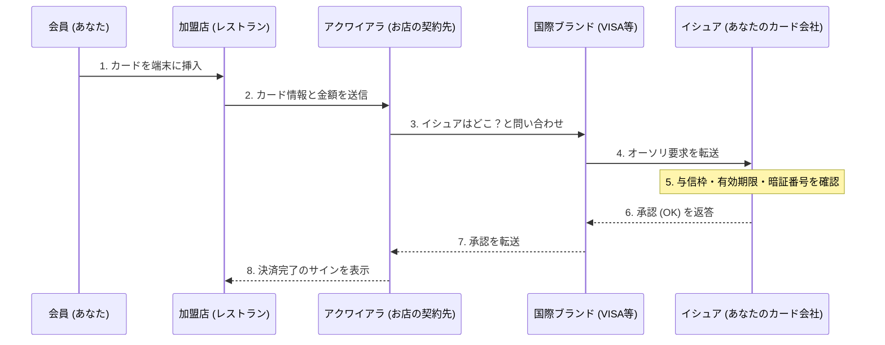

## 1. 「ピッ」という数秒間に何が起きているのか

レストランでの食事後、クレジットカードを端末に差し込んで暗証番号を入力すると、数秒で「承認（決済完了）」のサインが出ます。
私たちにとっては日常のありふれた光景ですが、このわずか数秒の間に、店舗の端末からカード発行会社（地球の裏側にあるかもしれません）まで、世界を股にかけた複雑なデータ通信が行われています。

もしこのネットワークが1時間でも停止すれば、世界中の経済活動は大混乱に陥ります。世界で最も堅牢で、最も素早いレスポンスが求められる「クレジットカード決済ネットワーク」の裏側を覗いてみましょう。

## 2. 登場人物（4パーティモデル）

クレジットカード決済の仕組みを理解するには、基本となる「**4つの登場人物（4パーティ）**」を知る必要があります。

1. **カード会員 (Cardholder)**: あなたです。カードを使って買い物をする人。
2. **加盟店 (Merchant)**: レストランやAmazonなど、カード決済を受け付けるお店。
3. **アクワイアラ (Acquirer)**: 加盟店を開拓し、お店に決済端末を提供する会社（加盟店契約会社）。お店の売上を立替払いしてくれます。
4. **イシュア (Issuer)**: あなたにクレジットカードを発行し、利用限度額を設定している会社（カード発行会社）。

そして、アクワイアラとイシュアを繋ぐ「巨大な橋」の役割を果たしているのが、VISAやMastercardなどの**国際ブランド（決済ネットワーク）**です。

## 3. オーソリゼーション（信用承認）のプロセス

お店でカードを差し込んだ瞬間に走るのが「**オーソリゼーション（Authorization：与信承認）**」というプロセスです。これは「このカードは偽造されておらず、十分な利用枠があるか」をリアルタイムで確認する作業です。

1. **カード読み取り**: お店の端末（CAT/CCT端末）が、カードのICチップから暗号化されたデータを読み取ります。
2. **CAFISなどのネットワーク**: 日本の場合、お店からのデータは「CAFIS」や「CARDNET」といった国内の中継ネットワークを通ってアクワイアラに届きます。
3. **ブランドネットワークを駆け巡る**: アクワイアラは、カード番号の先頭桁（BINコード）を見て「これはVISAのカードだ」と判断し、VISAの国際ネットワーク（VisaNetなど）にデータを投げます。
4. **イシュアでの判定**: データはあなたのカードを発行した会社（イシュア）のホストコンピュータに到達します。ここで「利用限度額を超えていないか」「盗難届が出ていないか」「不正検知システム(AI)に引っかからないか」を瞬時に計算し、承認コードを返します。
5. **お店への回答**: 承認コードが元来た道を猛スピードで戻り、お店の端末に「承認（OK）」と表示されます。

これだけの複雑なリレーが、たった数秒で行われているのです。

## 4. クリアリング（清算）とセトルメント（決済）

オーソリゼーションが完了した時点では、**実はまだお金は1円も動いていません。** 「後で払う約束（枠の確保）」ができただけです。
実際にお金を動かす作業は、お店が閉まった後の深夜などに「バッチ処理」としてまとめて行われます。これを**クリアリング（清算）**と**セトルメント（資金移動）**と呼びます。

1. **売上データの送信**: お店は、その日の売上データ（オーソリ済みのデータ）をまとめてアクワイアラに送信します。
2. **クリアリング（清算）**: アクワイアラは国際ブランドのネットワークを通じて、各イシュアに対して「今日の売上はこれだけだから、お金を請求するよ」という精算データ（クリアリングデータ）を送り合います。
3. **セトルメント（資金移動）**: 翌日以降、国際ブランドを介して銀行間ネットワークが動き、イシュアの銀行口座からアクワイアラの銀行口座へと、まとめて数億円単位の資金が移動します（手数料が引かれます）。
4. **お店への入金とあなたへの請求**: その後、アクワイアラからお店へ売上金が振り込まれ、翌月になってからイシュアからあなたの銀行口座へ利用代金の引き落としがかかります。

## 5. セキュリティと不正検知システム

クレジットカードの世界では、常に不正利用（ハッカーによる番号盗難など）との戦いが続いています。

かつての磁気ストライプカードは「スキミング（情報のコピー）」が容易でしたが、現在の「**ICチップ（EMV仕様）**」カードは、チップの中に極小のコンピュータが入っており、決済のたびに「1回限りの暗号（クリプトグラム）」を生成するため、偽造が事実上不可能になっています。

また、イシュアの裏側では強力な**AI（不正検知システム）**が稼働しています。
「普段は東京でスーパーの買い物にしか使わない人が、深夜に突然海外のサイトで高額なパソコンを3台連続で買おうとしている」といった、過去の購買パターンから外れた異常な行動を瞬時に検知し、オーソリを自動的にブロックして被害を防いでいます。

## 6. まとめ

クレジットカード決済のネットワークは、金融機関、中継ネットワーク、国際ブランドなど、無数の企業が強固なルールのもとで連携する「信用（クレジット）」のインフラです。

私たちが何気なくカードをかざすその背後には、0.1秒のレスポンスを削り出すための通信技術と、複雑な資金清算のバッチ処理、そして見えない犯罪者と戦い続けるAIの監視の目が光っているのです。
