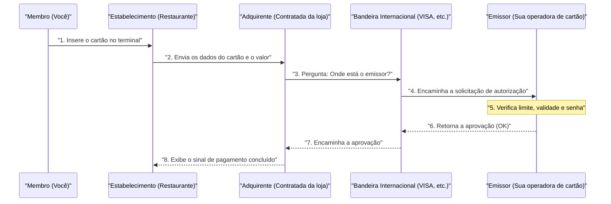

## 1. O que acontece naqueles poucos segundos do "bip"

Após uma refeição em um restaurante, ao inserir o cartão de crédito no terminal e digitar a senha, o sinal de "aprovado (pagamento concluído)" aparece em poucos segundos.
Para nós, essa é uma cena cotidiana muito comum, mas durante esses poucos segundos, ocorre uma complexa comunicação de dados em escala global, desde o terminal da loja até a empresa emissora do cartão (que pode estar do outro lado do mundo).

Se essa rede parar mesmo que por uma hora, a atividade econômica global entrará em grande caos. Vamos dar uma olhada nos bastidores da "rede de pagamento com cartão de crédito", a mais robusta e que exige a resposta mais rápida do mundo.

## 2. Os Personagens (Modelo de 4 Partes)

Para entender o mecanismo de pagamento com cartão de crédito, é necessário conhecer os "**4 personagens (4 partes)**" básicos.

1. **Titular do Cartão (Cardholder)**: É você. A pessoa que faz compras usando o cartão.
2. **Estabelecimento Comercial (Merchant)**: Lojas que aceitam pagamentos com cartão, como um restaurante ou a Amazon.
3. **Adquirente (Acquirer)**: A empresa que prospecta os estabelecimentos e fornece o terminal de pagamento para a loja (empresa credenciadora de estabelecimentos). Ela adianta o pagamento das vendas da loja.
4. **Emissor (Issuer)**: A empresa que emite o cartão de crédito para você e define o limite de crédito (empresa emissora do cartão).

E o papel da "ponte gigante" que conecta o adquirente e o emissor é desempenhado pelas **bandeiras internacionais (redes de pagamento)**, como VISA e Mastercard.

## 3. O Processo de Autorização (Aprovação de Crédito)

No momento em que o cartão é inserido na loja, é executado o processo de "**Autorização (Authorization: Aprovação de Crédito)**". Esta é uma operação em tempo real para verificar se "este cartão não é falsificado e tem limite de crédito suficiente".

1. **Leitura do cartão**: O terminal da loja (terminal CAT/CCT) lê os dados criptografados do chip IC do cartão.
2. **Redes como CAFIS**: No caso do Japão, os dados da loja chegam ao adquirente através de redes de retransmissão domésticas como "CAFIS" ou "CARDNET".
3. **Percorrendo a rede da bandeira**: O adquirente analisa os primeiros dígitos do número do cartão (código BIN), determina que "este é um cartão VISA" e envia os dados para a rede internacional da VISA (como a VisaNet).
4. **Decisão no emissor**: Os dados chegam ao computador host da empresa que emitiu o seu cartão (emissor). Aqui, ele calcula instantaneamente se "o limite de crédito não foi excedido", se "não há notificação de roubo" e se "não é pego pelo sistema de detecção de fraudes (IA)", retornando o código de aprovação.
5. **Resposta à loja**: O código de aprovação retorna pelo mesmo caminho em altíssima velocidade, e o terminal da loja exibe "aprovado (OK)".

Todo esse complexo revezamento é feito em apenas alguns segundos.

## 4. Compensação (Clearing) e Liquidação (Settlement)

No momento em que a autorização é concluída, **na verdade, nem um centavo de dinheiro foi movimentado ainda.** Apenas se fez uma "promessa de pagar depois (reserva de limite)".
O trabalho de movimentar o dinheiro de fato é realizado de forma agrupada como um "processamento em lote (batch processing)" tarde da noite, depois que a loja fecha. Isso é chamado de **Compensação (Clearing)** e **Liquidação (Settlement)**.

1. **Envio dos dados de vendas**: A loja envia os dados de vendas do dia (dados já autorizados) em lote para o adquirente.
2. **Compensação (Clearing)**: O adquirente envia dados de compensação (clearing data) para cada emissor através da rede da bandeira internacional, dizendo: "As vendas de hoje são essas, então vou cobrar o dinheiro".
3. **Liquidação (Settlement)**: A partir do dia seguinte, a rede interbancária entra em ação através da bandeira internacional, e fundos na casa dos centenas de milhões de ienes são movimentados em lote da conta bancária do emissor para a conta bancária do adquirente (as taxas são deduzidas).
4. **Depósito para a loja e cobrança para você**: Depois disso, o adquirente transfere o valor das vendas para a loja e, no mês seguinte, o emissor debita o valor utilizado da sua conta bancária.

## 5. Segurança e Sistema de Detecção de Fraudes

No mundo dos cartões de crédito, há uma batalha constante contra o uso fraudulento (como roubo de números por hackers).

Os antigos cartões de tarja magnética eram fáceis de sofrer "skimming (cópia de informações)", mas os atuais cartões com "**Chip IC (padrão EMV)**" contêm um minúsculo computador dentro do chip. A cada pagamento, eles geram um "código criptografado de uso único (criptograma)", tornando a falsificação virtualmente impossível.

Além disso, por trás do emissor, opera uma poderosa **IA (Sistema de Detecção de Fraudes)**.
Ela detecta instantaneamente comportamentos anormais que fogem do padrão de compras anterior, como "alguém que normalmente só usa o cartão em supermercados em Tóquio, de repente tentando comprar 3 computadores caros consecutivamente em um site no exterior tarde da noite", e bloqueia automaticamente a autorização para evitar prejuízos.

## 6. Resumo

A rede de pagamento com cartão de crédito é uma infraestrutura de "crédito" onde inúmeras empresas, como instituições financeiras, redes de retransmissão e bandeiras internacionais, colaboram sob regras rigorosas.

Por trás do ato casual de aproximarmos nosso cartão, brilham a tecnologia de comunicação para conseguir uma resposta de 0,1 segundo, o complexo processamento em lote para a liquidação de fundos e os olhos vigilantes da IA que continua a lutar contra criminosos invisíveis.
