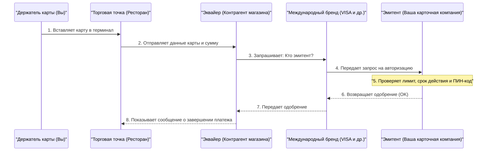

## 1. Что происходит за те несколько секунд, пока звучит «пип»

После ужина в ресторане, когда вы вставляете кредитную карту в терминал и вводите ПИН-код, уже через несколько секунд появляется сообщение «одобрено» (платеж завершен).
Для нас это обычная, повседневная картина, но за эти считанные секунды от терминала в магазине до компании-эмитента карты (которая может находиться на другой стороне земного шара) происходит сложнейший обмен данными, охватывающий весь мир.

Если эта сеть остановится хотя бы на час, экономическая деятельность во всем мире погрузится в хаос. Давайте заглянем за кулисы «сети платежей по кредитным картам», от которой требуется быть самой надежной в мире и обеспечивать максимально быстрый отклик.

## 2. Участники (4-сторонняя модель)

Чтобы понять, как работают платежи по кредитным картам, необходимо знать основные «**4 стороны (4 участника)**».

1. **Держатель карты (Cardholder)**: Это вы. Человек, использующий карту для покупок.
2. **Торговая точка (Merchant)**: Магазины, принимающие оплату картой, например, рестораны или Amazon.
3. **Эквайер (Acquirer)**: Компания, которая привлекает торговые точки и предоставляет им платежные терминалы (компания, заключающая договор с магазином). Она авансирует выплату выручки магазину.
4. **Эмитент (Issuer)**: Компания, которая выпустила вашу кредитную карту и устанавливает кредитный лимит (компания-эмитента карты).

А роль «огромного моста», соединяющего эквайера и эмитента, играют **международные бренды (платежные сети)**, такие как VISA или Mastercard.

## 3. Процесс авторизации (подтверждение кредитоспособности)

В момент, когда вы вставляете карту в магазине, запускается процесс «**авторизации (Authorization: одобрение кредита)**». Это операция в реальном времени, которая проверяет: «не является ли эта карта поддельной, и достаточно ли на ней средств для оплаты».

1. **Считывание карты**: Терминал в магазине (терминалы CAT/CCT) считывает зашифрованные данные с чипа карты.
2. **Сети, такие как CAFIS**: В случае Японии данные из магазина поступают к эквайеру через внутренние транзитные сети, такие как «CAFIS» или «CARDNET».
3. **Маршрутизация по сети бренда**: Эквайер, посмотрев на первые цифры номера карты (BIN-код), определяет: «Это карта VISA», и отправляет данные в международную сеть VISA (например, VisaNet).
4. **Проверка у эмитента**: Данные достигают главного компьютера компании, выпустившей вашу карту (эмитента). Здесь мгновенно рассчитывается: «не превышен ли кредитный лимит», «нет ли заявления о краже», «не сработает ли система обнаружения мошенничества (ИИ)», после чего возвращается код авторизации.
5. **Ответ магазину**: Код авторизации на огромной скорости возвращается по тому же пути, и на терминале магазина отображается «Одобрено (OK)».

Вся эта сложная эстафета происходит всего за несколько секунд.

## 4. Клиринг (очистка) и сетлмент (расчеты)

На момент завершения авторизации, **на самом деле еще не переведено ни одной копейки.** Было лишь дано «обещание заплатить позже (резервирование лимита)».
Фактическое перемещение денег осуществляется пакетно (batch processing) поздно ночью, после закрытия магазина. Это называется **клирингом (очисткой)** и **сетлментом (расчетами)**.

1. **Отправка данных о продажах**: Магазин собирает данные о продажах за день (авторизованные данные) и отправляет их эквайеру.
2. **Клиринг (очистка)**: Эквайер через сеть международного бренда отправляет каждому эмитенту расчетные данные (данные клиринга), сообщая: «Вот столько составили продажи за сегодня, поэтому я запрашиваю средства».
3. **Сетлмент (расчеты)**: Начиная со следующего дня, через международные бренды задействуется межбанковская сеть, и средства на сотни миллионов переводятся со счетов банков-эмитентов на счета банков-эквайеров (за вычетом комиссий).
4. **Поступление средств в магазин и выставление счета вам**: После этого эквайер переводит выручку на счет магазина, а в следующем месяце эмитент списывает сумму покупки с вашего банковского счета.

## 5. Безопасность и системы обнаружения мошенничества

В мире кредитных карт постоянно ведется борьба с мошенничеством (например, с кражей номеров хакерами).

Прежние карты с магнитной полосой было легко подвергнуть «скиммингу (копированию информации)», но современные карты с «**чипами IC (стандарт EMV)**» содержат внутри микроскопический компьютер, который при каждой транзакции генерирует «одноразовый криптограмм» (одноразовый шифр), что делает их подделку практически невозможной.

Кроме того, на стороне эмитента работает мощный **ИИ (система обнаружения мошенничества)**.
Он мгновенно выявляет аномальное поведение, отклоняющееся от прошлых паттернов покупок, например: «Человек, который обычно использует карту только для покупок в супермаркете в Токио, вдруг пытается купить три дорогих компьютера подряд на зарубежном сайте посреди ночи», и автоматически блокирует авторизацию, чтобы предотвратить ущерб.

## 6. Заключение

Сеть платежей по кредитным картам — это инфраструктура «доверия (кредита)», в которой бесчисленное множество компаний, включая финансовые учреждения, транзитные сети и международные бренды, взаимодействуют друг с другом на основе строгих правил.

За нашим повседневным прикладыванием карты стоят технологии связи, направленные на достижение времени отклика в 0,1 секунды, сложные процессы пакетного расчета средств и бдительный контроль ИИ, который продолжает бороться с невидимыми преступниками.
