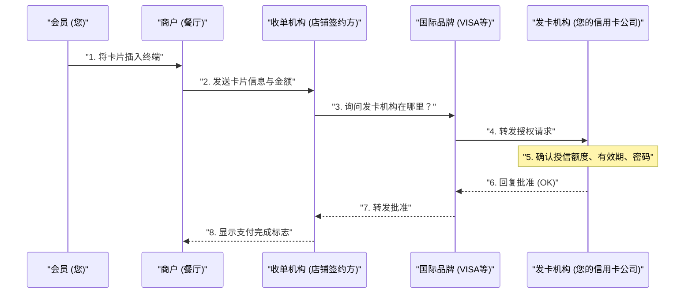

## 1. “滴”的一声几秒钟内发生了什么

在餐厅用餐后，将信用卡插入终端并输入密码，只需几秒钟便会显示“批准（支付完成）”的标志。
对我们来说这是日常司空见惯的场景，但在这短短几秒钟内，从店铺的终端到信用卡发行公司（可能在地球的另一端），跨越全球的复杂数据通信正在进行着。

如果这个网络哪怕只停止1小时，全球的经济活动都将陷入大混乱。让我们来看看需要世界上最坚固、响应速度最快的“信用卡支付网络”的后台吧。

## 2. 登场人物（四方模式）

要理解信用卡支付的机制，必须了解基本的“ **4个登场人物（4方）** ”。

1. **持卡人 (Cardholder)** : 是你。使用卡片购物的人。
2. **商户 (Merchant)** : 餐厅或 Amazon 等接受信用卡支付的店铺。
3. **收单机构 (Acquirer)** : 开拓商户并向店铺提供支付终端的公司（商户签约公司）。为您垫付店铺的营业额。
4. **发卡机构 (Issuer)** : 向您发行信用卡并设定信用额度的公司（信用卡发行公司）。

而充当连接收单机构与发卡机构“巨大桥梁”角色的，就是 VISA 和 Mastercard 等 **国际品牌（支付网络）** 。

## 3. 授权（信用审批）过程

在店铺插卡的瞬间触发的就是“ **授权（Authorization：授信审批）** ”过程。这是一项实时确认“此卡未被伪造，且有足够可用额度”的作业。

1. **卡片读取** : 店铺的终端（CAT/CCT终端）从卡片的IC芯片中读取加密数据。
2. **CAFIS 等网络** : 在日本的情况下，来自店铺的数据通过“CAFIS”或“CARDNET”等国内中继网络送达收单机构。
3. **穿梭于品牌网络** : 收单机构通过查看卡号的前几位（BIN代码）判断“这是VISA的卡”，并将数据投递到 VISA 的国际网络（VisaNet等）。
4. **发卡机构的判定** : 数据到达发行您的卡片的公司（发卡机构）的主机计算机。在这里会瞬间计算“是否超出了信用额度”、“是否挂失”、“是否触发了欺诈检测系统 (AI)”，并返回批准代码。
5. **回复店铺** : 批准代码以极快的速度原路返回，并在店铺的终端上显示“批准（OK）”。

如此复杂的接力，在短短几秒钟内便完成了。

## 4. 清算（Clearing）与结算（Settlement）

在授权完成的那一刻， **实际上还没有产生任何一分钱的资金变动。** 只是达成了“以后付款的约定（确保额度）”。
实际转移资金的作业，是在店铺打烊后的深夜等时间作为“批处理”统一进行的。这被称为 **清算（Clearing）** 和 **结算（资金转移）** 。

1. **发送营业额数据** : 店铺将当天的营业额数据（已授权的数据）汇总发送给收单机构。
2. **清算（Clearing）** : 收单机构通过国际品牌的网络，向各个发卡机构互相发送“今天的营业额是这么多，所以我来请求付款”的精算数据（清算数据）。
3. **结算（资金转移）** : 次日以后，银行间网络通过国际品牌运作，以数亿日元为单位的资金从发卡机构的银行账户统一转移到收单机构的银行账户（扣除手续费）。
4. **向店铺入账与向您请款** : 之后，收单机构将营业款汇入店铺，到了下个月，发卡机构会从您的银行账户中扣除使用款项。

## 5. 安全与欺诈检测系统

在信用卡的世界里，与非法使用（如黑客盗取卡号等）的战斗从未停止。

过去的磁条卡很容易遭到“侧录（复制信息）”，但现在的“ **IC 芯片（EMV规范）** ”卡，芯片内嵌入了极小的计算机，在每次支付时都会生成“一次性密码（Cryptogram）”，因此伪造实际上是不可能的。

此外，发卡机构的后台强大的 **AI（欺诈检测系统）** 正在运行。
系统能够瞬间检测出类似“平时只在东京的超市买东西的人，深夜突然在海外网站连续购买3台昂贵的电脑”这种偏离过往购买模式的异常行为，并自动拦截授权以防止损失。

## 6. 总结

信用卡支付网络是一个在严格规则下，由金融机构、中继网络、国际品牌等无数企业协作的“信用（Credit）”基础设施。

在我们漫不经心刷卡的背后，闪耀着为了挤出0.1秒响应时间的通信技术、复杂的资金清算批处理，以及与看不见的犯罪分子持续战斗的 AI 监控之眼。
