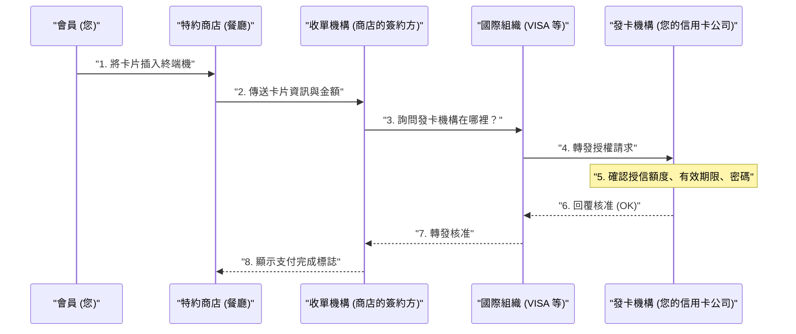

## 1. 「嗶」的幾秒鐘內發生了什麼事

在餐廳用餐後，將信用卡插入終端機並輸入密碼，幾秒鐘內就會出現「核准（支付完成）」的標誌。
對我們來說，這是日常生活中再平凡不過的景象，但在這短短的幾秒鐘內，從商店的終端機到發卡公司（可能在地球的另一端），正在進行著跨越全球的複雜數據通訊。

如果這個網路停機哪怕只有 1 小時，全球的經濟活動都將陷入混亂。讓我們來一窺這個世界上最堅固、要求最快速回應的「信用卡支付網路」背後的秘密。

## 2. 登場人物（四方模式）

要了解信用卡支付的機制，必須先認識基本的「 **4 個登場人物（四方模式）** 」。

1. **持卡人 (Cardholder)** ：也就是您。使用信用卡購物的人。
2. **特約商店 (Merchant)** ：餐廳或 Amazon 等接受信用卡支付的商店。
3. **收單機構 (Acquirer)** ：開拓特約商店，並為商店提供支付終端機的公司（特約商店簽約公司）。他們會為商店墊付營業額。
4. **發卡機構 (Issuer)** ：為您發行信用卡，並設定信用額度的公司（發卡公司）。

而扮演連接收單機構與發卡機構「巨大橋樑」角色的，就是 VISA 或 Mastercard 等 **國際組織（支付網路）** 。

## 3. 授權（信用核准）的流程

在商店插入卡片的瞬間，執行的就是「 **授權（Authorization：授信核准）** 」流程。這是一個即時確認「這張卡沒有被偽造，且有足夠的可用額度」的作業。

1. **卡片讀取** ：商店的終端機（CAT/CCT 終端機）從卡片的 IC 晶片中讀取加密數據。
2. **CAFIS 等網路** ：在日本的情況下，來自商店的數據會透過「CAFIS」或「CARDNET」等國內中繼網路傳送到收單機構。
3. **穿梭於國際組織網路** ：收單機構會查看卡號的前幾碼（BIN 碼）來判斷「這是 VISA 的卡片」，並將數據傳送到 VISA 的國際網路（如 VisaNet）。
4. **發卡機構的判定** ：數據到達發行您卡片的公司（發卡機構）的主機電腦。在這裡會瞬間計算「是否超過信用額度」、「是否已報失」、「是否觸發防詐欺系統 (AI)」，並回傳授權碼。
5. **回覆商店** ：授權碼以極快的速度循原路返回，商店的終端機上會顯示「核准 (OK)」。

如此複雜的接力賽，僅在短短幾秒鐘內就完成了。

## 4. 清算 (Clearing) 與結算 (Settlement)

在授權完成的時間點， **實際上連 1 塊錢都還沒有移動。** 只是完成了「稍後付款的約定（確保額度）」。
實際移動資金的作業，是在商店打烊後的深夜等時段，以「批次處理」的方式統一進行。這被稱為 **清算 (Clearing)** 和 **結算 (資金移動, Settlement)** 。

1. **傳送營業額數據** ：商店將當天的營業額數據（已授權的數據）統整後傳送給收單機構。
2. **清算 (Clearing)** ：收單機構透過國際組織的網路，向各發卡機構互相發送「今天的營業額有這些，我要請款」的結算數據（清算數據）。
3. **結算 (資金移動)** ：隔天之後，銀行間網路會透過國際組織運作，將高達數億日圓單位的資金從發卡機構的銀行帳戶統一移動到收單機構的銀行帳戶（會扣除手續費）。
4. **商店入帳與向您請款** ：之後，收單機構會將營業額匯入商店，而發卡機構則會在下個月從您的銀行帳戶中扣除消費款項。

## 5. 安全性與防詐欺系統

在信用卡的世界裡，與盜刷（如駭客盜取卡號）的戰鬥始終持續著。

過去的磁條卡很容易被「側錄（複製資訊）」，但現在的「 **IC 晶片（EMV 規格）** 」卡，晶片內部裝有微型電腦，每次支付都會產生「一次性密碼（動態密碼，Cryptogram）」，使偽造實際上變得不可能。

此外，在發卡機構的背後，還有強大的 **AI（防詐欺系統）** 正在運作。
它能瞬間偵測出偏離過去購買模式的異常行為，例如「平常只在東京的超市買東西的人，深夜突然在國外網站連續購買了 3 台昂貴的電腦」，並自動阻擋授權以防止損害。

## 6. 總結

信用卡支付網路是由金融機構、中繼網路、國際組織等無數企業在嚴謹的規則下協作而成的「信用 (Credit)」基礎設施。

當我們漫不經心地刷卡時，其背後閃耀著為了擠出 0.1 秒回應速度的通訊技術、複雜的資金清算批次處理，以及持續與看不見的罪犯抗爭的 AI 監視之眼。
