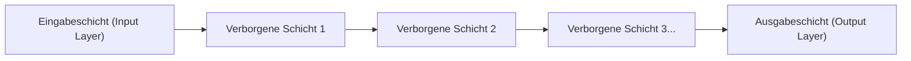

## 1. Die Grenzen der KI (Maschinelles Lernen) vor Deep Learning

Der Begriff „KI (Künstliche Intelligenz)“ existiert schon lange, aber auf dem Weg seiner Entwicklung gab es eine große Hürde.
Bei der herkömmlichen KI (dem klassischen maschinellen Lernen) musste **der Mensch der KI „beachtenswerte Merkmale“ beibringen**, damit sie entscheiden konnte, ob auf einem Bild eine „Katze“ oder ein „Hund“ zu sehen ist. Merkmale wie „Sind die Ohren spitz?“ oder „Hat es Schnurrhaare?“ wurden von Menschen programmiert, und die KI traf darauf basierend ihre Unterscheidungen.

Allerdings gibt es Grenzen dafür, dass Menschen alle Merkmale definieren. Das „**Deep Learning**“ schaffte den Durchbruch, indem es diese „Grenze des Feature Engineerings“ durchbrach: **„Wenn man nur genug Daten bereitstellt, findet die KI die Merkmale von selbst.“**

## 2. „Neuronale Netze“, die das menschliche Gehirn nachahmen

Die Grundlage des Deep Learning ist ein Algorithmus namens „**Neuronales Netz**“, der das Netzwerk der Nervenzellen (Neuronen) im menschlichen Gehirn mathematisch nachahmt.

Im menschlichen Gehirn werden visuelle Informationen, die durch die Augen eintreten, nacheinander durch Neuronen weitergeleitet, um zu erkennen: „Das ist eine Katze.“ Die folgende Struktur bildet dies auf einem Computer nach:

1. **Eingabeschicht**: Empfängt Rohdaten wie die Pixeldaten eines Bildes.
2. **Verborgene Schicht (Zwischenschicht)**: Eine Schicht, die Merkmale der Daten extrahiert und verarbeitet.
3. **Ausgabeschicht**: Gibt die endgültige Schlussfolgerung aus (z. B. „mit 99%iger Wahrscheinlichkeit eine Katze“).

Wenn diese verborgene Schicht (Zwischenschicht) in **vielen tiefen (deep) Schichten übereinander gestapelt** wird, spricht man von Deep Learning.

## 3. Warum kann eine KI „lernen“? (Gewichte und Backpropagation)

In einem neuronalen Netz sind die einzelnen Neuronen durch Linien miteinander verbunden, und diesen Verbindungen ist ein numerischer Wert zugewiesen, das „**Gewicht (Weight)**“. Genau dieses „Gewicht“ ist die wahre Natur der „Intelligenz“ der KI.

### Schritte des Lernens (Backpropagation)
1. Man zeigt der KI das „Bild einer Katze“. Da die „Gewichte“ anfangs zufällig sind, rechnet die KI willkürlich und gibt fälschlicherweise die Antwort „Es ist ein Hund“.
2. Der „**Fehler (das Ausmaß des Irrtums)**“ zwischen der richtigen Antwort (Katze) und der von der KI gegebenen Antwort (Hund) wird berechnet.
3. Die Information über diesen Fehler wird von der Ausgabeschicht in Richtung der Eingabeschicht **rückwärts** zurückgemeldet.
4. Mithilfe mathematischer Infinitesimalrechnung (Gradientenabstieg) im Sinne von „Wenn ich dieses Gewicht damals etwas gesenkt hätte, wäre ich der richtigen Antwort näher gekommen“, werden die **„Gewichte“ des gesamten Netzwerks ein wenig korrigiert**.

Diese Schritte 1 bis 4 werden mit Millionen von Bildern zehntausende Male wiederholt (das ist das „Lernen“). Dadurch werden die „Gewichte“ des Netzwerks allmählich optimiert, und schließlich entsteht eine intelligente KI, die „selbst bei einem ihr unbekannten Bild dieses genau als Katze erkennen kann“.

## 4. Die Entwicklung von GPUs hat Deep Learning erwachen lassen

Tatsächlich existierten die Theorien für neuronale Netze und Backpropagation bereits seit den 1980er Jahren. Damals wurden sie jedoch mit der Begründung verworfen, dass „die Rechenlast explosionsartig ansteigt, wenn man die Schichten vertieft, und Computer das damals nicht verarbeiten konnten“.

Im Jahr 2012 waren es „**GPUs (Grafikkarten)**“ und „**Big Data**“, die diese schlummernde Theorie erwachen ließen.
GPUs, die eigentlich Komponenten zum Rendern von Bildern für 3D-Spiele sind, wurden so konzipiert, dass sie „einfache Matrixmultiplikationen mit Tausenden von Kernen auf einmal parallel verarbeiten“. Dies passte perfekt zu den massiven Multiplikationsprozessen in neuronalen Netzen. Durch den massiven Einsatz von GPUs der Firma NVIDIA konnte das Lernen, das früher Monate dauerte, in wenigen Tagen abgeschlossen werden, und der dritte KI-Boom explodierte.

## 5. Die Entwicklung von der Bilderkennung zur „Generativen KI (LLM)“

Deep Learning erzielte zunächst große Erfolge in der „Bilderkennung (CNN)“. Später übertraf es auch in Bereichen wie „Spracherkennung“ und „Übersetzung (RNN)“ die menschliche Genauigkeit.

Heute ist eine Architektur namens „Transformer“ erschienen, die dieses Deep Learning weiterentwickelt hat, und es ist ein riesiges neuronales Netz entstanden, das gewaltige Mengen an Textdaten aus dem Internet gelernt hat. Das ist das „**Große Sprachmodell (LLM: Large Language Model)**“, und es ist die wahre Identität der „Generativen KI“ wie **ChatGPT**, die wir täglich nutzen.

## 6. Fazit

Deep Learning ist eine Technologie, die durch die Kombination von Algorithmen, die von der Funktionsweise des menschlichen Gehirns inspiriert sind, und den heute verfügbaren, überwältigenden Rechenressourcen (GPUs) entstanden ist.
Dieser Paradigmenwechsel, bei dem man „die Logik, die zur richtigen Antwort führt, nicht in die KI programmiert“, sondern „die KI die Logik (Gewichte) aus den Daten selbst finden lässt“, ist eine der wichtigsten Revolutionen in der Geschichte der IT und ist gerade dabei, unsere gesamte Gesellschaft umzugestalten.
