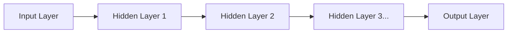

## 1. The Limits of AI (Machine Learning) Before Deep Learning

The term "AI (Artificial Intelligence)" has been around for a long time, but there were major barriers in its evolutionary process.
In conventional AI (traditional machine learning), in order to determine whether a "cat" or a "dog" is in an image, **humans had to teach the AI what "features to focus on."** Humans would program features (feature variables) such as "Are the ears pointy?" or "Does it have whiskers?", and the AI made judgments based on these.

However, there is a limit to humans defining every single feature. Breaking through this "wall of feature engineering" and achieving the breakthrough that **"as long as a massive amount of data is provided, the AI will automatically discover features on its own"** is what we call "**Deep Learning**."

## 2. "Neural Networks" Modeled After the Human Brain

The foundation of deep learning is an algorithm called a "**neural network**," which mathematically mimics the network of nerve cells (neurons) in the human brain.

In the human brain, visual information entering from the eyes is sequentially transmitted through neurons, leading to the recognition that "this is a cat." The following structure reproduces this on a computer.

1. **Input Layer**: Receives raw data, such as the pixel data of an image.
2. **Hidden Layer (Intermediate Layer)**: The layer that extracts and processes the features of the data.
3. **Output Layer**: Outputs the final conclusion (e.g., "99% probability of being a cat").

When these hidden layers (intermediate layers) are **"deeply stacked in multiple layers,"** it is called deep learning.

## 3. Why Can AI "Learn"? (Weights and Backpropagation)

Within a neural network, individual neurons are connected to each other by lines, and a numerical value called a "**Weight**" is set for these connections. This "weight" is the true identity of AI's "intelligence."

### Learning Steps (Backpropagation)

1. You show the AI an "image of a cat." Initially, the "weights" are random, so the AI calculates haphazardly and gives the wrong answer, saying "It is a dog."
2. The "**error (the magnitude of the mistake)**" between the correct answer (cat) and the AI's answer (dog) is calculated.
3. This error information is fed back **in reverse**, from the output layer to the input layer.
4. Using mathematical calculus (gradient descent), the **"weights" of the entire network are slightly adjusted** based on the idea that "if this weight had been slightly lower back then, it would have been closer to the correct answer."

These steps 1 to 4 are repeated tens of thousands of times using millions of images (this is "learning"). As a result, the "weights" of the network are gradually optimized, and ultimately a smart AI is born that can "accurately identify a cat even when shown an unknown image."

## 4. The Evolution of GPUs Awakened Deep Learning

Actually, the theories of neural networks and backpropagation themselves have existed since the 1980s. However, they were abandoned at the time because "deepening the layers causes an explosive increase in computational volume, which the computers of that era could not fully process."

In 2012, this dormant theory was awakened by "**GPUs (Graphics Processing Units)**" and "**Big Data**."

Originally a component for rendering 3D game graphics, the GPU was designed to "process simple matrix multiplications in parallel all at once using thousands of cores." This perfectly matched the massive amount of multiplication processing required by neural networks. By using large numbers of NVIDIA GPUs, learning that once took months could be completed in a few days, and the third AI boom exploded.

## 5. Evolution from Image Recognition to "Generative AI (LLMs)"

Deep learning initially achieved great success in "image recognition (CNNs)." After that, it also achieved superhuman accuracy in "speech recognition" and "translation (RNNs)."

And now, an architecture called the "Transformer," which evolved from this deep learning, has emerged, giving birth to a giant neural network trained on vast amounts of text data on the internet. This is the "**[Large Language Model](/en/p/large-language-models-llm-transformer-prompt-engineering/) (LLM)**," which is the true identity of the "generative AI" we use on a daily basis, such as **ChatGPT**.

## 6. Conclusion

Deep learning is a technology born from the combination of algorithms inspired by the mechanisms of the human brain and the overwhelming computing resources (GPUs) of the modern era.

This paradigm shift—not "programming the logic for the AI to reach the correct answer," but rather "allowing the AI to find the logic (weights) on its own from data"—is one of the most important revolutions in IT history, and it is currently transforming society as a whole.
