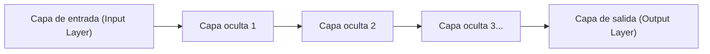

## 1. Los límites de la IA (Machine Learning) antes del Deep Learning

La palabra "IA (Inteligencia Artificial)" existe desde hace mucho tiempo, pero en su proceso de evolución hubo un gran obstáculo.
En la IA tradicional (Machine Learning tradicional), para que juzgue si lo que hay en una imagen es un "gato" o un "perro", **los humanos tenían que enseñarle a la IA las "características a las que debía prestar atención"**. Los humanos programaban características (features) como "¿tiene las orejas puntiagudas?" o "¿tiene bigotes?", y la IA las distinguía basándose en eso.

Sin embargo, hay un límite a la capacidad de los humanos para definir todas las características. El "**Deep Learning (aprendizaje profundo)**" es el avance que rompió este "muro del diseño de características" logrando que **"si se le da una gran cantidad de datos, la IA descubra sus propias características por sí misma"**.

## 2. "Redes neuronales" que imitan el cerebro humano

La base del Deep Learning es un algoritmo llamado "**red neuronal**", que imita matemáticamente la red de células nerviosas (neuronas) del cerebro humano.

En el cerebro humano, la información visual que entra por los ojos es transmitida a través de las neuronas una tras otra, reconociendo que "esto es un gato". La estructura que reproduce esto en una computadora es la siguiente.

1. **Capa de entrada**: Recibe los datos en bruto, como los datos de los píxeles de una imagen.
2. **Capa oculta (capa intermedia)**: Una capa que extrae y procesa las características de los datos.
3. **Capa de salida**: Produce la conclusión final (por ejemplo, "gato con un 99% de probabilidad").

Esta capa oculta (capa intermedia) **apilada profundamente (deep) en muchas capas** es lo que se llama Deep Learning.

## 3. ¿Por qué la IA puede "aprender"? (Pesos y retropropagación de errores)

Dentro de una red neuronal, las neuronas están conectadas por líneas, y estas conexiones tienen un valor numérico llamado "**peso (Weight)**". Este "peso" es la verdadera identidad de la "inteligencia" de la IA.

### Pasos de aprendizaje (algoritmo de retropropagación: Backpropagation)
1. Le mostramos a la IA una "imagen de un gato". Al principio, los "pesos" son aleatorios, por lo que la IA calcula al azar y da una respuesta incorrecta: "es un perro".
2. Se calcula el "**error (magnitud del error)**" entre la respuesta correcta (gato) y la respuesta que dio la IA (perro).
3. Esta información del error se retroalimenta **hacia atrás**, desde la capa de salida hacia la capa de entrada.
4. Se utiliza el cálculo matemático (descenso del gradiente) de "si hubiera bajado un poco este peso en aquel momento, me habría acercado más a la respuesta correcta" para **modificar ligeramente los "pesos" de toda la red**.

Este proceso del 1 al 4 se repite decenas de miles de veces utilizando millones de imágenes (esto es el "aprendizaje"). Entonces, los "pesos" de la red se optimizan gradualmente, y al final nace una IA inteligente que "puede juzgar con precisión que es un gato, incluso si se le muestra una imagen desconocida".

## 4. La evolución de la GPU despertó el Deep Learning

De hecho, la teoría de las redes neuronales y la retropropagación de errores existía desde la década de 1980. Sin embargo, en aquel entonces fue abandonada por la razón de que "si las capas se hacen más profundas, la cantidad de cálculos aumenta explosivamente, y no se podían procesar con las computadoras de la época".

En 2012, quienes despertaron a esta teoría dormida fueron las "**GPU (tarjetas gráficas)**" y el "**Big Data**".
Originalmente, la GPU, una pieza para renderizar imágenes de juegos 3D, estaba diseñada para "procesar de forma paralela cálculos sencillos de multiplicación de matrices con miles de núcleos de una sola vez". Esto encajaba perfectamente con los cálculos masivos de multiplicaciones de las redes neuronales. Al utilizar de forma masiva las GPU de NVIDIA, el aprendizaje que antes tardaba meses pasó a completarse en días, y el tercer boom de la IA estalló.

## 5. La evolución del reconocimiento de imágenes a la "IA generativa (LLM)"

Inicialmente, el Deep Learning logró grandes resultados en el "reconocimiento de imágenes (CNN)". Después, superó la precisión humana en el "reconocimiento de voz" y la "traducción (RNN)".

Y ahora, ha surgido una arquitectura llamada "Transformer", que es una evolución de este Deep Learning, y ha nacido una enorme red neuronal entrenada con enormes cantidades de datos de texto en Internet. Este es el "**Gran Modelo de Lenguaje (LLM)**", y la verdadera identidad de la "IA generativa" como **ChatGPT** que usamos a diario.

## 6. Conclusión

El Deep Learning es una tecnología que nace de la combinación de algoritmos inspirados en el funcionamiento del cerebro humano y los abrumadores recursos computacionales (GPU) modernos.
En lugar de "programar la lógica para que la IA llegue a la respuesta correcta", el cambio de paradigma donde "la IA descubre su propia lógica (pesos) a partir de los datos" es una de las revoluciones más importantes en la historia de la informática, y ahora mismo está transformando la sociedad entera.
