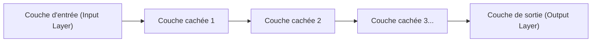

## 1. Les limites de l'IA (apprentissage automatique) avant le deep learning

Le terme « IA (intelligence artificielle) » existe depuis longtemps, mais son évolution a été entravée par un obstacle majeur.
Dans l'IA traditionnelle (l'apprentissage automatique classique), pour qu'elle puisse déterminer si une image représente un « chat » ou un « chien », **les humains devaient lui indiquer les « caractéristiques pertinentes »**. Les humains programmaient des caractéristiques (features) telles que « a-t-il des oreilles pointues ? » ou « a-t-il des moustaches ? », et l'IA se basait là-dessus pour faire sa classification.

Cependant, définir toutes les caractéristiques manuellement a ses limites. Le **« deep learning (apprentissage profond) »** a brisé ce « mur de la conception des caractéristiques » en réalisant une percée majeure : **« si on lui fournit simplement une quantité massive de données, l'IA trouvera d'elle-même les caractéristiques »**.

## 2. Le « réseau de neurones » qui imite le cerveau humain

La base du deep learning est un algorithme appelé **« réseau de neurones »**, qui imite mathématiquement le réseau de cellules nerveuses (neurones) du cerveau humain.

Dans le cerveau humain, l'information visuelle entrant par les yeux est transmise d'un neurone à l'autre pour reconnaître « c'est un chat ». Voici la structure qui reproduit cela sur un ordinateur :

1. **Couche d'entrée** : Reçoit les données brutes, telles que les données de pixels d'une image.
2. **Couche cachée (couche intermédiaire)** : La couche qui extrait et traite les caractéristiques des données.
3. **Couche de sortie** : Fournit la conclusion finale (par exemple, « chat avec 99 % de probabilité »).

Le fait d'**empiler profondément (en anglais, deep) de nombreuses couches** cachées (intermédiaires) est ce qu'on appelle le deep learning.

## 3. Pourquoi l'IA peut-elle « apprendre » ? (Poids et rétropropagation de l'erreur)

Dans un réseau de neurones, chaque neurone est relié aux autres par des lignes, et une valeur numérique appelée **« poids (Weight) »** est attribuée à chaque connexion. Ce « poids » est la véritable nature de l'« intelligence » de l'IA.

### Les étapes de l'apprentissage (Rétropropagation de l'erreur : Backpropagation)
1. On montre une « image de chat » à l'IA. Au début, les « poids » étant aléatoires, l'IA calcule au hasard et donne une mauvaise réponse, comme « c'est un chien ».
2. On calcule l'**« erreur (la taille de l'erreur) »** entre la bonne réponse (chat) et la réponse donnée par l'IA (chien).
3. L'information de cette erreur est renvoyée en **sens inverse**, de la couche de sortie vers la couche d'entrée.
4. En utilisant le calcul différentiel et intégral (la descente de gradient) selon l'idée que « si j'avais un peu baissé ce poids à ce moment-là, je me serais rapproché de la bonne réponse », **les « poids » de l'ensemble du réseau sont légèrement modifiés**.

Ces étapes de 1 à 4 sont répétées des dizaines de milliers de fois en utilisant des millions d'images (c'est cela, l'« apprentissage »). Ensuite, les « poids » du réseau sont progressivement optimisés, ce qui donne naissance à une IA intelligente capable de « reconnaître précisément un chat même lorsqu'on lui montre une image inconnue ».

## 4. L'évolution des GPU a éveillé le deep learning

En fait, la théorie des réseaux de neurones et de la rétropropagation de l'erreur existait déjà depuis les années 1980. Cependant, elle avait été abandonnée à l'époque car « augmenter le nombre de couches entraîne une explosion de la quantité de calculs, impossible à traiter pour les ordinateurs de l'époque ».

En 2012, ce sont les **« GPU (cartes graphiques) »** et le **« Big Data »** qui ont réveillé cette théorie endormie.
Les GPU, conçus à l'origine pour le rendu des images des jeux 3D, sont prévus pour « traiter en parallèle et d'un coup de simples multiplications matricielles avec des milliers de cœurs ». Cela correspondait parfaitement aux immenses calculs de multiplication des réseaux de neurones. L'utilisation massive des GPU de la société NVIDIA a permis de terminer en quelques jours des apprentissages qui prenaient auparavant des mois, provoquant ainsi l'explosion du troisième boom de l'IA.

## 5. De la reconnaissance d'images à l'« IA générative (LLM) »

Le deep learning a d'abord obtenu d'excellents résultats dans la « reconnaissance d'images (CNN) ». Par la suite, il a également atteint une précision supérieure à celle des humains dans des domaines tels que la « reconnaissance vocale » et la « traduction (RNN) ».

Aujourd'hui, une architecture appelée « Transformer », qui est une évolution de ce deep learning, est apparue, donnant naissance à de gigantesques réseaux de neurones ayant appris à partir d'immenses quantités de données textuelles sur Internet. Il s'agit des **« grands modèles de langage (LLM) »**, qui sont la véritable nature de l'« IA générative » comme **ChatGPT**, que nous utilisons quotidiennement.

## 6. Conclusion

Le deep learning est une technologie née de la combinaison d'un algorithme inspiré du fonctionnement du cerveau humain et de la puissance de calcul écrasante (les GPU) de l'ère moderne.
Ce changement de paradigme, consistant non plus à « programmer la logique menant à la bonne réponse dans l'IA », mais à laisser « l'IA découvrir d'elle-même la logique (les poids) à partir des données », est l'une des révolutions les plus importantes de l'histoire de l'informatique et est actuellement en train de remodeler la société dans son ensemble.
