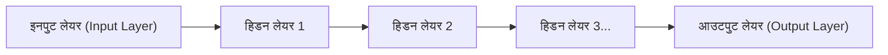

## 1. डीप लर्निंग से पहले के AI (मशीन लर्निंग) की सीमाएं

"AI (आर्टिफिशियल इंटेलिजेंस)" शब्द बहुत पुराना है, लेकिन इसके विकास की प्रक्रिया में एक बड़ी बाधा थी।
पारंपरिक AI (पारंपरिक मशीन लर्निंग) में, यह पहचानने के लिए कि किसी चित्र में "बिल्ली" है या "कुत्ता", **इंसानों को AI को "ध्यान देने योग्य विशेषताएं" बतानी पड़ती थीं**। "क्या कान नुकीले हैं" या "क्या मूंछें हैं" जैसी विशेषताएं (features) इंसानों द्वारा प्रोग्राम की जाती थीं, और AI उनके आधार पर निर्णय लेता था।

हालाँकि, इंसानों द्वारा सभी विशेषताओं को परिभाषित करने की एक सीमा है। "फ़ीचर इंजीनियरिंग की दीवार" को तोड़ते हुए, यह **डीप लर्निंग (Deep Learning)** था जिसने एक बड़ी सफलता हासिल की, जहाँ **"अगर केवल बड़ी मात्रा में डेटा दिया जाए, तो AI खुद ही विशेषताएं ढूंढ लेता है"**।

## 2. मानव मस्तिष्क की नकल करने वाला "न्यूरल नेटवर्क"

डीप लर्निंग का आधार "**न्यूरल नेटवर्क**" नामक एल्गोरिदम है, जो मानव मस्तिष्क में तंत्रिका कोशिकाओं (न्यूरॉन्स) के नेटवर्क की गणितीय नकल करता है।

मानव मस्तिष्क में, आंखों से आने वाली दृश्य जानकारी एक के बाद एक न्यूरॉन्स के माध्यम से प्रेषित होती है, जिससे यह पहचाना जाता है कि "यह एक बिल्ली है"। कंप्यूटर पर इसी को फिर से बनाने वाली संरचना नीचे दी गई है:

1. **इनपुट लेयर**: चित्र के पिक्सेल डेटा जैसे कच्चे डेटा को प्राप्त करता है।
2. **हिडन लेयर (मध्यवर्ती लेयर)**: डेटा की विशेषताओं को निकालने और संसाधित करने वाली लेयर।
3. **आउटपुट लेयर**: अंतिम निष्कर्ष ("99% संभावना के साथ बिल्ली" आदि) निकालता है।

इस हिडन लेयर (मध्यवर्ती लेयर) को "**गहराई (Deep) में कई परतों तक स्टैक करने**" को डीप लर्निंग कहा जाता है।

## 3. AI "सीख" कैसे सकता है? (वजन और बैकप्रोपेगेशन)

न्यूरल नेटवर्क के अंदर, प्रत्येक न्यूरॉन एक दूसरे से लाइनों से जुड़े होते हैं, और इन कनेक्शनों में "**वजन (Weight)**" नामक एक संख्यात्मक मान निर्धारित होता है। यह "वजन" ही AI की "बुद्धिमत्ता" की असली पहचान है।

### सीखने के चरण (बैकप्रोपेगेशन: Backpropagation)
1. हम AI को "बिल्ली का चित्र" दिखाते हैं। शुरुआत में क्योंकि "वजन" यादृच्छिक (random) होता है, AI बेतरतीब गणना करता है और "यह कुत्ता है" जैसा गलत उत्तर देता है।
2. हम सही उत्तर (बिल्ली) और AI द्वारा दिए गए उत्तर (कुत्ता) के बीच "**त्रुटि (गलती का आकार)**" की गणना करते हैं।
3. इस त्रुटि की जानकारी को आउटपुट लेयर से इनपुट लेयर की ओर **उल्टे दिशा में (backward)** फीडबैक किया जाता है।
4. "अगर उस समय इस वजन को थोड़ा कम कर दिया जाता, तो हम सही उत्तर के करीब पहुंच जाते", इस तरह के गणितीय कैलकुलस (ग्रैडिएंट डिसेंट) का उपयोग करके, **पूरे नेटवर्क के "वजन" को थोड़ा सा संशोधित** किया जाता है।

लाखों छवियों का उपयोग करके इन 1 से 4 चरणों को हज़ारों बार दोहराया जाता है (यही "सीखना" है)। नतीजतन, नेटवर्क का "वजन" धीरे-धीरे अनुकूलित हो जाता है, और अंततः एक ऐसा चतुर AI पैदा होता है जो "एक अज्ञात छवि दिखाए जाने पर भी सटीक रूप से पहचान सकता है कि यह एक बिल्ली है"।

## 4. GPU के विकास ने डीप लर्निंग को जगाया

वास्तव में, न्यूरल नेटवर्क और बैकप्रोपेगेशन का सिद्धांत 1980 के दशक से मौजूद था। हालाँकि, उस समय इसे इस कारण से छोड़ दिया गया था कि "परतों को गहरा करने से गणनाओं की मात्रा बहुत अधिक बढ़ जाती है, और उस समय के कंप्यूटर उन्हें संसाधित नहीं कर सकते थे"।

2012 में, यह "**GPU (ग्राफिक्स बोर्ड)**" और "**बिग डेटा**" थे जिन्होंने इस सोए हुए सिद्धांत को फिर से जगाया।
मूल रूप से 3D गेम के दृश्यों को प्रस्तुत करने के लिए डिज़ाइन किया गया एक घटक, GPU "हजारों कोर का उपयोग करके एक साथ साधारण मैट्रिक्स गुणा को समानांतर रूप से संसाधित करने" के लिए बनाया गया था। यह पूरी तरह से न्यूरल नेटवर्क की भारी गुणा प्रसंस्करण से मेल खाता था। NVIDIA के GPU के बड़े पैमाने पर उपयोग के कारण, जिस सीखने की प्रक्रिया में महीनों लगते थे वह कुछ ही दिनों में पूरी होने लगी, जिससे तीसरे AI बूम में विस्फोट हुआ।

## 5. इमेज रिकग्निशन से "जेनरेटिव AI (LLM)" तक का विकास

डीप लर्निंग ने शुरुआत में "इमेज रिकग्निशन (CNN)" में बड़ी सफलता हासिल की। बाद में, इसने "वॉयस रिकग्निशन" और "अनुवाद (RNN)" जैसी चीजों में भी इंसान से बेहतर सटीकता हासिल की।

और अब, इस डीप लर्निंग को आगे बढ़ाते हुए "Transformer (ट्रांसफॉर्मर)" नामक एक आर्किटेक्चर सामने आया है, और एक विशाल न्यूरल नेटवर्क बनाया गया है जिसने इंटरनेट पर बड़ी मात्रा में टेक्स्ट डेटा सीखा है। यह "**लार्ज लैंग्वेज मॉडल (LLM)**" है, और यही वह "जेनरेटिव AI" जिसे हम हर दिन **ChatGPT** के रूप में उपयोग करते हैं।

## 6. निष्कर्ष

डीप लर्निंग एक ऐसी तकनीक है जो मानव मस्तिष्क के काम करने के तरीके से प्रेरित एक एल्गोरिदम और आधुनिक समय के भारी कंप्यूटिंग संसाधनों (GPU) के संयोजन से पैदा हुई है।
"AI में सही उत्तर तक पहुंचने वाले तर्क को प्रोग्राम करने" के बजाय "AI का खुद डेटा से तर्क (वजन) खोजना", यह प्रतिमान बदलाव (paradigm shift) IT इतिहास की सबसे महत्वपूर्ण क्रांतियों में से एक है, और अब यह पूरी तरह से समाज को फिर से आकार देने जा रहा है।
