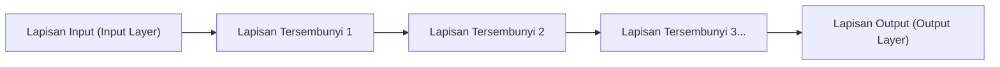

## 1. Batasan AI (Machine Learning) Sebelum Adanya Deep Learning

Istilah "AI (Artificial Intelligence)" telah ada sejak lama, tetapi ada rintangan besar dalam proses evolusinya.
Pada AI tradisional (machine learning tradisional), untuk membuat AI menentukan apakah yang ada di dalam gambar adalah "kucing" atau "anjing", **manusia harus memberi tahu AI "fitur apa yang harus diperhatikan"**. Manusia memprogram fitur-fitur (feature values) seperti "apakah telinganya runcing" atau "apakah ada kumis", dan AI membuat penilaian berdasarkan hal tersebut.

Namun, ada batasan bagi manusia untuk mendefinisikan semua fitur. Terobosan yang menghancurkan "rintangan desain fitur" ini dan mewujudkan bahwa **"selama data dalam jumlah besar diberikan, AI akan menemukan fiturnya sendiri secara mandiri"** adalah **"Deep Learning (Pembelajaran Mendalam)"**.

## 2. "Neural Network" yang Meniru Otak Manusia

Dasar dari deep learning adalah algoritma yang disebut **"Neural Network"**, yang secara matematis meniru jaringan sel saraf (neuron) pada otak manusia.

Pada otak manusia, informasi visual yang masuk dari mata ditransmisikan dari neuron satu ke neuron lainnya secara berurutan, dan ia mengenalinya sebagai "ini adalah kucing". Hal yang direproduksi di komputer adalah struktur berikut.

1. **Lapisan Input**: Menerima data mentah seperti data piksel dari sebuah gambar.
2. **Lapisan Tersembunyi (Lapisan Menengah)**: Lapisan yang mengekstrak dan memproses fitur data.
3. **Lapisan Output**: Menghasilkan kesimpulan akhir (seperti "kucing dengan probabilitas 99%").

Lapisan tersembunyi (lapisan menengah) ini, ketika **"ditumpuk sangat dalam (deep) dalam banyak lapisan"**, disebut sebagai deep learning.

## 3. Mengapa AI Dapat "Belajar"? (Bobot dan Backpropagation)

Di dalam neural network, setiap neuron dihubungkan satu sama lain oleh garis, dan nilai numerik yang disebut **"Bobot (Weight)"** diatur untuk setiap koneksi tersebut. "Bobot" inilah identitas sebenarnya dari "kecerdasan" AI.

### Langkah-langkah Pembelajaran (Algoritma Propagasi Balik: Backpropagation)
1. Kita memperlihatkan "gambar kucing" kepada AI. Pada awalnya, karena "bobot" diatur secara acak, AI menghitung sembarangan dan memberikan jawaban yang salah, seperti "Ini adalah anjing".
2. Kita menghitung **"kesalahan (besarnya kesalahan)"** antara jawaban yang benar (kucing) dan jawaban yang diberikan AI (anjing).
3. Informasi kesalahan ini diumpankan balik secara **mundur (backward)** dari lapisan output menuju lapisan input.
4. Menggunakan kalkulus matematika (Gradient Descent) dengan logika "Jika kita menurunkan bobot ini sedikit saat itu, pasti akan lebih mendekati jawaban yang benar", kita **memodifikasi "bobot" dari seluruh jaringan sedikit demi sedikit**.

Langkah 1 hingga 4 ini diulangi puluhan ribu kali menggunakan jutaan gambar (inilah yang disebut "pembelajaran"). Hasilnya, "bobot" jaringan secara bertahap dioptimalkan, dan pada akhirnya lahirlah AI cerdas yang "dapat mengenali kucing dengan akurat bahkan saat diperlihatkan gambar yang belum pernah dilihat sebelumnya".

## 4. Evolusi GPU Membangkitkan Deep Learning

Sebenarnya, teori neural network dan backpropagation sendiri sudah ada sejak tahun 1980-an. Namun, pada saat itu, teori tersebut ditinggalkan karena alasan bahwa "jika lapisan dibuat lebih dalam, jumlah komputasi akan meningkat secara eksplosif, dan tidak dapat diproses oleh komputer pada masa itu".

Pada tahun 2012, hal yang membangunkan teori yang sedang tidur ini adalah **"GPU (Kartu Grafis)"** dan **"Big Data"**.

GPU, yang pada dasarnya merupakan komponen untuk me-render grafik game 3D, dirancang untuk "memproses perkalian matriks sederhana secara paralel dalam jumlah besar dengan ribuan core secara bersamaan". Ini sangat cocok dengan perhitungan perkalian matriks besar-besaran pada neural network. Dengan menggunakan sejumlah besar GPU dari NVIDIA, proses pembelajaran yang dulunya memakan waktu berbulan-bulan kini dapat diselesaikan dalam hitungan hari, yang kemudian memicu ledakan AI generasi ke-3.

## 5. Evolusi dari Pengenalan Gambar menuju "Generative AI (LLM)"

Pada awalnya, deep learning mencapai kesuksesan besar dalam "Pengenalan Gambar (CNN)". Setelah itu, ia juga melampaui akurasi manusia dalam hal "Pengenalan Suara" dan "Terjemahan (RNN)".

Dan saat ini, sebuah arsitektur bernama "Transformer" yang merupakan perkembangan dari deep learning telah muncul, menciptakan neural network raksasa yang dilatih pada sejumlah besar data teks di internet. Inilah yang disebut **"Large Language Model (LLM)"**, dan merupakan identitas dari "Generative AI" seperti **ChatGPT** yang kita gunakan sehari-hari.

## 6. Kesimpulan

Deep learning adalah teknologi yang lahir dari kombinasi algoritma yang terinspirasi oleh mekanisme otak manusia dan sumber daya komputasi modern yang sangat besar (GPU).

Pergeseran paradigma dari "memprogram logika agar AI mencapai jawaban yang benar" menjadi "AI menemukan logika (bobot) dari data secara mandiri" merupakan salah satu revolusi terpenting dalam sejarah TI, dan saat ini sedang mengubah masyarakat secara keseluruhan.
