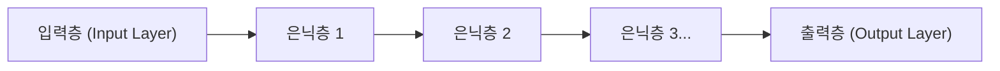

## 1. 딥러닝 이전의 AI(기계 학습)의 한계

'AI(인공지능)'라는 단어는 오래 전부터 있었지만, 그 진화 과정에는 큰 장벽이 있었습니다.
기존의 AI(기존의 기계 학습)에서는 이미지에 찍힌 것이 '고양이'인지 '개'인지를 판단하게 하기 위해, **인간이 '주목해야 할 특징'을 AI에게 가르쳐 주어야만 했습니다**. '귀가 뾰족한가', '수염이 났는가'와 같은 특징(특징량)을 인간이 프로그래밍하고, AI는 그것을 바탕으로 판별했던 것입니다.

그러나 인간이 모든 특징을 정의하는 것에는 한계가 있습니다. 이 '특징량 설계의 장벽'을 부수고, **'데이터만 대량으로 주어지면 AI가 스스로 알아서 특징을 찾아낸다'** 라는 돌파구를 마련한 것이 '**딥러닝(심층 학습)**' 입니다.

## 2. 인간의 뇌를 모방한 '신경망'

딥러닝의 기초가 되는 것은 인간의 뇌 신경세포(뉴런) 네트워크를 수학적으로 모방한 '**신경망**' 이라는 알고리즘입니다.

인간의 뇌는 눈으로 들어온 시각 정보가 뉴런을 차례로 전달하여, '이것은 고양이다'라고 인식합니다. 이것을 컴퓨터상에서 재현한 것이 아래의 구조입니다.

1. **입력층**: 이미지의 픽셀 데이터 등 원시 데이터를 받는다.
2. **은닉층(중간층)**: 데이터의 특징을 추출하고 처리하는 층.
3. **출력층**: 최종적인 결론('99%의 확률로 고양이' 등)을 낸다.

이 은닉층(중간층)을 '**깊게(딥하게) 여러 층으로 겹친**' 것을 딥러닝이라고 부릅니다.

## 3. 왜 AI는 '학습'할 수 있는가? (가중치와 오차역전파법)

신경망 안에서는 각각의 뉴런들이 선으로 연결되어 있으며, 그 연결에는 '**가중치 (Weight)**' 라는 수치가 설정되어 있습니다. 이 '가중치'야말로 AI의 '지능'의 정체입니다.

### 학습의 단계 (오차역전파법: 백프로퍼게이션)
1. AI에게 '고양이 이미지'를 보여줍니다. 처음에는 '가중치'가 엉터리이므로, AI는 적당히 계산하여 '개입니다'라고 틀린 답을 냅니다.
2. 정답(고양이)과 AI가 낸 답(개)의 '**오차(틀린 정도)**' 를 계산합니다.
3. 이 오차의 정보를 출력층에서 입력층을 향해 **역방향으로** 피드백합니다.
4. '그때 이 가중치를 조금 낮춰두었다면 더 정답에 가까워졌을 것이다'라는 수학적인 미적분(경사하강법)을 사용하여 **네트워크 전체의 '가중치'를 조금씩 수정** 합니다.

이 1~4의 작업을 수백만 장의 이미지를 사용하여 수만 번 반복합니다(이것이 '학습'입니다). 그러면 네트워크의 '가중치'가 서서히 최적화되어, 최종적으로는 '미지의 이미지를 보여주어도 정확하게 고양이라고 판별할 수 있는' 똑똑한 AI가 탄생하는 것입니다.

## 4. GPU의 진화가 딥러닝을 각성시켰다

사실 신경망이나 오차역전파법의 이론 자체는 1980년대부터 존재했습니다. 하지만 당시에는 '층을 깊게 하면 계산량이 폭발적으로 늘어나서, 당시의 컴퓨터로는 다 처리할 수 없다'는 이유로 버려져 있었습니다.

2012년, 이 잠들어 있던 이론을 각성시킨 것이 '**GPU (그래픽 보드)**' 와 '**빅데이터**' 입니다.
본래는 3D 게임의 영상을 그리기 위한 부품인 GPU는, '단순한 행렬의 곱셈을 수천 개의 코어로 단번에 병렬 처리한다'는 설계로 되어 있었습니다. 이것이 신경망의 방대한 곱셈 처리와 멋지게 맞아떨어진 것입니다. NVIDIA사의 GPU를 대량으로 사용함으로써, 예전에 몇 달씩 걸리던 학습이 며칠 만에 끝나게 되었고, 제3차 AI 붐이 폭발했습니다.

## 5. 이미지 인식에서 '생성형 AI(LLM)'로의 진화

딥러닝은 초기에 '이미지 인식(CNN)'에서 큰 성과를 올렸습니다. 그 후 '음성 인식'이나 '번역(RNN)' 등에서도 인간을 뛰어넘는 정확도를 기록합니다.

그리고 현재, 이 딥러닝을 발전시킨 'Transformer(트랜스포머)'라는 아키텍처가 등장하여, 인터넷상의 방대한 텍스트 데이터를 학습한 거대한 신경망이 탄생했습니다. 이것이 '**대규모 언어 모델 (LLM)**' 이며, 우리가 일상적으로 사용하고 있는 **ChatGPT** 등의 '생성형 AI'의 정체입니다.

## 6. 요약

딥러닝은 인간의 뇌 구조에서 힌트를 얻은 알고리즘과 현대의 압도적인 계산 자원(GPU)이 결합하여 탄생한 기술입니다.
'AI에게 정답에 이르는 로직을 프로그래밍한다'가 아니라 'AI가 스스로 데이터에서 로직(가중치)을 찾아낸다'라는 이 패러다임 전환은, IT 역사상 가장 중요한 혁명 중 하나로서 지금 바로 사회 전체를 바꿔나가려 하고 있습니다.
