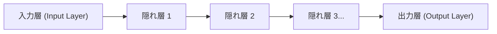

## 1. ディープラーニング以前のAI（機械学習）の限界

「AI（人工知能）」という言葉は古くからありますが、その進化の過程には大きな壁がありました。
従来のAI（従来の機械学習）では、画像に写っているのが「猫」か「犬」かを判断させるために、**人間が「注目すべき特徴」をAIに教えてあげる必要がありました**。「耳が尖っているか」「髭が生えているか」といった特徴（特徴量）を人間がプログラミングし、AIはそれに基づいて判別していたのです。

しかし、人間がすべての特徴を定義することには限界があります。この「特徴量設計の壁」をぶち破り、**「データさえ大量に与えれば、AIが自ら勝手に特徴を見つけ出す」**というブレイクスルーを果たしたのが「**ディープラーニング（深層学習）**」です。

## 2. 人間の脳を模倣した「ニューラルネットワーク」

ディープラーニングの基礎となっているのは、人間の脳の神経細胞（ニューロン）のネットワークを数学的に模倣した「**ニューラルネットワーク**」というアルゴリズムです。

人間の脳は、目から入った視覚情報がニューロンを次々と伝達し、「これは猫だ」と認識します。これをコンピュータ上で再現したのが以下の構造です。

1. **入力層**: 画像のピクセルデータなどの生のデータを受け取る。
2. **隠れ層（中間層）**: データの特徴を抽出・処理する層。
3. **出力層**: 最終的な結論（「99%の確率で猫」など）を出す。

この隠れ層（中間層）を「**深く（ディープに）何層にも重ねた**」ものが、ディープラーニングと呼ばれます。

## 3. なぜAIは「学習」できるのか？（重みと誤差逆伝播法）

ニューラルネットワークの中では、それぞれのニューロン同士が線で繋がれており、その接続には「**重み（Weight）**」という数値が設定されています。この「重み」こそが、AIの「知能」の正体です。

### 学習のステップ（誤差逆伝播法：バックプロパゲーション）
1. AIに「猫の画像」を見せます。最初は「重み」がデタラメなので、AIは適当に計算し「犬です」と間違った答えを出します。
2. 正解（猫）と、AIの出した答え（犬）の「**誤差（間違いの大きさ）**」を計算します。
3. この誤差の情報を、出力層から入力層へ向かって**逆向きに**フィードバックします。
4. 「あの時、この重みを少し下げておけば、もっと正解に近づいたはずだ」という数学的な微積分（勾配降下法）を用いて、**ネットワーク全体の「重み」を少しだけ修正**します。

この1〜4の作業を、何百万枚という画像を使って何万回も繰り返します（これが「学習」です）。すると、ネットワークの「重み」が徐々に最適化され、最終的には「未知の画像を見せても、正確に猫だと判別できる」賢いAIが誕生するのです。

## 4. GPUの進化がディープラーニングを覚醒させた

実は、ニューラルネットワークや誤差逆伝播法の理論自体は1980年代から存在していました。しかし、当時は「層を深くすると計算量が爆発的に増え、当時のコンピュータでは処理しきれない」という理由で見捨てられていました。

2012年、この眠っていた理論を覚醒させたのが「**GPU（グラフィックボード）**」と「**ビッグデータ**」です。
本来は3Dゲームの映像を描画するための部品であるGPUは、「単純な行列の掛け算を、数千個のコアで一気に並列処理する」という設計になっていました。これが、ニューラルネットワークの膨大な掛け算処理と見事に合致したのです。NVIDIA社のGPUを大量に用いることで、かつて数ヶ月かかった学習が数日で終わるようになり、第3次AIブームが爆発しました。

## 5. 画像認識から「生成AI（LLM）」への進化

ディープラーニングは当初「画像認識（CNN）」で大きな成果を上げました。その後、「音声認識」や「翻訳（RNN）」などでも人間を超える精度を叩き出します。

そして現在、このディープラーニングを発展させた「Transformer（トランスフォーマー）」というアーキテクチャが登場し、インターネット上の膨大なテキストデータを学習した巨大なニューラルネットワークが生まれました。これが「**大規模言語モデル（LLM）**」であり、私たちが日常的に使っている**ChatGPT**などの「生成AI」の正体です。

## 6. まとめ

ディープラーニングは、人間の脳の仕組みをヒントにしたアルゴリズムと、現代の圧倒的な計算資源（GPU）が結びついて生まれた技術です。
「AIに正解に至るロジックをプログラミングする」のではなく、「AIが自らデータからロジック（重み）を見つけ出す」というこのパラダイムシフトは、ITの歴史において最も重要な革命の一つとして、今まさに社会全体を作り変えようとしています。
