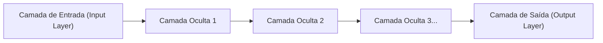

## 1. As Limitações da IA (Aprendizado de Máquina) antes do Deep Learning

O termo "IA (Inteligência Artificial)" existe há muito tempo, mas o seu processo evolutivo enfrentou um grande obstáculo.
Na IA tradicional (aprendizado de máquina tradicional), para fazer o sistema julgar se uma imagem mostra um "gato" ou um "cachorro", **era necessário que os humanos ensinassem à IA as "características a observar"**. Os humanos programavam características (features) como "tem orelhas pontudas" ou "tem bigodes", e a IA fazia a distinção com base nisso.

No entanto, há um limite na capacidade dos humanos de definirem todas as características. O "**Deep Learning (Aprendizado Profundo)**" foi a inovação que quebrou essa "barreira do design de features" e conseguiu o seguinte feito: "**basta fornecer dados em grande quantidade e a IA encontrará por conta própria as características**".

## 2. A "Rede Neural" que Imita o Cérebro Humano

A base do deep learning é um algoritmo chamado "**Rede Neural (Neural Network)**", que imita matematicamente a rede de células nervosas (neurônios) do cérebro humano.

O cérebro humano reconhece que "isto é um gato" quando a informação visual entra pelos olhos e é transmitida pelos neurônios, um após o outro. A estrutura abaixo reproduz esse processo em um computador.

1. **Camada de Entrada**: Recebe os dados brutos, como os pixels de uma imagem.
2. **Camadas Ocultas (Camadas Intermediárias)**: As camadas que extraem e processam as características dos dados.
3. **Camada de Saída**: Emite a conclusão final (como "99% de probabilidade de ser um gato").

O que chamamos de deep learning ocorre quando essas camadas ocultas (camadas intermediárias) são "**sobrepostas profundamente (deep) em muitas camadas**".

## 3. Por que a IA Consegue "Aprender"? (Pesos e Backpropagation)

Dentro da rede neural, os neurônios estão conectados uns aos outros por linhas, e essas conexões recebem valores numéricos chamados de "**Pesos (Weights)**". Esses "pesos" são a verdadeira essência da "inteligência" da IA.

### O Processo de Aprendizado (Método de Retropropagação de Erro: Backpropagation)
1. Mostramos à IA a "imagem de um gato". No início, os "pesos" são aleatórios, então a IA calcula de forma aleatória e dá a resposta errada: "É um cachorro".
2. O "**erro (tamanho do erro)**" entre a resposta correta (gato) e a resposta da IA (cachorro) é calculado.
3. Essa informação sobre o erro é transmitida (feedback) da camada de saída de volta para a camada de entrada, de forma **reversa**.
4. Usando cálculo matemático e derivadas (método de descida do gradiente), que determina que "se tivéssemos reduzido um pouco esse peso naquela hora, estaríamos mais próximos da resposta correta", a IA faz pequenos **ajustes nos "pesos" de toda a rede**.

Esse processo, dos passos 1 a 4, é repetido dezenas de milhares de vezes utilizando milhões de imagens (é isso que chamamos de "aprendizado"). Então, os "pesos" da rede são otimizados gradualmente e, no final, nasce uma IA inteligente que "pode identificar corretamente que se trata de um gato, mesmo que a imagem seja mostrada pela primeira vez".

## 4. A Evolução das GPUs Despertou o Deep Learning

Na verdade, a teoria das redes neurais e da retropropagação de erro já existe desde os anos 1980. No entanto, naquela época, eles foram abandonados pela seguinte razão: "À medida que se aumenta o número de camadas, a quantidade de cálculos aumenta exponencialmente, o que não podia ser processado pelos computadores da época".

Em 2012, o que despertou essa teoria adormecida foram as "**GPUs (Placas de Vídeo)**" e o "**Big Data**".
Originalmente projetadas como componentes para renderizar gráficos de jogos em 3D, as GPUs foram construídas para "processar multiplicações de matrizes simples de uma vez em paralelo, utilizando milhares de núcleos". Isso se alinhou perfeitamente com o enorme processamento de multiplicações das redes neurais. Ao usar uma grande quantidade de GPUs da NVIDIA, o aprendizado, que antes demorava meses, pôde ser finalizado em questão de dias, e o terceiro boom da IA explodiu.

## 5. Do Reconhecimento de Imagem à "IA Generativa (LLMs)"

O deep learning alcançou enormes resultados inicialmente no "reconhecimento de imagem (CNN)". Depois disso, começou a alcançar níveis de precisão superiores aos humanos em "reconhecimento de voz" e "tradução (RNN)".

E hoje, a arquitetura chamada de "Transformer", que é uma evolução do deep learning, apareceu e criou redes neurais massivas que aprenderam a partir de imensas quantidades de dados de texto na internet. Esse é o "**Grande Modelo de Linguagem (LLM)**", e é a verdadeira identidade das "IAs Gerativas" que usamos diariamente, como o **ChatGPT**.

## 6. Conclusão

O deep learning é uma tecnologia que nasceu da união de um algoritmo inspirado na estrutura do cérebro humano e os recursos computacionais esmagadores da atualidade (GPU).
A mudança de paradigma de não "programar na IA a lógica para se chegar à resposta correta", mas sim permitir que "a própria IA descubra a lógica (pesos) a partir dos dados", está em processo de remodelar nossa sociedade como uma das revoluções mais importantes da história da TI.
