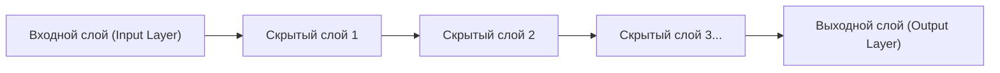

## 1. Пределы ИИ (машинного обучения) до глубокого обучения

Хотя термин «ИИ (искусственный интеллект)» существует уже давно, на пути его эволюции была большая преграда.
В традиционном ИИ (традиционном машинном обучении), чтобы заставить его определить, изображена ли на картинке «кошка» или «собака», **человеку нужно было указывать ИИ «отличительные признаки, на которые следует обратить внимание»**. Люди программировали такие признаки (features), как «заостренные ли уши» или «есть ли усы», и ИИ производил классификацию на их основе.

Однако есть предел тому, сколько признаков может определить человек. Прорывом, который разрушил эту «стену проектирования признаков» и позволил **«ИИ самостоятельно и произвольно находить признаки, если ему предоставить достаточное количество данных»**, стало «**глубокое обучение (Deep Learning)**».

## 2. «Нейронная сеть», имитирующая человеческий мозг

Основой глубокого обучения является алгоритм под названием «**нейронная сеть**» (Neural Network), который математически имитирует сеть нервных клеток (нейронов) в человеческом мозге.

В человеческом мозге визуальная информация, поступающая через глаза, передается от одного нейрона к другому, и мы понимаем, что «это кошка». Структура ниже показывает, как это воспроизводится на компьютере.

1. **Входной слой**: Принимает необработанные данные, такие как пиксельные данные изображения.
2. **Скрытый слой (промежуточный слой)**: Слой, который извлекает и обрабатывает признаки данных.
3. **Выходной слой**: Выдает окончательное заключение (например, «кошка с вероятностью 99%»).

Когда этот скрытый слой (промежуточный слой) **«глубоко накладывается в несколько слоев»**, это называется глубоким обучением.

## 3. Почему ИИ может «обучаться»? (Веса и метод обратного распространения ошибки)

Внутри нейронной сети каждый нейрон соединен с другими линиями, и этим соединениям присваивается числовое значение, называемое «**весом (Weight)**». Этот «вес» и есть истинная природа «интеллекта» ИИ.

### Шаги обучения (Метод обратного распространения ошибки: Backpropagation)
1. Покажите ИИ «изображение кошки». Сначала «веса» случайны, поэтому ИИ вычисляет наобум и выдает неправильный ответ: «Это собака».
2. Вычисляется «**ошибка (величина ошибки)**» между правильным ответом (кошка) и ответом ИИ (собака).
3. Информация об этой ошибке передается **в обратном направлении** от выходного слоя к входному слою.
4. Используя математическое исчисление (градиентный спуск) с идеей, что «если бы мы немного уменьшили этот вес тогда, мы были бы ближе к правильному ответу», **«веса» всей сети немного корректируются**.

Эти шаги с 1 по 4 повторяются десятки тысяч раз с использованием миллионов изображений (это и есть «обучение»). В результате «веса» сети постепенно оптимизируются, и в конечном итоге рождается умный ИИ, который может «точно определить, что это кошка, даже если показать ему неизвестное изображение».

## 4. Эволюция GPU пробудила глубокое обучение

На самом деле теория нейронных сетей и метода обратного распространения ошибки существовала еще с 1980-х годов. Однако в то время от нее отказались из-за того, что «добавление дополнительных слоев приведет к взрывному росту объема вычислений, с которыми компьютеры того времени не могли справиться».

В 2012 году эту спящую теорию пробудили «**GPU (видеокарты)**» и «**большие данные**».
Изначально предназначенные для рендеринга 3D-графики в играх, GPU были разработаны для того, чтобы «обрабатывать простые перемножения матриц параллельно с использованием тысяч ядер». Это идеально совпало с огромным количеством умножений в нейронных сетях. Благодаря массовому использованию GPU от компании NVIDIA, обучение, на которое раньше уходили месяцы, стало завершаться за несколько дней, и третий бум ИИ взорвался.

## 5. Эволюция от распознавания изображений к «Генеративному ИИ (LLM)»

Сначала глубокое обучение достигло больших успехов в «распознавании изображений (CNN)». После этого оно достигло точности, превосходящей человеческую, в таких областях, как «распознавание речи» и «перевод (RNN)».

В настоящее время появилась архитектура под названием «Transformer», которая развивает глубокое обучение, и была создана гигантская нейронная сеть, обученная на огромных объемах текстовых данных в Интернете. Это и есть «**большая языковая модель (LLM)**», которая является истинной природой «генеративного ИИ», такого как **ChatGPT**, которым мы пользуемся ежедневно.

## 6. Заключение

Глубокое обучение — это технология, рожденная путем объединения алгоритмов, вдохновленных структурой человеческого мозга, с подавляющими вычислительными ресурсами (GPU) современности.
Сдвиг парадигмы от «программирования логики для достижения правильного ответа ИИ» к «ИИ самостоятельно находит логику (веса) из данных» — это одна из самых важных революций в истории ИТ, которая прямо сейчас собирается перестроить все наше общество.
