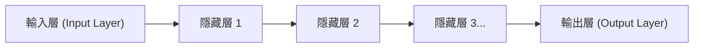

## 1. 深度學習之前的 AI（機器學習）的極限

「AI（人工智慧）」這個詞由來已久，但其進化過程曾面臨巨大的障礙。
在過去的 AI（傳統機器學習）中，為了讓它判斷圖片中是「貓」還是「狗」， **人類必須先教導 AI「應該關注的特徵」** 。人類需要將「耳朵是否尖尖的」、「是否長著鬍鬚」等特徵（特徵量）寫成程式，AI 再根據這些特徵進行判別。

然而，由人類定義所有特徵是有極限的。打破這個「特徵量設計之壁」，實現 **「只要提供大量資料，AI 就會自行找出特徵」** 這項重大突破的，正是「 **深度學習（Deep Learning）** 」。

## 2. 模仿人類大腦的「神經網路」

深度學習的基礎是一種名為「 **神經網路** 」的演算法，它在數學上模仿了人類大腦神經細胞（神經元）的網路結構。

人類的大腦會將眼睛接收到的視覺資訊，透過神經元逐一傳遞，最後認知到「這是一隻貓」。將這個過程在電腦上重現的結構如下：

1. **輸入層**：接收圖像像素資料等原始資料。
2. **隱藏層（中間層）**：提取和處理資料特徵的層。
3. **輸出層**：得出最終結論（例如「99% 的機率是貓」）。

將這個隱藏層（中間層）「 **深深地疊加許多層** 」的架構，就被稱為深度學習。

## 3. 為什麼 AI 能夠「學習」？（權重與反向傳播演算法）

在神經網路中，各個神經元之間由線連接，這些連接都設有稱為「 **權重（Weight）** 」的數值。這個「權重」正是 AI「智慧」的真面目。

### 學習的步驟（反向傳播演算法：Backpropagation）
1. 讓 AI 看「貓的圖片」。因為一開始的「權重」是隨機的，AI 會隨便計算並給出「是狗」的錯誤答案。
2. 計算正確答案（貓）與 AI 給出的答案（狗）之間的「 **誤差（錯誤的程度）** 」。
3. 將這個誤差的資訊，從輸出層向輸入層 **反向** 進行回饋（Feedback）。
4. 運用數學的微積分（梯度下降法），基於「當時如果把這個權重稍微調低，應該就會更接近正確答案」的邏輯， **稍微修正整個網路的「權重」** 。

使用數百萬張圖片，將這 1 到 4 的步驟重複幾萬次（這就是「學習」）。這樣一來，網路的「權重」就會逐漸達到最佳化，最終誕生出「即使看到未知的圖片，也能準確判別出是貓」的聰明 AI。

## 4. GPU 的進化喚醒了深度學習

事實上，神經網路和反向傳播演算法的理論早在 1980 年代就已經存在。然而，當時這些理論被遺棄了，原因是「如果將層數加深，計算量會爆發性地增加，當時的電腦根本無法處理」。

到了 2012 年，將這個沉睡的理論喚醒的，正是「 **GPU（顯示卡）** 」與「 **大數據** 」。
原本設計用來繪製 3D 遊戲畫面的 GPU，其架構是「使用數千個核心，一口氣平行處理簡單的矩陣相乘」。這與神經網路龐大的相乘運算完美契合。透過大量使用 NVIDIA 公司的 GPU，過去需要耗費數個月的學習過程縮短到了幾天內完成，引發了第三次 AI 浪潮的爆發。

## 5. 從圖像識別到「生成式 AI（LLM）」的進化

深度學習最初在「圖像識別（CNN）」領域取得了巨大成果。隨後，在「語音識別」和「翻譯（RNN）」等領域也展現了超越人類的精準度。

而現在，發展自深度學習的「Transformer」架構問世，並誕生了學習網際網路上龐大文本資料的巨型神經網路。這就是「 **大型語言模型（LLM）** 」，也就是我們日常使用的 **ChatGPT** 等「生成式 AI」的真面目。

## 6. 總結

深度學習是結合了受人類大腦機制啟發的演算法，以及現代壓倒性計算資源（GPU）所誕生的技術。
從「為 AI 撰寫導向正確答案的邏輯程式」轉變為「讓 AI 自行從資料中找出邏輯（權重）」，這種典範轉移是 IT 歷史上最重要的革命之一，如今正要徹底改變整個社會。
