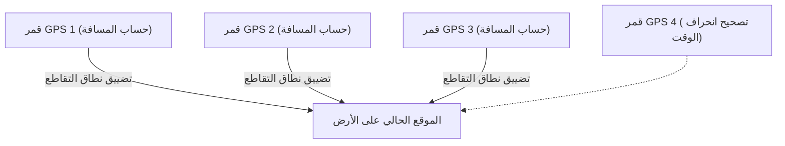

## 1. إشارات "الوقت" المرسلة من الفضاء

**نظام تحديد المواقع العالمي (GPS)** هو نظام طورته وزارة الدفاع الأمريكية في الأصل للأغراض العسكرية، ولكنه أصبح اليوم بنية تحتية لا غنى عنها في المجتمع الحديث، بدءًا من الهواتف الذكية وأنظمة الملاحة في السيارات وصولًا إلى الطيار الآلي في الطائرات.

يسيء الكثير من الناس الفهم معتقدين أن "الهاتف الذكي يرسل موجات لاسلكية إلى الأقمار الصناعية في الفضاء ليتم إخباره بموقعه". ولكن في الواقع، العكس هو الصحيح.

الهاتف الذكي **يستقبل فقط** الموجات اللاسلكية. هناك حوالي 30 قمرًا صناعيًا لنظام GPS تحلق على ارتفاع حوالي 20,000 كيلومتر في السماء، وهي ببساطة **تستمر في بث إشارات مستمرة باتجاه الأرض تحتوي على "موقعها الحالي (القمر الصناعي)" و"الوقت الحالي"**.

## 2. مبدأ "التثليث" لمعرفة موقعك

إذن، كيف يمكن للهاتف الذكي على الأرض معرفة موقعه الحالي باستخدام بيانات "الوقت" و"المكان" فقط من الأقمار الصناعية؟
يكمن السر في "**وقت وصول الموجات اللاسلكية**".

تنتقل الموجات اللاسلكية بنفس سرعة الضوء (حوالي 300,000 كيلومتر في الثانية).
لنفترض أن الوقت المرسل من قمر GPS كان "12:00:00.000"، والوقت الذي استقبله فيه الهاتف الذكي كان "12:00:00.067".
بما أن الموجات اللاسلكية استغرقت "0.067 ثانية" للوصول، فيمكن حساب المسافة بين القمر الصناعي والهاتف الذكي على أنها "سرعة الضوء × 0.067 ثانية = حوالي 20,000 كيلومتر".

1. إذا عرفت المسافة من قمر صناعي واحد، فإنك تعرف أنك "في مكان ما على سطح كروي نصف قطره 20,000 كم مركزه ذلك القمر الصناعي".
2. إذا عرفت المسافة من قمرين صناعيين، فيمكنك تضييق النطاق إلى أنك في مكان ما على "دائرة" حيث يتقاطع هذان الكرويان.
3. **إذا عرفت المسافة من ثلاثة أقمار صناعية، فيمكنك تضييق النطاق إلى "نقطتين" حيث تتقاطع الكرات.** (بما أن إحدى النقطتين ستكون في الفضاء، يتم تحديد الموقع الحالي على الأرض عن طريق الاستبعاد).

بمعنى آخر، **إذا تمكنت من استقبال إشارات من 3 أقمار GPS صناعية على الأقل، فيمكنك حساب مكانك على الأرض**. (في الواقع، هناك حاجة إلى إشارة من **قمر صناعي رابع** لتصحيح الانحراف في الساعة الداخلية للهاتف الذكي).

## 3. بدون النظرية النسبية لأينشتاين، سيختل نظام GPS

أهم شيء في حسابات GPS هو "الوقت". فانحراف بمقدار جزء من المليون من الثانية (1 ميكروثانية) سيؤدي إلى خطأ يبلغ حوالي 300 متر على الأرض. لذلك، يتم تجهيز أقمار GPS بـ "**ساعات ذرية**" فائقة الدقة لا تنحرف إلا بمقدار ثانية واحدة كل عشرات الآلاف من السنين.

ولكن هنا نقف أمام عقبة فيزيائية، وهي "**النظرية النسبية**" لأينشتاين.

1. **النسبية الخاصة (التأخير بسبب السرعة)**:
   تطير أقمار GPS بسرعة هائلة تبلغ حوالي 14,000 كم/ساعة. نظرًا لأن الوقت يمر بشكل أبطأ بالنسبة للأجسام التي تتحرك بسرعة أكبر، فإن ساعات الأقمار الصناعية **تتأخر بحوالي 7 ميكروثانية في اليوم** مقارنة بتلك الموجودة على الأرض.
2. **النسبية العامة (التقدم بسبب الجاذبية)**:
   في الفضاء على ارتفاع 20,000 كم، تكون جاذبية الأرض أضعف مما هي عليه على السطح. نظرًا لأن الوقت يمر بشكل أسرع في الأماكن ذات الجاذبية الأضعف، فإن ساعات الأقمار الصناعية **تتقدم بحوالي 45 ميكروثانية في اليوم** مقارنة بتلك الموجودة على الأرض.

ونتيجة لذلك، وبالطرح "45 - 7 = **38 ميكروثانية**"، فإن ساعات أقمار GPS تتقدم بشكل أسرع كل يوم مقارنة بتلك الموجودة على الأرض.
إذا قمنا بتشغيل نظام GPS دون تصحيح انحراف الوقت الناتج عن هذه النظرية النسبية، فوفقًا للحسابات، سيختل الموقع الحالي في نظام الملاحة بالسيارة بمقدار **حوالي 11 كيلومترًا** في يوم واحد فقط.
تقوم هواتفنا الذكية يوميًا بحساب معادلات أينشتاين لتحديد موقعنا الحالي.

## 4. دقة على مستوى السنتيمتر بفضل نظام Michibiki (QZSS)

هل لاحظت أن دقة تحديد المواقع في اليابان قد تحسنت بشكل أكبر في السنوات الأخيرة؟
ويرجع ذلك إلى بدء تشغيل نظام الأقمار الصناعية شبه السمتية "**Michibiki (QZSS)**"، والذي يتواجد دائمًا فوق اليابان.

من خلال استخدام إشارات "Michibiki" المرسلة من أعلى اليابان مباشرة (السمت) بالإضافة إلى أقمار GPS الأمريكية، أصبح من الصعب حجب الموجات اللاسلكية حتى بين ناطحات السحاب أو في المناطق الجبلية. وعلاوة على ذلك، باستخدام معدات مخصصة يمكنها استقبال إشارات تصحيح خاصة (إشارات L6)، يمكن تحديد الموقع الحالي بدقة مذهلة لا تتجاوز بضعة سنتيمترات من الخطأ، ويتم تطبيق ذلك في القيادة الذاتية للجرارات وتوصيل الطلبات بالطائرات بدون طيار (الدرون).

## 5. الخلاصة

إن "علامة الموقع الحالي الزرقاء" التي نراها على الخرائط دون تفكير هي ثمرة القوانين الفيزيائية العظيمة: الساعات الذرية في الفضاء، سرعة الضوء، والنظرية النسبية.
يمكن القول إن تقنية GPS هي واحدة من أعظم روائع البشرية، حيث تدمج ببراعة بين المنظور الكلي للفضاء والتقنية الجزئية للذرة.
