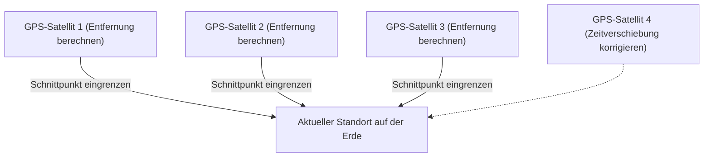

## 1. Das "Zeit"-Signal aus dem All

Das **GPS (Global Positioning System)** wurde ursprünglich vom US-Verteidigungsministerium für militärische Zwecke entwickelt, ist aber heute eine unverzichtbare Infrastruktur in der modernen Gesellschaft geworden, von Smartphones und Autonavigationssystemen bis hin zu Autopiloten in Flugzeugen.

Viele Menschen glauben fälschlicherweise, dass "das Smartphone Radiowellen an künstliche Satelliten im Weltraum sendet und diese ihm seinen Standort mitteilen". Tatsächlich ist jedoch das Gegenteil der Fall.
Das Smartphone **empfängt nur** Radiowellen. Die rund 30 GPS-Satelliten, die in einer Höhe von etwa 20.000 Kilometern fliegen, senden ununterbrochen Radiowellen mit ihrem **"aktuellen Standort (des Satelliten)" und der "aktuellen Uhrzeit"** zur Erde.

## 2. Das Prinzip der "Trilateration", um die eigene Position zu kennen

Aber warum kann das Smartphone auf der Erde allein durch die "Zeit"- und "Orts"-Daten vom Satelliten seinen aktuellen Standort kennen?
Der Schlüssel dazu liegt in der **"Ankunftszeit der Radiowellen"**.

Radiowellen breiten sich mit der gleichen Geschwindigkeit wie Licht aus (etwa 300.000 Kilometer pro Sekunde).
Angenommen, die vom GPS-Satelliten gesendete Zeit ist "12:00:00.000" und die Zeit, zu der das Smartphone sie empfängt, ist "12:00:00.067".
Da die Radiowellen "0,067 Sekunden" gebraucht haben, um anzukommen, lässt sich berechnen, dass die Entfernung zwischen dem Satelliten und dem Smartphone "Lichtgeschwindigkeit × 0,067 Sekunden = etwa 20.000 Kilometer" beträgt.

1. Wenn die Entfernung zu einem Satelliten bekannt ist, weiß man, dass man sich "irgendwo auf einer Kugeloberfläche mit einem Radius von 20.000 km um diesen Satelliten" befindet.
2. Wenn die Entfernung zu zwei Satelliten bekannt ist, lässt sich dies auf "irgendwo auf einem Kreis" eingrenzen, wo sich diese beiden Kugeln schneiden.
3. **Wenn die Entfernung zu drei Satelliten bekannt ist, lässt es sich auf "zwei Punkte" eingrenzen, an denen sich die Kugeln schneiden.** (Da einer davon im Weltraum liegt, wird der aktuelle Standort auf der Erde durch das Ausschlussverfahren bestimmt).

Das bedeutet: **Wenn man die Radiowellen von mindestens drei GPS-Satelliten empfangen kann, lässt sich berechnen, wo man sich auf der Erde befindet.** (Tatsächlich werden die Radiowellen eines **vierten Satelliten** benötigt, um die Abweichung der internen Uhr des Smartphones zu korrigieren).

## 3. Ohne Einsteins Relativitätstheorie gerät GPS aus den Fugen

Das Wichtigste bei der GPS-Berechnung ist die "Zeit". Eine Abweichung von einer Mikrosekunde (einem Millionstel einer Sekunde) führt auf der Erde zu einem Fehler von etwa 300 Metern. Aus diesem Grund sind GPS-Satelliten mit ultrapräzisen **"Atomuhren"** ausgestattet, die in zehntausend Jahren nur um eine Sekunde abweichen.

Doch hier steht uns die Barriere der Physik im Weg: Einsteins **"Relativitätstheorie"**.

1. **Spezielle Relativitätstheorie (Zeitdilatation durch Geschwindigkeit)**:
   GPS-Satelliten fliegen mit einer enormen Geschwindigkeit von etwa 14.000 km/h. Da die Zeit für sich schneller bewegende Objekte langsamer vergeht, läuft die Uhr des Satelliten **etwa 7 Mikrosekunden pro Tag langsamer** als auf der Erde.
2. **Allgemeine Relativitätstheorie (Zeitbeschleunigung durch Schwerkraft)**:
   Im Weltraum auf 20.000 km Höhe ist die Schwerkraft der Erde schwächer als am Boden. Da die Zeit an Orten mit schwächerer Schwerkraft schneller vergeht, läuft die Uhr des Satelliten **etwa 45 Mikrosekunden pro Tag schneller** als auf der Erde.

Infolgedessen läuft die Uhr des GPS-Satelliten durch die Verrechnung "45 - 7 = **38 Mikrosekunden**" jeden Tag schneller als auf der Erde.
Würde man GPS betreiben, ohne diese Zeitverschiebung durch die Relativitätstheorie zu korrigieren, wäre der aktuelle Standort im Autonavigationssystem nach nur einem Tag um **etwa 11 Kilometer verschoben**.
Unsere Smartphones berechnen jeden Tag Einsteins Gleichungen, um unseren aktuellen Standort zu ermitteln.

## 4. Zentimetergenauigkeit durch Michibiki (QZSS)

Haben Sie bemerkt, dass sich die Genauigkeit der Standortbestimmung in Japan in den letzten Jahren weiter verbessert hat?
Das liegt daran, dass das Quasi-Zenith-Satellitensystem **"Michibiki (QZSS)"**, das sich immer über Japan aufhält, seinen Betrieb aufgenommen hat.

Durch die Nutzung von "Michibiki", das nicht nur amerikanische GPS-Satelliten nutzt, sondern auch Radiowellen direkt von oben (Zenit) über Japan sendet, werden die Radiowellen selbst in Gebäudekomplexen und Bergregionen weniger blockiert. Darüber hinaus kann der aktuelle Standort mit speziellen Geräten, die das spezielle Korrektursignal (L6-Signal) empfangen können, mit einer Genauigkeit von nur wenigen Zentimetern ermittelt werden, was unter anderem für das fahrerlose Fahren von Traktoren und Drohnenlieferungen genutzt wird.

## 5. Fazit

Die "blaue Standortmarkierung", die wir beiläufig auf der Karte sehen, ist die Kristallisation großer physikalischer Gesetze: Atomuhren im Weltraum, die Lichtgeschwindigkeit und die Relativitätstheorie.
Die GPS-Technologie ist eines der größten Meisterwerke der Menschheit, das eine makroskopische Perspektive des Universums mit einer mikroskopischen Technologie von Atomen wunderbar verbindet.
