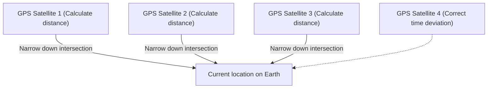

## 1. The "Time" Signal Sent from Space

**GPS (Global Positioning System)** was originally developed by the United States Department of Defense for military purposes, but it has now become an essential infrastructure in modern society, used in everything from smartphones and car navigation systems to aircraft autopilots.

Many people have the misconception that "a smartphone sends out radio waves to satellites in space to be told its location". However, the truth is actually the opposite.
The smartphone is **only receiving** radio waves. The approximately 30 GPS satellites flying at an altitude of about 20,000 kilometers are simply constantly **broadcasting their "own (satellite's) current position" and "current time" towards Earth**.

## 2. The Principle of "Trilateration" to Know Your Own Location

So, why can a smartphone on the ground determine its current location using only "time" and "location" data from satellites?
The key lies in the "**arrival time of the radio waves**".

Radio waves travel at the same speed as light (about 300,000 kilometers per second).
Suppose the time sent from a GPS satellite is "12:00:00.000" and the time the smartphone received it is "12:00:00.067".
The fact that it took "0.067 seconds" for the radio waves to arrive means that the distance between the satellite and the smartphone can be calculated as "speed of light × 0.067 seconds = about 20,000 kilometers".

1. If you know the distance from one satellite, you know that you are "somewhere on a sphere with a radius of 20,000 km centered on that satellite".
2. If you know the distances from two satellites, you can narrow it down to being somewhere on the "circle" where those two spheres intersect.
3. **If you know the distances from three satellites, you can narrow it down to the "two points" where the spheres intersect.** (Since one point will be in outer space, your current location on the ground is determined by process of elimination).

In other words, **if you can receive radio waves from at least three GPS satellites, you can calculate where you are on Earth**. (In reality, radio waves from a **fourth satellite** are necessary to correct the deviation of the smartphone's internal clock).

## 3. Without Einstein's Theory of Relativity, GPS Would Go Awry

The most important factor in GPS calculations is "time". A deviation of 1/1,000,000th of a second (1 microsecond) translates to an error of about 300 meters on the ground. For this reason, GPS satellites are equipped with ultra-precise "**atomic clocks**" that only deviate by 1 second every tens of thousands of years.

However, a wall of physics stands in the way here: Einstein's "**Theory of Relativity**".

1. **Special Relativity (Time dilation due to velocity)**:
   GPS satellites are flying at incredible speeds of about 14,000 km/h. Because time moves slower for faster-moving objects, the satellites' clocks are delayed by **about 7 microseconds per day** compared to those on the ground.
2. **General Relativity (Time advancing due to gravity)**:
   In outer space at an altitude of 20,000 km, the Earth's gravity is weaker than on the ground. Because time moves faster in places with weaker gravity, the satellites' clocks advance by **about 45 microseconds per day** compared to those on the ground.

As a result, subtracting the two, "45 - 7 = **38 microseconds**", the clocks on GPS satellites run faster than those on the ground every day.
If we were to operate GPS without correcting for this time difference due to the theory of relativity, a car navigation system's current location would be **off by about 11 kilometers** in just one day.
Our smartphones are calculating Einstein's equations every day to pinpoint our current location.

## 4. Centimeter-level Accuracy with Michibiki (QZSS)

Have you noticed that the accuracy of current locations in Japan has improved even further in recent years?
This is because the Quasi-Zenith Satellite System "**Michibiki (QZSS)**", which constantly stays above Japan, has started operation.

By utilizing "Michibiki", which sends radio waves from directly above (zenith) Japan in addition to American GPS satellites, it has become harder for radio waves to be blocked even in skyscraper districts or mountainous areas. Furthermore, by using dedicated equipment that can receive special correction signals (L6 signals), the current location can be pinpointed with an astonishing accuracy of just a few centimeters of error, which is being applied to the unmanned operation of tractors, drone deliveries, and more.

## 5. Conclusion

The "blue current location dot" on the maps we casually look at is the crystallization of grand physical laws: atomic clocks in space, the speed of light, and the theory of relativity.
GPS technology can be said to be one of humanity's greatest masterpieces, a brilliant fusion of a macro perspective of space and micro technology of atoms.
