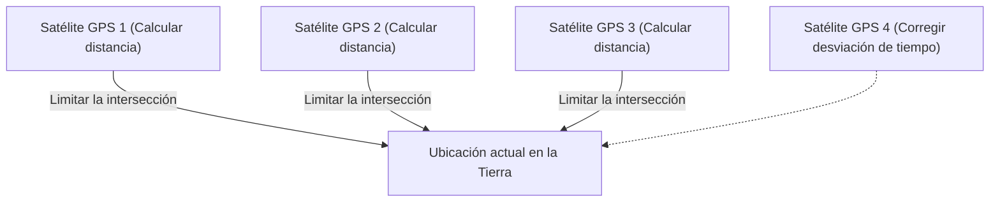

## 1. La señal de "tiempo" enviada desde el espacio

El **GPS (Global Positioning System: Sistema de Posicionamiento Global)** es un sistema desarrollado originalmente por el Departamento de Defensa de los EE. UU. para fines militares, pero hoy en día se ha convertido en una infraestructura esencial para la sociedad moderna, desde los teléfonos inteligentes y los sistemas de navegación de automóviles hasta el piloto automático de los aviones.

Muchas personas tienen el malentendido de que "el teléfono inteligente envía ondas de radio a los satélites artificiales en el espacio y estos le indican su ubicación". Sin embargo, la realidad es la contraria.
El teléfono inteligente **solo recibe** ondas de radio. Los aproximadamente 30 satélites GPS que vuelan a unos 20.000 kilómetros de altitud simplemente **transmiten de forma continua ondas de radio con su "ubicación actual (del satélite)" y la "hora actual" hacia la Tierra**.

## 2. El principio de "trilateración" para conocer tu propia ubicación

Entonces, ¿por qué los teléfonos inteligentes en la Tierra pueden conocer su ubicación actual solo con los datos de "tiempo" y "ubicación" de los satélites?
La clave está en el "**tiempo de llegada de las ondas de radio**".

Las ondas de radio viajan a la misma velocidad que la luz (aproximadamente 300.000 kilómetros por segundo).
Supongamos que la hora enviada por el satélite GPS fue "12:00:00.000" y la hora en que el teléfono inteligente la recibió fue "12:00:00.067".
El hecho de que las ondas de radio tardaran "0.067 segundos" en llegar significa que la distancia entre el satélite y el teléfono inteligente se puede calcular como "velocidad de la luz × 0.067 segundos = aproximadamente 20.000 kilómetros".

1. Si conoces la distancia desde un satélite, sabrás que estás "en algún lugar de la superficie de una esfera con un radio de 20.000 km centrada en ese satélite".
2. Si conoces la distancia desde dos satélites, puedes limitarlo a estar en algún lugar del "círculo" donde se cruzan esas dos esferas.
3. **Si conoces la distancia desde tres satélites, puedes limitarlo a "dos puntos" donde se cruzan las esferas.** (Como uno de ellos estará en el espacio exterior, la ubicación actual en la Tierra se determina por eliminación).

En resumen, **si puedes recibir ondas de radio de al menos 3 satélites GPS, puedes calcular en qué parte de la Tierra te encuentras.** (En realidad, se necesitan las ondas de radio de un **cuarto satélite** para corregir la desviación del reloj interno del teléfono inteligente).

## 3. Sin la teoría de la relatividad de Einstein, el GPS fallaría

Lo más importante en los cálculos del GPS es el "tiempo". Una desviación de una millonésima de segundo (1 microsegundo) se convierte en un error de aproximadamente 300 metros en tierra. Por esta razón, los satélites GPS están equipados con "**relojes atómicos**" ultraprecisos que solo se desvían 1 segundo cada decenas de miles de años.

Sin embargo, aquí surge un muro de la física. La "**teoría de la relatividad**" de Einstein.

1. **Teoría de la relatividad especial (retraso debido a la velocidad)**:
   Los satélites GPS vuelan a una velocidad vertiginosa de unos 14.000 km/h. Como el tiempo transcurre más lentamente cuanto más rápido se mueve algo, el reloj del satélite se retrasa **unos 7 microsegundos por día** en comparación con la Tierra.
2. **Teoría de la relatividad general (avance debido a la gravedad)**:
   El espacio exterior a 20.000 km de altitud tiene una gravedad terrestre más débil que en tierra. Como el tiempo transcurre más rápido en lugares con gravedad más débil, el reloj del satélite avanza **unos 45 microsegundos por día** en comparación con la Tierra.

Como resultado, restando "45 - 7 = **38 microsegundos**", el reloj del satélite GPS avanza más rápido cada día que en la Tierra.
Si se operara el GPS sin corregir esta desviación de tiempo debido a la teoría de la relatividad, se calcula que la ubicación actual en el sistema de navegación del automóvil **fallaría en unos 11 kilómetros** en solo un día.
Nuestros teléfonos inteligentes calculan las ecuaciones de Einstein todos los días para determinar nuestra ubicación actual.

## 4. Precisión centimétrica gracias a Michibiki (QZSS)

¿Te has dado cuenta de que en los últimos años la precisión de la ubicación actual en Japón ha mejorado aún más?
Esto se debe a que el Sistema de Satélites Cuasi-Cenitales "**Michibiki (QZSS)**", que permanece constantemente sobre Japón, ha comenzado a operar.

Al utilizar no solo los satélites GPS estadounidenses, sino también "Michibiki", que envía ondas de radio directamente desde arriba (cenit) de Japón, las ondas de radio son menos propensas a ser bloqueadas incluso en grupos de edificios o áreas montañosas. Además, si se utilizan equipos dedicados que pueden recibir señales de corrección especiales (señal L6), se puede especificar la ubicación actual con una asombrosa precisión de solo unos pocos centímetros de error, lo que se aplica a la conducción no tripulada de tractores y la entrega con drones.

## 5. Resumen

La "marca azul de ubicación actual" en el mapa que vemos casualmente es la cristalización de grandes leyes físicas: relojes atómicos en el espacio, la velocidad de la luz y la teoría de la relatividad.
Se puede decir que la tecnología GPS es una de las mayores obras maestras de la humanidad, donde se fusionan de manera brillante la perspectiva macro del universo y la tecnología micro de los átomos.
