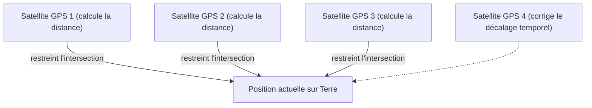

## 1. Le signal de "temps" envoyé depuis l'espace

Le **GPS (Global Positioning System : système mondial de positionnement)** est un système développé à l'origine par le Département de la Défense des États-Unis à des fins militaires, mais il est aujourd'hui une infrastructure indispensable de la société moderne, utilisée dans les smartphones, les systèmes de navigation automobile et le pilotage automatique des avions.

Beaucoup de gens pensent à tort que "le smartphone émet des ondes radio vers les satellites artificiels dans l'espace pour leur demander sa position". Mais en réalité, c'est l'inverse.
Le smartphone se contente de **recevoir** des ondes radio. Environ 30 satellites GPS volant à environ 20 000 kilomètres d'altitude ne font que **diffuser continuellement vers la Terre des ondes radio indiquant "leur propre position actuelle (celle du satellite)" et "l'heure actuelle"**.

## 2. Le principe de la "trilatération" pour connaître sa position

Alors, pourquoi le smartphone au sol peut-il connaître sa position actuelle avec seulement les données de "temps" et de "lieu" provenant des satellites ?
La clé réside dans le "**temps de parcours des ondes radio**".

Les ondes radio voyagent à la même vitesse que la lumière (environ 300 000 kilomètres par seconde).
Supposons que l'heure envoyée par le satellite GPS soit "12 heures 00 minute 00 seconde .000" et que l'heure à laquelle le smartphone la reçoit soit "12 heures 00 minute 00 seconde .067".
Le fait qu'il ait fallu "0,067 seconde" pour que l'onde radio arrive signifie que la distance entre le satellite et le smartphone peut être calculée comme suit : "vitesse de la lumière × 0,067 seconde = environ 20 000 kilomètres".

1. Si l'on connaît la distance depuis un seul satellite, on sait que l'on se trouve "quelque part sur une sphère de 20 000 km de rayon centrée sur ce satellite".
2. Si l'on connaît la distance depuis deux satellites, on peut restreindre la position à "quelque part sur un cercle" où les deux sphères se croisent.
3. **Si l'on connaît la distance depuis trois satellites, on peut restreindre la position aux "deux points" où les sphères se croisent.** (Comme l'un des points se trouve dans l'espace, la position actuelle au sol est déterminée par élimination).

En résumé, **il est possible de calculer sa position sur Terre si l'on peut recevoir les ondes radio d'au moins trois satellites GPS**. (En réalité, les ondes radio d'un **quatrième satellite** sont nécessaires pour corriger le décalage de l'horloge interne du smartphone).

## 3. Sans la théorie de la relativité d'Einstein, le GPS se dérèglerait

La chose la plus importante dans le calcul du GPS est le "temps". Un décalage d'un millionième de seconde (1 microseconde) entraîne une erreur d'environ 300 mètres au sol. Pour cette raison, les satellites GPS sont équipés d'une "**horloge atomique**" ultra-précise qui ne se décale que d'une seconde tous les dizaines de milliers d'années.

Cependant, un mur de la physique se dresse ici : la "**théorie de la relativité**" d'Einstein.

1. **Théorie de la relativité restreinte (retard dû à la vitesse)** :
   Les satellites GPS volent à une vitesse vertigineuse d'environ 14 000 km/h. Plus la vitesse est élevée, plus le temps s'écoule lentement, de sorte que l'horloge du satellite **retarde d'environ 7 microsecondes par jour** par rapport à celle de la Terre.
2. **Théorie de la relativité générale (avance due à la gravité)** :
   L'espace à 20 000 km d'altitude a une gravité terrestre plus faible qu'au sol. Plus la gravité est faible, plus le temps s'écoule rapidement, de sorte que l'horloge du satellite **avance d'environ 45 microsecondes par jour** par rapport à celle de la Terre.

En conséquence, avec une différence de "45 - 7 = **38 microsecondes**", l'horloge du satellite GPS avance tous les jours plus vite que celle de la Terre.
Si l'on utilisait le GPS sans corriger ce décalage temporel dû à la théorie de la relativité, la position actuelle du système de navigation automobile **se décalerait d'environ 11 kilomètres** en une seule journée.
Nos smartphones calculent chaque jour les équations d'Einstein pour déterminer notre position actuelle.

## 4. Précision de l'ordre du centimètre avec Michibiki (QZSS)

Avez-vous remarqué que la précision de localisation au Japon s'est encore améliorée ces dernières années ?
Ceci est dû à la mise en service du système de satellites quasi-zénithaux "**Michibiki (QZSS)**", qui reste constamment au-dessus du Japon.

En utilisant non seulement les satellites GPS américains, mais aussi "Michibiki", qui envoie des ondes radio directement au-dessus (zénith) du Japon, les ondes radio sont moins susceptibles d'être bloquées, même dans les zones de bâtiments ou les régions montagneuses. De plus, en utilisant des équipements dédiés capables de recevoir des signaux de correction spéciaux (signaux L6), la position actuelle peut être identifiée avec une précision redoutable, avec une erreur de quelques centimètres seulement, ce qui est appliqué à la conduite sans pilote de tracteurs et à la livraison par drones.

## 5. Conclusion

La "marque bleue de la position actuelle" sur la carte, que nous regardons sans y prêter attention, est l'aboutissement de lois physiques grandioses telles que les horloges atomiques dans l'espace, la vitesse de la lumière et la théorie de la relativité.
On peut dire que la technologie GPS est l'un des plus grands chefs-d'œuvre de l'humanité, alliant brillamment la perspective macroscopique de l'espace et la technologie microscopique de l'atome.
