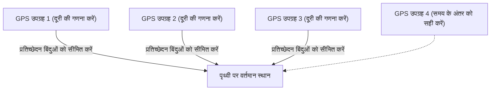

## 1. अंतरिक्ष से भेजे जाने वाले "समय" के संकेत

**GPS (ग्लोबल पोजिशनिंग सिस्टम: Global Positioning System)** मूल रूप से अमेरिकी रक्षा विभाग द्वारा सैन्य उद्देश्यों के लिए विकसित किया गया था, लेकिन आज यह स्मार्टफोन, कार नेविगेशन और यहां तक कि विमानों के ऑटोपायलट सहित आधुनिक समाज के लिए एक आवश्यक बुनियादी ढांचा बन गया है।

कई लोगों को यह गलतफहमी है कि "स्मार्टफोन अंतरिक्ष में कृत्रिम उपग्रहों को रेडियो तरंगें भेजते हैं और उनसे अपना स्थान पूछते हैं।" लेकिन वास्तव में यह इसके विपरीत है।
स्मार्टफोन केवल रेडियो तरंगें **प्राप्त कर रहे हैं**। पृथ्वी से लगभग 20,000 किलोमीटर ऊपर उड़ने वाले लगभग 30 GPS उपग्रह लगातार **"अपनी (उपग्रह की) वर्तमान स्थिति" और "वर्तमान समय" की रेडियो तरंगें पृथ्वी की ओर प्रसारित करते रहते हैं**।

## 2. अपना स्थान जानने का "त्रि-बिंदु मापन" सिद्धांत

तो, उपग्रहों से केवल "समय" और "स्थान" के डेटा के साथ जमीन पर मौजूद स्मार्टफोन अपना वर्तमान स्थान कैसे जान सकते हैं?
इसकी कुंजी "**रेडियो तरंगों के पहुंचने के समय**" में निहित है।

रेडियो तरंगें प्रकाश की गति (लगभग 300,000 किलोमीटर प्रति सेकंड) से चलती हैं।
मान लीजिए कि GPS उपग्रह से भेजा गया समय "12:00:00.000" है और स्मार्टफोन इसे "12:00:00.067" पर प्राप्त करता है।
रेडियो तरंगों को पहुंचने में "0.067 सेकंड" का समय लगा, जिसका अर्थ है कि उपग्रह और स्मार्टफोन के बीच की दूरी की गणना "प्रकाश की गति × 0.067 सेकंड = लगभग 20,000 किलोमीटर" के रूप में की जा सकती है।

1. यदि आप एक उपग्रह से दूरी जानते हैं, तो आप जानते हैं कि आप "उस उपग्रह को केंद्र मानकर 20,000 किमी त्रिज्या वाले गोले पर कहीं" हैं।
2. यदि आप दो उपग्रहों से दूरी जानते हैं, तो आप इसे उस "वृत्त" पर कहीं होने तक सीमित कर सकते हैं जहां वे दोनों गोले प्रतिच्छेद करते हैं।
3. **यदि आप तीन उपग्रहों से दूरी जानते हैं, तो आप इसे गोले के प्रतिच्छेद करने वाले "दो बिंदुओं" तक सीमित कर सकते हैं।** (चूंकि एक बिंदु बाहरी अंतरिक्ष में होगा, इसलिए विलोपन की प्रक्रिया द्वारा जमीन पर वर्तमान स्थान निर्धारित किया जाता है)।

दूसरे शब्दों में, **यदि आप कम से कम तीन GPS उपग्रहों से रेडियो तरंगें प्राप्त कर सकते हैं, तो आप गणना कर सकते हैं कि आप पृथ्वी पर कहां हैं।** (व्यवहार में, स्मार्टफोन की आंतरिक घड़ी में किसी भी विसंगति को दूर करने के लिए **चौथे उपग्रह** से रेडियो तरंगों की आवश्यकता होती है)।

## 3. आइंस्टीन के सापेक्षता के सिद्धांत के बिना, GPS काम नहीं करेगा

GPS की गणना में सबसे महत्वपूर्ण चीज "समय" है। 1 माइक्रोसेकंड (एक सेकंड का दस लाखवां हिस्सा) का अंतर जमीन पर लगभग 300 मीटर की त्रुटि में बदल जाता है। इसलिए, GPS उपग्रह अति-सटीक "**परमाणु घड़ियों**" से लैस हैं जो हज़ारों वर्षों में केवल 1 सेकंड पीछे होती हैं।

हालांकि, यहीं भौतिकी की दीवार आड़े आती है। आइंस्टीन का "**सापेक्षता का सिद्धांत**"।

1. **विशेष सापेक्षता (गति के कारण देरी)**:
   GPS उपग्रह लगभग 14,000 किमी/घंटा की तीव्र गति से उड़ रहे हैं। गति जितनी तेज़ होती है, समय उतनी ही धीमी गति से बीतता है, इसलिए उपग्रह की घड़ी जमीन की तुलना में **प्रति दिन लगभग 7 माइक्रोसेकंड धीमी** चलती है।
2. **सामान्य सापेक्षता (गुरुत्वाकर्षण के कारण तेजी)**:
   20,000 किमी की ऊंचाई पर अंतरिक्ष में, पृथ्वी का गुरुत्वाकर्षण जमीन की तुलना में कमजोर होता है। जहां गुरुत्वाकर्षण कमजोर होता है, वहां समय तेजी से बीतता है, इसलिए उपग्रह की घड़ी जमीन की तुलना में **प्रति दिन लगभग 45 माइक्रोसेकंड तेज** चलती है।

परिणामस्वरूप, "45 - 7 = **38 माइक्रोसेकंड**" को घटाने पर, GPS उपग्रहों की घड़ियां जमीन की तुलना में हर दिन तेजी से चलती हैं।
यदि हम इस सापेक्षता के सिद्धांत के कारण होने वाले समय के अंतर को ठीक किए बिना GPS का संचालन करते हैं, तो गणना बताती है कि कार नेविगेशन सिस्टम का वर्तमान स्थान केवल एक दिन में **लगभग 11 किलोमीटर गलत हो जाएगा**।
हमारे स्मार्टफोन हर दिन हमारी वर्तमान लोकेशन का पता लगाने के लिए आइंस्टीन के समीकरणों की गणना कर रहे हैं।

## 4. मिचिबिकी (QZSS) द्वारा सेंटीमीटर-स्तरीय सटीकता

क्या आपने देखा है कि हाल के वर्षों में जापान में लोकेशन सटीकता में और सुधार हुआ है?
ऐसा इसलिए है क्योंकि क्वासी-जेनिथ सैटेलाइट सिस्टम "**मिचिबिकी (QZSS)**", जो हमेशा जापान के ठीक ऊपर रहता है, ने काम करना शुरू कर दिया है।

न केवल अमेरिकी GPS उपग्रहों का उपयोग करके, बल्कि "मिचिबिकी" का भी उपयोग करके, जो सीधे जापान के ऊपर (ज़ेनिथ) से रेडियो तरंगें भेजता है, इमारतों और पहाड़ी क्षेत्रों के बीच भी रेडियो तरंगों के ब्लॉक होने की संभावना कम हो गई है। इसके अलावा, यदि आप एक समर्पित उपकरण का उपयोग करते हैं जो एक विशेष सुधार संकेत (L6 संकेत) प्राप्त कर सकता है, तो वर्तमान स्थान को केवल कुछ सेंटीमीटर की त्रुटि के साथ अविश्वसनीय सटीकता के साथ निर्धारित किया जा सकता है, और इसे मानव रहित ट्रैक्टर संचालन और ड्रोन डिलीवरी में लागू किया जा रहा है।

## 5. निष्कर्ष

मैप पर "नीला वर्तमान स्थान चिह्न" जिसे हम लापरवाही से देखते हैं, वह अंतरिक्ष में परमाणु घड़ियों, प्रकाश की गति और सापेक्षता के सिद्धांत के भव्य भौतिक नियमों का क्रिस्टलीकरण है।
GPS तकनीक को मानव जाति की महानतम कृतियों में से एक कहा जा सकता है, जहां अंतरिक्ष का मैक्रो परिप्रेक्ष्य और परमाणुओं की सूक्ष्म तकनीक पूरी तरह से विलीन हो जाती है。
