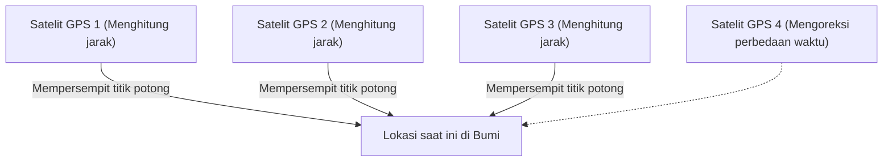

## 1. Sinyal "Waktu" yang Dikirim dari Luar Angkasa

**GPS (Global Positioning System)** awalnya adalah sistem yang dikembangkan oleh Departemen Pertahanan Amerika Serikat untuk tujuan militer, namun saat ini telah menjadi infrastruktur yang sangat penting bagi masyarakat modern, mulai dari ponsel pintar, sistem navigasi mobil, hingga autopilot pesawat terbang.

Banyak orang salah paham bahwa "ponsel pintar memancarkan gelombang radio ke satelit buatan di luar angkasa agar diberi tahu lokasinya". Namun kenyataannya justru sebaliknya.
Ponsel pintar **hanya menerima** gelombang radio. Sekitar 30 satelit GPS yang terbang di ketinggian sekitar 20.000 kilometer di atas langit terus-menerus **hanya memancarkan gelombang radio berisi "posisi satelit itu sendiri" dan "waktu saat ini" ke arah Bumi**.

## 2. Prinsip "Trilaterasi" untuk Mengetahui Posisi Anda

Lalu, mengapa hanya dengan data "waktu" dan "lokasi" dari satelit, ponsel pintar di Bumi dapat mengetahui lokasinya saat ini?
Kuncinya ada pada "**waktu tempuh gelombang radio**".

Gelombang radio bergerak dengan kecepatan yang sama dengan cahaya (sekitar 300.000 kilometer per detik).
Misalnya, waktu yang dikirim dari satelit GPS adalah "12:00:00.000", dan waktu ponsel pintar menerimanya adalah "12:00:00.067".
Fakta bahwa gelombang radio membutuhkan waktu "0,067 detik" untuk tiba berarti jarak antara satelit dan ponsel pintar dapat dihitung sebagai "kecepatan cahaya × 0,067 detik = sekitar 20.000 kilometer".

1. Jika jarak dari satu satelit diketahui, kita tahu bahwa kita berada di "suatu tempat di permukaan bola dengan radius 20.000 km yang berpusat pada satelit tersebut".
2. Jika jarak dari dua satelit diketahui, posisinya dapat dipersempit menjadi "lingkaran" di mana kedua bola tersebut berpotongan.
3. **Jika jarak dari tiga satelit diketahui, posisinya dapat dipersempit menjadi "dua titik" di mana bola-bola tersebut berpotongan.** (Satu titik berada di luar angkasa, jadi melalui proses eliminasi, lokasi di permukaan bumi dapat dipastikan).

Dengan kata lain, **jika Anda dapat menerima gelombang radio dari setidaknya tiga satelit GPS, Anda dapat menghitung di mana letak Anda di Bumi**. (Dalam praktiknya, gelombang radio dari **satelit keempat** diperlukan untuk mengoreksi perbedaan waktu pada jam internal ponsel pintar).

## 3. Tanpa Teori Relativitas Einstein, GPS Akan Kacau

Hal yang paling penting dalam perhitungan GPS adalah "waktu". Perbedaan sepersejuta detik (1 mikrodetik) dapat menyebabkan kesalahan sekitar 300 meter di permukaan bumi. Oleh karena itu, satelit GPS dilengkapi dengan "**jam atom**" yang sangat presisi, yang hanya meleset 1 detik setiap puluhan ribu tahun.

Namun, di sinilah hambatan fisika muncul, yaitu "**teori relativitas**" Einstein.

1. **Teori relativitas khusus (Keterlambatan akibat kecepatan)**:
   Satelit GPS terbang dengan kecepatan luar biasa sekitar 14.000 km/jam. Karena waktu berjalan lebih lambat seiring bertambahnya kecepatan, jam satelit akan **melambat sekitar 7 mikrodetik per hari** dibandingkan jam di Bumi.
2. **Teori relativitas umum (Percepatan akibat gravitasi)**:
   Di luar angkasa dengan ketinggian 20.000 km, gravitasi Bumi lebih lemah daripada di permukaan. Karena waktu berjalan lebih cepat di tempat dengan gravitasi yang lebih lemah, jam satelit akan **maju sekitar 45 mikrodetik per hari** dibandingkan jam di Bumi.

Akibatnya, setelah dikurangi "45 - 7 = **38 mikrodetik**", jam satelit GPS berjalan lebih cepat setiap harinya dibandingkan jam di Bumi.
Jika GPS dioperasikan tanpa mengoreksi perbedaan waktu akibat teori relativitas ini, posisi pada sistem navigasi mobil akan **bergeser sekitar 11 kilometer** hanya dalam satu hari.
Setiap hari, ponsel pintar kita menghitung persamaan Einstein untuk menentukan lokasi saat ini.

## 4. Akurasi Tingkat Sentimeter dengan Michibiki (QZSS)

Pernahkah Anda menyadari bahwa akurasi lokasi menjadi lebih baik akhir-akhir ini?
Ini karena pengoperasian Sistem Satelit Kuasi-Zenit "**Michibiki (QZSS)**", yang selalu berada di atas wilayah Jepang.

Dengan menggunakan "Michibiki", yang mengirimkan gelombang radio langsung dari atas (zenit) wilayah Jepang, bukan hanya satelit GPS Amerika, sinyal menjadi tidak mudah terhalang bahkan di antara gedung-gedung tinggi atau daerah pegunungan. Selain itu, dengan menggunakan peralatan khusus yang dapat menerima sinyal koreksi khusus (sinyal L6), lokasi saat ini dapat ditentukan dengan akurasi yang menakjubkan, dengan kesalahan hanya beberapa sentimeter, yang kemudian diaplikasikan pada traktor tanpa awak dan pengiriman dengan drone.

## 5. Kesimpulan

"Tanda biru lokasi saat ini" yang biasa kita lihat di peta adalah hasil karya gabungan dari hukum fisika yang luar biasa, yaitu jam atom di luar angkasa, kecepatan cahaya, dan teori relativitas.
Teknologi GPS dapat dikatakan sebagai salah satu mahakarya terbaik umat manusia, yang menggabungkan perspektif makro alam semesta dengan teknologi mikro pada tingkat atom.
