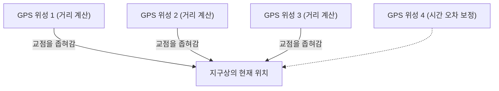

## 1. 우주에서 보내는 '시간'의 신호

**GPS(Global Positioning System: 전 지구 측위 시스템)** 는 원래 미국 국방부가 군사 목적으로 개발한 시스템이지만, 현재는 스마트폰이나 내비게이션, 항공기의 자동 조종에 이르기까지 현대 사회에 없어서는 안 될 인프라가 되었습니다.

많은 사람은 '스마트폰이 우주의 인공위성을 향해 전파를 보내고, 위치를 안내받는다'고 오해합니다. 하지만 실제로는 그 반대입니다.
스마트폰은 전파를 **수신하고 있을 뿐** 입니다. 상공 약 2만 킬로미터를 날고 있는 약 30개의 GPS 위성은 오로지 **'자신(위성)의 현재 위치'** 와 **'현재 시각'** 의 전파를 지구를 향해 계속 흘려보내고 있을 뿐입니다.

## 2. 자신의 위치를 아는 '삼변측량'의 원리

그렇다면 어떻게 위성에서 온 '시간'과 '장소' 데이터만으로 지상의 스마트폰은 자신의 현재 위치를 알 수 있는 것일까요?
그 열쇠는 **'전파의 도달 시간'** 에 있습니다.

전파는 빛과 같은 속도(초속 약 30만 킬로미터)로 나아갑니다.
만약 GPS 위성에서 보내온 시각이 '12시 00분 00초 .000'이고, 스마트폰이 그것을 수신한 시각이 '12시 00분 00초 .067'이었다고 가정해 봅시다.
전파가 도달하는 데 '0.067초'가 걸렸다는 것은 위성과 스마트폰의 거리가 '빛의 속도 × 0.067초 = 약 2만 킬로미터'라고 계산할 수 있습니다.

1. 1개의 위성으로부터의 거리를 알면, 자신이 '그 위성을 중심으로 한 반지름 2만 km 구면의 어딘가'에 있다는 것을 알 수 있습니다.
2. 2개의 위성으로부터의 거리를 알면, 그 두 구가 교차하는 '원'의 어딘가에 있다고 좁힐 수 있습니다.
3. **3개의 위성으로부터의 거리를 알면, 구가 교차하는 '두 개의 점'으로까지 좁힐 수 있습니다.** (하나는 우주 공간이 되기 때문에, 소거법으로 지상의 현재 위치가 확정됩니다).

즉, **최소 3개의 GPS 위성 전파를 수신할 수 있다면 지구상 어디에 있는지 계산할 수 있는** 것입니다. (실제로는 스마트폰 내장 시계의 오차를 보정하기 위해 **4번째 위성** 의 전파가 필요합니다).

## 3. 아인슈타인의 상대성이론이 없으면 GPS는 어긋난다

GPS 계산에서 가장 중요한 것은 '시간'입니다. 100만 분의 1초(1마이크로초)의 오차가 지상에서는 약 300미터의 오차가 되어 버립니다. 그래서 GPS 위성에는 수만 년에 1초밖에 틀리지 않는 초정밀 **'원자시계'** 가 탑재되어 있습니다.

하지만 여기서 물리학의 벽이 가로막습니다. 바로 아인슈타인의 **'상대성이론'** 입니다.

1. **특수 상대성이론(속도에 의한 지연)**:
   GPS 위성은 시속 약 1만 4000km라는 맹렬한 속도로 날고 있습니다. 속도가 빠를수록 시간의 흐름이 느려지기 때문에, 위성의 시계는 지상보다 **하루에 약 7마이크로초 느려집니다**.
2. **일반 상대성이론(중력에 의한 빠름)**:
   고도 2만 km의 우주 공간은 지상보다 지구의 중력이 약합니다. 중력이 약한 곳일수록 시간의 흐름이 빨라지기 때문에, 위성의 시계는 지상보다 **하루에 약 45마이크로초 빨라집니다**.

결과적으로 이를 빼면 '45 - 7 = **38마이크로초**', GPS 위성의 시계는 지상보다 매일 빠르게 진행되어 버리는 것입니다.
만약 이 상대성이론에 의한 시간의 오차를 보정하지 않고 GPS를 운용하면, 단 하루 만에 내비게이션의 현재 위치가 **약 11킬로미터나 어긋나버리는** 계산이 됩니다.
우리의 스마트폰은 매일 아인슈타인의 방정식을 계산해서 현재 위치를 알아내고 있는 것입니다.

## 4. 미치비키(QZSS)에 의한 센티미터급 정밀도

최근 일본의 현재 위치 정밀도가 더욱 향상되었다는 것을 눈치채셨나요?
이것은 일본 상공에 항상 머무는 준천정 위성 시스템 **'미치비키(QZSS)'** 가 운용을 시작했기 때문입니다.

미국의 GPS 위성뿐만 아니라 일본의 바로 위(천정)에서 전파를 보내는 '미치비키'를 이용함으로써 빌딩 숲이나 산간 지역에서도 전파가 차단되기 어려워졌습니다. 또한, 특수한 보정 신호(L6 신호)를 수신할 수 있는 전용 기기를 사용하면 오차 단 몇 센티미터라는 경이로운 정밀도로 현재 위치를 특정할 수 있어, 트랙터의 무인 운전이나 드론 배송 등에 응용되고 있습니다.

## 5. 요약

우리가 무심코 보는 지도의 '파란색 현재 위치 마크'는 우주 공간의 원자시계, 빛의 속도, 그리고 상대성이론이라는 장대한 물리 법칙의 결정체입니다.
GPS 기술은 우주라는 거시적인 시점과 원자라는 미시적인 기술이 훌륭하게 융합된, 인류 최고 걸작 중 하나라고 할 수 있을 것입니다.
