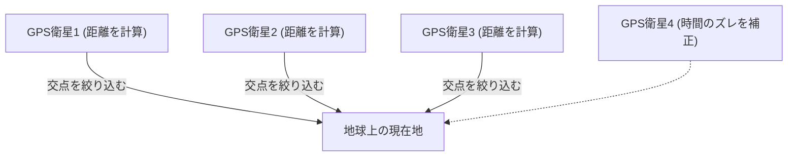

## 1. 宇宙から送られる「時間」のシグナル

<strong>GPS（Global Positioning System: 全地球測位システム）</strong>は、もともとアメリカ国防総省が軍事目的で開発したシステムですが、現在ではスマートフォンやカーナビ、航空機の自動操縦まで、現代社会に不可欠なインフラとなっています。

多くの人は「スマホが宇宙の人工衛星に向けて電波を出し、場所を教えてもらっている」と誤解しています。しかし実際は逆です。
スマホは電波を**受信しているだけ**です。上空約2万キロメートルを飛んでいる約30個のGPS衛星は、ただひたすらに<strong>「自分（衛星）の現在位置」と「現在時刻」の電波を地球に向かって垂れ流し続けている</strong>だけなのです。

## 2. 自分の位置を知る「三点測位」の原理

では、なぜ衛星からの「時間」と「場所」のデータだけで、地上のスマホは自分の現在地を知ることができるのでしょうか？
その鍵は「**電波の到達時間**」にあります。

電波は光と同じスピード（秒速約30万キロメートル）で進みます。
もし、GPS衛星から送られてきた時刻が「12時00分00秒.000」で、スマホがそれを受信した時刻が「12時00分00秒.067」だったとします。
電波が届くのに「0.067秒」かかったということは、衛星とスマホの距離は「光の速さ × 0.067秒 = 約2万キロメートル」だと計算できます。

1. 1つの衛星からの距離がわかれば、自分が「その衛星を中心とした半径2万kmの球面のどこか」にいることがわかります。
2. 2つの衛星からの距離がわかれば、その2つの球が交わる「円」のどこかにいると絞り込めます。
3. **3つの衛星からの距離がわかれば、球が交わる「2つの点」にまで絞り込めます。**（一方は宇宙空間になるため、消去法で地上の現在地が確定します）。

つまり、**最低3つのGPS衛星の電波を受信できれば、地球上のどこにいるかが計算できる**のです。（実際には、スマホの内蔵時計のズレを補正するために、**4つ目の衛星**の電波が必要になります）。

## 3. アインシュタインの相対性理論がないとGPSは狂う

GPSの計算で最も重要なのは「時間」です。100万分の1秒（1マイクロ秒）のズレが、地上では約300メートルの誤差になってしまいます。そのため、GPS衛星には数万年に1秒しか狂わない超精密な「**原子時計**」が搭載されています。

しかし、ここで物理学の壁が立ちはだかります。アインシュタインの「**相対性理論**」です。

1. **特殊相対性理論（速度による遅れ）**:
   GPS衛星は時速約1万4000kmという猛スピードで飛んでいます。速度が速いものほど時間の進み方が遅くなるため、衛星の時計は地上よりも**1日あたり約7マイクロ秒遅れます**。
2. **一般相対性理論（重力による進み）**:
   高度2万kmの宇宙空間は、地上よりも地球の重力が弱いです。重力が弱い場所ほど時間の進み方が速くなるため、衛星の時計は地上よりも**1日あたり約45マイクロ秒進みます**。

結果として、差し引き「45 - 7 = **38マイクロ秒**」、GPS衛星の時計は地上よりも毎日早く進んでしまうのです。
もしこの相対性理論による時間のズレを補正せずにGPSを運用すると、たった1日でカーナビの現在地が**約11キロメートルも狂ってしまう**計算になります。
私たちのスマホは、毎日アインシュタインの方程式を計算して現在地を割り出しているのです。

## 4. みちびき（QZSS）によるセンチメートル級の精度

近年、日本の現在地精度がさらに向上していることに気づいたでしょうか？
これは、日本上空に常に滞在する準天頂衛星システム「**みちびき（QZSS）**」が運用を開始したためです。

アメリカのGPS衛星だけでなく、日本の真上（天頂）から電波を送る「みちびき」を利用することで、ビル群や山間部でも電波が遮られにくくなりました。さらに、特殊な補正信号（L6信号）を受信できる専用機器を使えば、誤差わずか数センチメートルという脅威的な精度で現在地を特定でき、トラクターの無人運転やドローン配達などに応用されています。

## 5. まとめ

私たちが何気なく見ているマップの「青い現在地マーク」は、宇宙空間の原子時計、光の速度、そして相対性理論という壮大な物理法則の結晶です。
GPSの技術は、宇宙というマクロな視点と、原子というミクロな技術が見事に融合した、人類最高傑作の一つと言えるでしょう。
