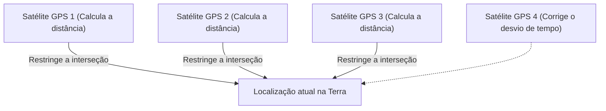

## 1. O Sinal do "Tempo" Enviado do Espaço

O **GPS (Global Positioning System: Sistema de Posicionamento Global)** é um sistema originalmente desenvolvido pelo Departamento de Defesa dos Estados Unidos para fins militares, mas hoje tornou-se uma infraestrutura essencial para a sociedade moderna, desde smartphones e sistemas de navegação automotiva até o piloto automático de aeronaves.

Muitas pessoas têm o equívoco de que "o smartphone emite ondas de rádio para os satélites artificiais no espaço e pede que informem a sua localização". No entanto, a realidade é o oposto.
O smartphone está apenas **recebendo** as ondas de rádio. Cerca de 30 satélites GPS, que voam a aproximadamente 20.000 quilômetros acima da superfície, estão constante e incessantemente **transmitindo ondas de rádio em direção à Terra com a sua própria "posição atual (do satélite)" e "hora atual"**.

## 2. O Princípio da "Trilateração" para Conhecer a Sua Posição

Então, como é que o smartphone na Terra consegue saber a sua posição atual apenas com os dados de "tempo" e "localização" dos satélites?
A chave para isso está no "**tempo de chegada das ondas de rádio**".

As ondas de rádio viajam à mesma velocidade que a luz (cerca de 300.000 quilômetros por segundo).
Suponha que a hora enviada pelo satélite GPS seja "12 horas 00 minutos 00 segundos.000" e a hora em que o smartphone a recebe seja "12 horas 00 minutos 00 segundos.067".
Se demorou "0,067 segundos" para as ondas de rádio chegarem, podemos calcular que a distância entre o satélite e o smartphone é de "velocidade da luz × 0,067 segundos = cerca de 20.000 quilômetros".

1. Se você souber a distância de um satélite, você sabe que está em "algum lugar em uma superfície esférica com um raio de 20.000 km centrada nesse satélite".
2. Se você souber as distâncias de dois satélites, você pode restringir a sua localização a "algum lugar no círculo" onde essas duas esferas se cruzam.
3. **Se você souber as distâncias de três satélites, você pode restringir ainda mais aos "dois pontos" onde as esferas se cruzam.** (Como um deles estará no espaço sideral, a posição atual na Terra é confirmada por processo de eliminação).

Em outras palavras, **se você puder receber ondas de rádio de pelo menos três satélites GPS, é possível calcular onde você está na Terra**. (Na realidade, as ondas de rádio de um **quarto satélite** são necessárias para corrigir o desvio do relógio interno do smartphone).

## 3. Sem a Teoria da Relatividade de Einstein, o GPS Enlouqueceria

O aspecto mais importante dos cálculos do GPS é o "tempo". Um desvio de 1 milionésimo de segundo (1 microssegundo) resulta em um erro de cerca de 300 metros no solo. Por isso, os satélites GPS estão equipados com um "**relógio atômico**" ultrapreciso que se desvia apenas 1 segundo a cada dezenas de milhares de anos.

No entanto, aqui, a barreira da física se impõe. É a "**Teoria da Relatividade**" de Einstein.

1. **Teoria da Relatividade Restrita (Atraso devido à velocidade)**:
   Os satélites GPS voam a uma velocidade feroz de cerca de 14.000 km/h. Como o tempo passa mais lentamente para os objetos que se movem mais rapidamente, os relógios dos satélites atrasam cerca de **7 microssegundos por dia** em comparação com os da Terra.
2. **Teoria da Relatividade Geral (Avanço devido à gravidade)**:
   A gravidade da Terra é mais fraca no espaço sideral, a uma altitude de 20.000 km, do que no solo. Como o tempo passa mais rápido em lugares com gravidade mais fraca, os relógios dos satélites avançam cerca de **45 microssegundos por dia** em comparação com os da Terra.

Como resultado, descontando "45 - 7 = **38 microssegundos**", os relógios dos satélites GPS avançam mais rápido todos os dias em comparação com o solo.
Se operássemos o GPS sem corrigir esse desvio de tempo devido à teoria da relatividade, a posição atual no sistema de navegação automotiva se desviaria em **cerca de 11 quilômetros** em apenas um dia.
Nossos smartphones estão calculando a equação de Einstein todos os dias para determinar a nossa localização atual.

## 4. Precisão em Nível de Centímetro com o Michibiki (QZSS)

Você notou que a precisão da localização atual no Japão melhorou ainda mais nos últimos anos?
Isso ocorreu porque o Quasi-Zenith Satellite System "**Michibiki (QZSS)**", que permanece constantemente sobre o Japão, iniciou as operações.

Ao utilizar não apenas satélites GPS americanos, mas também o "Michibiki", que transmite ondas de rádio diretamente de cima (zênite) do Japão, as ondas de rádio tornaram-se menos propensas a serem bloqueadas por edifícios e áreas montanhosas. Além disso, usando equipamentos dedicados capazes de receber um sinal de correção especial (sinal L6), a posição atual pode ser identificada com uma precisão impressionante e um erro de apenas alguns centímetros, o que está sendo aplicado na condução não tripulada de tratores, entregas por drones, etc.

## 5. Resumo

A "marca azul de localização atual" nos mapas que olhamos casualmente é o cristal de grandiosas leis físicas: relógios atômicos no espaço sideral, a velocidade da luz e a teoria da relatividade.
A tecnologia GPS é onde a perspectiva macroscópica do espaço sideral e a tecnologia microscópica dos átomos se fundem brilhantemente, e pode-se dizer que é uma das maiores obras-primas da humanidade.
