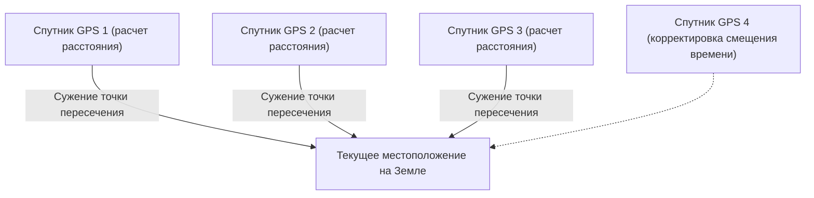

## 1. Сигналы «времени», посылаемые из космоса

**GPS (Global Positioning System: Глобальная система позиционирования)** изначально была разработана Министерством обороны США для военных целей, но сегодня она стала важнейшей инфраструктурой современного общества, начиная от смартфонов и автомобильных навигаторов и заканчивая автопилотами самолетов.

Многие люди ошибочно полагают, что «смартфон излучает радиоволны на искусственные спутники в космосе, чтобы они сообщили ему его местоположение». На самом деле все обстоит с точностью до наоборот.
Смартфоны **только принимают** радиоволны. Около 30 спутников GPS, летящих на высоте около 20 000 километров над землей, просто непрерывно **посылают радиоволны со своим «текущим положением (спутника)» и «текущим временем» на Землю**.

## 2. Принцип «трилатерации» для определения собственного местоположения

Тогда почему наземные смартфоны могут узнавать свое текущее местоположение только по данным о «времени» и «месте» со спутников?
Ключ к этому — **время прибытия радиоволн**.

Радиоволны распространяются со скоростью света (около 300 000 километров в секунду).
Предположим, что время, переданное со спутника GPS, — «12:00:00.000», а время, когда смартфон его принял, — «12:00:00.067».
То, что радиоволне потребовалось «0.067 секунды», означает, что расстояние между спутником и смартфоном можно рассчитать как «скорость света × 0.067 секунды = около 20 000 километров».

1. Если вы знаете расстояние от одного спутника, вы можете понять, что находитесь «где-то на поверхности сферы радиусом 20 000 км с центром в этом спутнике».
2. Если вы знаете расстояние от двух спутников, вы можете сузить область до «окружности», где пересекаются эти две сферы.
3. **Если вы знаете расстояние от трех спутников, вы можете сузить область до «двух точек», где пересекаются сферы.** (Поскольку одна из них будет находиться в космосе, текущее местоположение на земле определяется методом исключения).

Другими словами, **если вы можете получить радиоволны по крайней мере от трех спутников GPS, вы можете рассчитать, где вы находитесь на Земле**. (На самом деле радиоволны от **четвертого спутника** необходимы для корректировки отклонения встроенных часов смартфона).

## 3. Без теории относительности Эйнштейна GPS бы сбился с пути

Самое важное в расчетах GPS — это «время». Отклонение в одну миллионную долю секунды (1 микросекунда) приведет к ошибке примерно в 300 метров на земле. По этой причине спутники GPS оснащены сверхточными **атомными часами**, которые сбиваются лишь на 1 секунду за десятки тысяч лет.

Однако здесь мы сталкиваемся со стеной физики — **теорией относительности** Эйнштейна.

1. **Специальная теория относительности (замедление из-за скорости)**:
   Спутники GPS летят с невероятной скоростью около 14 000 км/ч. Чем выше скорость объекта, тем медленнее для него течет время, поэтому часы на спутнике **отстают примерно на 7 микросекунд в день** по сравнению с земными.
2. **Общая теория относительности (ускорение из-за гравитации)**:
   В космосе на высоте 20 000 км земное притяжение слабее, чем на поверхности. Чем слабее гравитация, тем быстрее течет время, поэтому часы на спутнике **спешат примерно на 45 микросекунд в день** по сравнению с земными.

В результате разница составляет «45 - 7 = **38 микросекунд**», и часы спутника GPS идут быстрее земных каждый день.
Если бы система GPS работала без корректировки этого временного сдвига, вызванного теорией относительности, то, по расчетам, всего за один день текущее местоположение в автомобильном навигаторе **сбилось бы примерно на 11 километров**.
Наши смартфоны каждый день вычисляют уравнения Эйнштейна, чтобы определить наше текущее местоположение.

## 4. Точность до сантиметра с помощью Michibiki (QZSS)

Вы заметили, что точность определения местоположения в Японии в последние годы еще больше повысилась?
Это связано с тем, что начала работать Квазизенитная спутниковая система **Michibiki (QZSS)**, которая постоянно находится над Японией.

Использование не только американских спутников GPS, но и «Michibiki», посылающего радиоволны прямо над Японией (из зенита), сделало радиоволны менее подверженными блокировке зданиями и горами. Кроме того, при использовании специального оборудования, способного принимать специальный корректирующий сигнал (сигнал L6), текущее местоположение можно определить с невероятной точностью и погрешностью всего в несколько сантиметров, что находит применение в таких областях, как беспилотное вождение тракторов и доставка дронами.

## 5. Заключение

«Синий маркер текущего местоположения» на картах, на который мы смотрим, не задумываясь, — это кристаллизация грандиозных законов физики: атомных часов в космосе, скорости света и теории относительности.
Технологию GPS можно назвать одним из величайших шедевров человечества, где макроскопическая перспектива космоса блестяще сливается с микроскопической технологией атомов.
