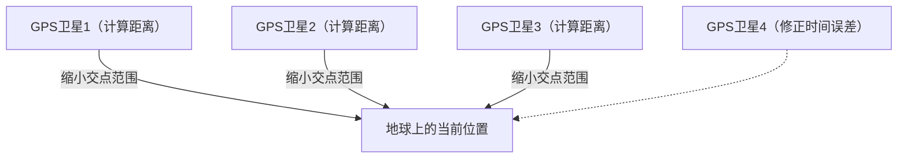

## 1. 来自太空的“时间”信号

**GPS（Global Positioning System：全球定位系统）** 最初是美国国防部为军事目的开发的系统，但现在已成为智能手机、车载导航甚至飞机自动驾驶等现代社会不可或缺的基础设施。

许多人误以为“智能手机向太空中的人造卫星发送电波，从而获知自己的位置”。但实际上恰恰相反。
智能手机只是在 **单纯地接收** 电波。在距离地面约2万公里高空飞行的约30颗GPS卫星，只是在不断地向地球 **发送“自己（卫星）的当前位置”和“当前时间”的电波** 而已。

## 2. 获知自身位置的“三点定位”原理

那么，为什么仅凭来自卫星的“时间”和“位置”数据，地面的智能手机就能知道自己的当前位置呢？
其关键在于“ **电波的到达时间** ”。

电波以光速（约每秒30万公里）传播。
假设GPS卫星发送的时间是“12点00分00秒.000”，而智能手机接收到该电波的时间是“12点00分00秒.067”。
电波到达花费了“0.067秒”，由此可以计算出卫星与智能手机之间的距离为“光速 × 0.067秒 = 约2万公里”。

1. 如果知道与1颗卫星的距离，就能知道自己位于“以该卫星为中心、半径2万公里的球面上某处”。
2. 如果知道与2颗卫星的距离，就能将范围缩小到这两个球面相交的“圆”上的某处。
3. **如果知道与3颗卫星的距离，就能将范围缩小到球面相交的“2个点”。** （由于其中一个点在太空中，通过排除法就可以确定地面上的当前位置）。

也就是说， **只要能接收到至少3颗GPS卫星的电波，就可以计算出你位于地球上的哪个位置** 。（实际上，为了修正智能手机内置时钟的误差，还需要 **第4颗卫星** 的电波）。

## 3. 没有爱因斯坦的相对论，GPS就会出现偏差

GPS计算中最重要的是“时间”。100万分之一秒（1微秒）的误差，在地面上就会造成约300米的距离误差。因此，GPS卫星搭载了数万年才误差1秒的超精密“ **原子钟** ”。

然而，在这里出现了一道物理学的壁垒。那就是爱因斯坦的“ **相对论** ”。

1. **狭义相对论（速度导致的时间变慢）** ：
   GPS卫星正以约每小时1万4000公里的极高速度飞行。物体运动速度越快，时间流逝就越慢，因此卫星的时钟比地面 **每天慢约7微秒** 。
2. **广义相对论（引力导致的时间变快）** ：
   高度2万公里的太空，其地球引力比地面弱。引力越弱的地方，时间流逝就越快，因此卫星的时钟比地面 **每天快约45微秒** 。

结果相抵后为“45 - 7 = **38微秒** ”，GPS卫星的时钟每天会比地面走得快。
如果不在运行GPS时修正由这种相对论引起的时间偏差，仅仅1天时间，计算结果就会显示车载导航的当前位置产生 **多达约11公里** 的偏差。
我们的智能手机每天都在通过计算爱因斯坦的方程式来定位当前位置。

## 4. “引路”（QZSS）带来的厘米级精度

近年来，你是否注意到日本的当前位置精度进一步提高了呢？
这是因为始终停留在日本上空的准天顶卫星系统“ **引路（QZSS）** ”已经投入运行。

不仅是美国的GPS卫星，通过利用从日本正上方（天顶）发送电波的“引路”，即使在建筑群或山区，电波也不容易被遮挡。此外，如果使用能够接收特殊修正信号（L6信号）的专用设备，能够以误差仅几厘米的惊人精度确定当前位置，这项技术已经被应用于拖拉机无人驾驶和无人机配送等领域。

## 5. 总结

我们在地图上漫不经心看到的“蓝色当前位置标记”，是太空中的原子钟、光速以及相对论等宏大物理定律的结晶。
GPS技术完美地融合了宇宙这一宏观视角和原子这一微观技术，称得上是人类最杰出的作品之一。
