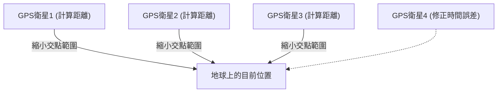

## 1. 來自宇宙的「時間」訊號

**GPS（全球定位系統，Global Positioning System）** 原本是美國國防部為了軍事目的而開發的系統，但現在從智慧型手機、汽車導航到飛機的自動駕駛，已成為現代社會不可或缺的基礎設施。

許多人誤以為「手機是朝著太空中的人造衛星發射電波，讓衛星告訴我們位置」。然而，實際情況恰好相反。
手機 **僅僅是在接收** 電波。在距地面約2萬公里的高空飛行的約30顆GPS衛星，只是不斷地朝著地球 **持續廣播「自己（衛星）的目前位置」與「目前時間」的電波** 而已。

## 2. 得知自己位置的「三點定位」原理

那麼，為什麼僅憑衛星傳來的「時間」與「位置」資料，地面的手機就能知道自己的目前位置呢？
關鍵就在於「 **電波到達的時間** 」。

電波的行進速度與光速相同（每秒約30萬公里）。
假設GPS衛星傳送出來的時間是「12點00分00秒.000」，而手機接收到該訊號的時間是「12點00分00秒.067」。
電波傳遞花了「0.067秒」，這意味著衛星與手機之間的距離可以計算為「光速 × 0.067秒 = 約2萬公里」。

1. 如果知道與1顆衛星的距離，就能知道自己位於「以該衛星為中心、半徑2萬公里的球面上的某處」。
2. 如果知道與2顆衛星的距離，就能將範圍縮小到這兩個球面交會而成的「圓」上的某處。
3. **如果知道與3顆衛星的距離，就能將範圍縮小到球面交會的「2個點」。** （由於其中一點位於太空中，利用刪去法便能確定地面的目前位置）。

換句話說， **只要接收到至少3顆GPS衛星的電波，就能計算出自己在地球上的哪個地方。** （實際上，為了修正手機內建時鐘的誤差，還需要 **第4顆衛星** 的電波）。

## 3. 沒有愛因斯坦的相對論，GPS就會失準

在GPS的計算中，最重要的是「時間」。百萬分之一秒（1微秒）的誤差，在地面上就會造成約300公尺的距離誤差。因此，GPS衛星上搭載了數萬年才會產生1秒誤差的超精密「 **原子鐘** 」。

然而，這裡會遇到物理學的障礙。也就是愛因斯坦的「 **相對論** 」。

1. **狹義相對論（速度造成的時間變慢）**:
   GPS衛星以時速約1萬4000公里的極快速度飛行。由於速度越快的物體，時間流逝得越慢，因此衛星上的時鐘會比地面上 **每天慢約7微秒** 。
2. **廣義相對論（重力造成的時間變快）**:
   高度2萬公里的太空中，地球的重力比地面弱。由於重力越弱的地方，時間流逝得越快，因此衛星上的時鐘會比地面上 **每天快約45微秒** 。

結果，相抵之後「45 - 7 = **38微秒** 」，GPS衛星的時鐘每天會比地面快。
如果不針對這項相對論造成的時間誤差進行修正而直接運用GPS，只要短短1天，汽車導航的目前位置就會產生 **約11公里的嚴重誤差** 。
我們的手機，每天都在計算愛因斯坦的方程式來推算出目前位置。

## 4. 引路號（QZSS）帶來的公分級精準度

您是否注意到，近年來日本的定位精準度變得更高了呢？
這是因為經常停留在日本上空的準天頂衛星系統「 **引路號（QZSS）** 」已經開始運作。

除了美國的GPS衛星之外，藉由使用從日本正上方（天頂）發送電波的「引路號」，即使在建築物密集區或山區，電波也不容易被遮蔽。此外，若使用能接收特殊修正訊號（L6訊號）的專用設備，就能以誤差僅數公分的驚人精準度來確定目前位置，這項技術已被應用於牽引機的無人駕駛以及無人機外送等領域。

## 5. 總結

我們平時在地圖上看到的「藍色目前位置標記」，其實是太空中的原子鐘、光速，以及相對論等宏大物理法則的結晶。
GPS技術可說是宏觀的宇宙視角與微觀的原子技術完美融合，人類最偉大的傑作之一。
