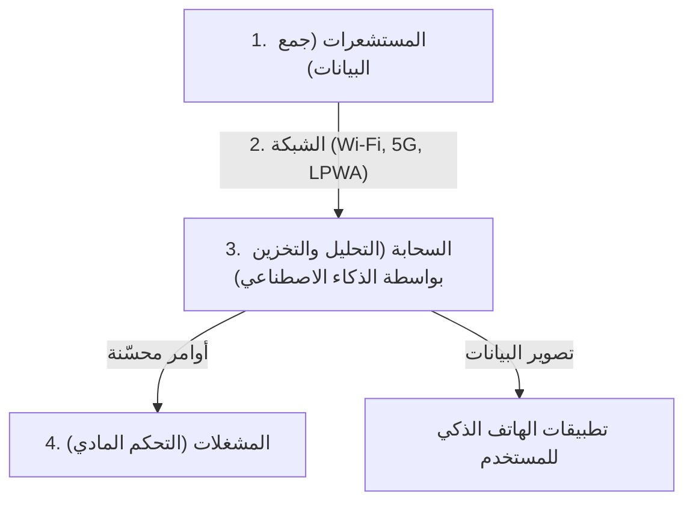

## 1. ما هو إنترنت الأشياء (IoT)؟

في الماضي، كانت الأجهزة المتصلة بالإنترنت مقتصرة في الغالب على أجهزة الكمبيوتر والهواتف الذكية أو الخوادم، أي "معدات تكنولوجيا المعلومات التي يشغلها البشر".
لكن اليوم، بدأت جميع "الأشياء" (Things) في العالم بالاتصال بالإنترنت، بدءاً من الأجهزة المنزلية مثل أجهزة التلفاز والمكيفات، والسيارات، وأعمدة إنارة الشوارع، وخطوط الإنتاج في المصانع، وصولاً إلى مستشعرات التربة الزراعية.

هذا النظام الذي تتصل فيه جميع الأشياء بالشبكة وتتبادل المعلومات مع بعضها البعض يسمى " **إنترنت الأشياء (IoT: Internet of Things)** ".

## 2. "الطبقات الأربع" التي يتكون منها إنترنت الأشياء (IoT)

لا يقتصر نظام إنترنت الأشياء على "توصيل الأشياء بالإنترنت" فحسب، بل يتكون من دورة متكاملة تبدأ بجمع البيانات، وتحليلها، وتقديم تغذية راجعة للعالم الحقيقي. بشكل عام، يتم تقسيمه إلى الطبقات الأربع التالية.

### ① الأجهزة والمستشعرات (الجمع)
تعمل بمثابة "العيون" و"الآذان" التي تحول جميع البيانات المادية في العالم الحقيقي إلى بيانات رقمية.
- مستشعرات الحرارة، ومستشعرات الرطوبة، وGPS (معلومات الموقع)، ومستشعرات التسارع، والكاميرات (الفيديو)، والميكروفونات (الصوت)، وغيرها.
- تقوم وحدات التحكم الدقيقة (أجهزة كمبيوتر صغيرة) المدمجة في الأشياء بجمع هذه البيانات.

### ② الشبكات والاتصالات (النقل)
تعمل بمثابة "الأعصاب" التي ترسل البيانات المجمعة إلى السحابة (الخوادم).
- بالنسبة للأجهزة المنزلية الذكية، تكون **Wi-Fi** الخاصة بالمنزل.
- بالنسبة للساعات الذكية، تكون **Bluetooth** عبر الهاتف الذكي.
- بالنسبة للمستشعرات الزراعية الخارجية وغيرها، تُستخدم شبكات **LPWA** (مثل LoRaWAN) التي تتميز باستهلاك منخفض للطاقة ومدى اتصال طويل، أو شبكات **5G** ذات السعة الكبيرة والسرعة العالية.

### ③ السحابة ومعالجة البيانات (التخزين والتحليل)
تعمل بمثابة "الدماغ" الذي يستقبل ويحفظ ويحلل كميات ضخمة من البيانات (البيانات الضخمة) المرسلة من جميع أنحاء العالم.
- لا يقتصر الأمر على التجميع البسيط، بل يتم استخدام **الذكاء الاصطناعي (AI: التعلم الآلي)** لاكتشاف الأنماط المخفية في البيانات، واستخلاص "علامات الأعطال" أو "إعدادات درجات الحرارة المثلى" وغيرها.

### ④ التطبيقات والمشغلات (التغذية الراجعة)
تعمل بمثابة "العضلات" التي تعرض النتائج المحللة بطريقة سهلة الفهم للإنسان، أو تحرك "الأشياء" في العالم الحقيقي مرة أخرى.
- التحقق من الرسوم البيانية عبر تطبيقات الهواتف الذكية.
- الأوامر الصادرة من السحابة مثل "خفض درجة حرارة المكيف" أو "الإيقاف الطارئ لآلات المصنع (حركة مادية بواسطة المشغلات)" وغيرها.

## 3. حالات الاستخدام التي يتألق فيها إنترنت الأشياء

لقد تغلغل إنترنت الأشياء بالفعل في كل جانب من جوانب حياتنا وصناعتنا.

- **المنازل الذكية**: توفر بيئة معيشية مريحة، مثل الأوامر الصوتية "أليكسا، أطفئي الأنوار" أو تشغيل المكيف تلقائيًا عند الاقتراب من المنزل بناءً على معلومات موقع الهاتف الذكي.
- **المصانع الذكية (الصناعة 4.0)**: عن طريق تركيب مستشعرات على جميع آلات المصنع، يتم مراقبة الاهتزازات والتغيرات الدقيقة في درجات حرارة المحركات لـ "استبدال الأجزاء قبل تعطلها (الصيانة التنبؤية)"، مما يمنع توقف خطوط الإنتاج.
- **الزراعة الذكية**: مراقبة مستويات رطوبة التربة في الحقول وساعات سطوع الشمس على مدار 24 ساعة بواسطة المستشعرات، وتشغيل الرشاشات تلقائيًا في الوقت الذي تنمو فيه المحاصيل بأفضل شكل، بالإضافة إلى توقع وقت الحصاد باستخدام الذكاء الاصطناعي.

## 4. المخاطر الأمنية لإنترنت الأشياء

مع الانتشار السريع لإنترنت الأشياء، أصبح " **الأمن السيبراني** " تحديًا بالغ الأهمية.
بينما تحتوي أجهزة الكمبيوتر والهواتف الذكية على برامج حماية قوية، فإن العديد من أجهزة إنترنت الأشياء الرخيصة (مثل كاميرات المراقبة والمقابس الذكية) تفتقر إلى التدابير الأمنية الكافية لتقليل التكاليف.

حدثت بالفعل هجمات فعلية (مثل شبكة روبوتات Mirai) حيث تم اختراق كاميرات إنترنت الأشياء المعرضة للإنترنت بكلمات مرور افتراضية (مثل `admin` / `password`) من جميع أنحاء العالم، واستُخدمت كنقطة انطلاق لشن هجمات حجب الخدمة الموزعة (DDoS) (هجمات تغمر خوادم الهدف بكميات هائلة من البيانات لإسقاطها).
يجب ألا ننسى أن "توصيل الأشياء بالإنترنت" يجلب الراحة، ولكنه في نفس الوقت يصاحبه خطر أن " **يتمكن القراصنة من التدخل ماديًا في العالم الحقيقي (مثل فتح الأقفال عنوة، التسبب في خروج السيارات عن السيطرة، إلخ)** ".

## 5. الخلاصة

إنترنت الأشياء هو جسر يربط بسلاسة بين العالم المادي والعالم الرقمي (السيبراني).
من خلال الجمع بين ثلاثة عناصر: تصغير وتقليل تكلفة تقنية المستشعرات، وتطور البنية التحتية للاتصالات مثل 5G، وتقدم تقنيات الذكاء الاصطناعي في السحابة، سيصبح إنترنت الأشياء أكثر تقدمًا في المستقبل، وسيقوم بتحسين المجتمع بأكمله إلى مستوى لا ندركه.
