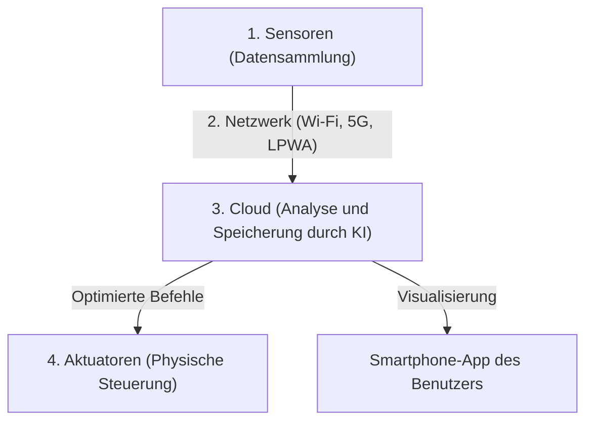

## 1. Was ist das IoT (Internet of Things)?

Bisher waren die mit dem Internet verbundenen Geräte hauptsächlich „von Menschen bediente IT-Geräte“ wie PCs, Smartphones oder Server.
Heute jedoch beginnen alle Arten von „Dingen“ (Things) auf der Welt – von Haushaltsgeräten wie Fernsehern und Klimaanlagen über Autos, Straßenlaternen und Fabrikproduktionslinien bis hin zu Bodensensoren in der Landwirtschaft –, sich mit dem Internet zu verbinden.

Dieses System, bei dem alle möglichen Dinge mit dem Netzwerk verbunden sind und Informationen miteinander austauschen, wird als „**IoT (Internet of Things: Internet der Dinge)**“ bezeichnet.

## 2. Die „4 Schichten“ des IoT

Ein IoT-System besteht nicht nur darin, dass „Dinge mit dem Internet verbunden werden“, sondern umfasst einen ganzen Zyklus vom Sammeln von Daten über deren Analyse bis hin zum Feedback in die reale Welt. Im Allgemeinen lässt es sich in die folgenden vier Schichten (Layer) unterteilen:

### ① Geräte & Sensoren (Sammlung)
Sie fungieren als die „Augen“ und „Ohren“, die alle Arten von physikalischen Daten aus der realen Welt in digitale Daten umwandeln.
- Temperatursensoren, Feuchtigkeitssensoren, GPS (Standortdaten), Beschleunigungssensoren, Kameras (Video), Mikrofone (Audio) usw.
- In die Dinge integrierte Mikrocontroller (kleine Computer) sammeln diese Daten.

### ② Netzwerk & Kommunikation (Übertragung)
Dies ist die Rolle der „Nerven“, die die gesammelten Daten an die Cloud (den Server) senden.
- Bei Smart-Home-Geräten ist es das heimische **Wi-Fi**.
- Bei Smartwatches ist es **Bluetooth** über das Smartphone.
- Für landwirtschaftliche Sensoren im Freien kommen Netzwerke mit geringem Stromverbrauch und großer Reichweite wie **LPWA** (z. B. LoRaWAN) oder schnelles, hochkapazitives **5G** zum Einsatz.

### ③ Cloud & Datenverarbeitung (Speicherung & Analyse)
Dies ist die Rolle des „Gehirns“, das riesige Datenmengen (Big Data) aus der ganzen Welt empfängt, speichert und analysiert.
- Neben einfachen Aggregationen wird **KI (Maschinelles Lernen)** eingesetzt, um in den Daten verborgene Muster zu finden und Dinge wie „Vorzeichen von Ausfällen“ oder „die optimale Temperatureinstellung“ abzuleiten.

### ④ Anwendungen & Aktuatoren (Feedback)
Dies ist die Rolle der „Muskeln“, die die analysierten Ergebnisse für Menschen verständlich darstellen oder die „Dinge“ in der realen Welt wieder in Bewegung setzen.
- Überprüfen von Graphen über eine Smartphone-App.
- Befehle aus der Cloud, wie „Senken der Temperatur der Klimaanlage“ oder „Notabschaltung von Maschinen in einer Fabrik (physische Aktionen durch Aktuatoren)“.

## 3. Anwendungsfälle des IoT

Das IoT ist bereits allgegenwärtig in unserem Leben und in der Industrie.

- **Smart Home**: Es ermöglicht ein komfortables Wohnumfeld, etwa durch Sprachbefehle wie „Alexa, mach das Licht aus“ oder durch automatisches Einschalten der Klimaanlage, basierend auf den Standortdaten des Smartphones, wenn man sich dem Haus nähert.
- **Smart Factory (Industrie 4.0)**: Alle Maschinen in der Fabrik werden mit Sensoren ausgestattet. Indem winzige Veränderungen bei Motorvibrationen oder Temperatur erkannt werden, können „Teile ausgetauscht werden, bevor sie kaputtgehen (vorausschauende Wartung)“, was Stillstände der Produktionslinie verhindert.
- **Smart Agriculture**: Der Feuchtigkeitsgehalt und die Sonnenscheindauer des Bodens auf den Feldern werden von Sensoren rund um die Uhr überwacht. Sprinkler werden automatisch zu dem Zeitpunkt aktiviert, an dem die Ernte am besten gedeiht, und die Erntezeit wird durch KI vorhergesagt.

## 4. Sicherheitsrisiken des IoT

Mit der raschen Verbreitung des IoT ist die „**Sicherheit**“ zu einer äußerst wichtigen Herausforderung geworden.
Während auf PCs und Smartphones leistungsstarke Sicherheitssoftware installiert ist, verfügen viele kostengünstige IoT-Geräte (wie Überwachungskameras oder Smart Plugs) aus Kostengründen über unzureichende Sicherheitsmaßnahmen.

Es kam bereits zu Vorfällen (wie beim Mirai-Botnet), bei denen IoT-Kameras, die mit ihren Standardpasswörtern (`admin` / `password` usw.) mit dem Internet verbunden waren, weltweit gehackt und als Sprungbrett für DDoS-Angriffe (Angriffe, bei denen massive Datenmengen an einen Zielserver gesendet werden, um ihn lahmzulegen) missbraucht wurden.
Wir dürfen nicht vergessen, dass die Tatsache, dass „Dinge mit dem Internet verbunden sind“, zwar Komfort bringt, aber gleichzeitig das Risiko birgt, dass „**Hacker in der Lage sind, physisch in die reale Welt einzugreifen (z. B. unbefugtes Öffnen von Schlössern, Autos außer Kontrolle geraten lassen usw.)**“.

## 5. Fazit

Das IoT ist die Brücke, die die physische Welt (den physischen Raum) nahtlos mit der digitalen Welt (dem Cyberraum) verbindet.
Durch die Kombination dreier Elemente – der Miniaturisierung und Preissenkung der Sensortechnologie, der Weiterentwicklung von Kommunikationsinfrastrukturen wie 5G und dem Fortschritt der KI-Technologie in der Cloud – wird das IoT künftig noch fortschrittlicher werden und die gesamte Gesellschaft auf einer Ebene optimieren, die uns nicht einmal bewusst ist.
