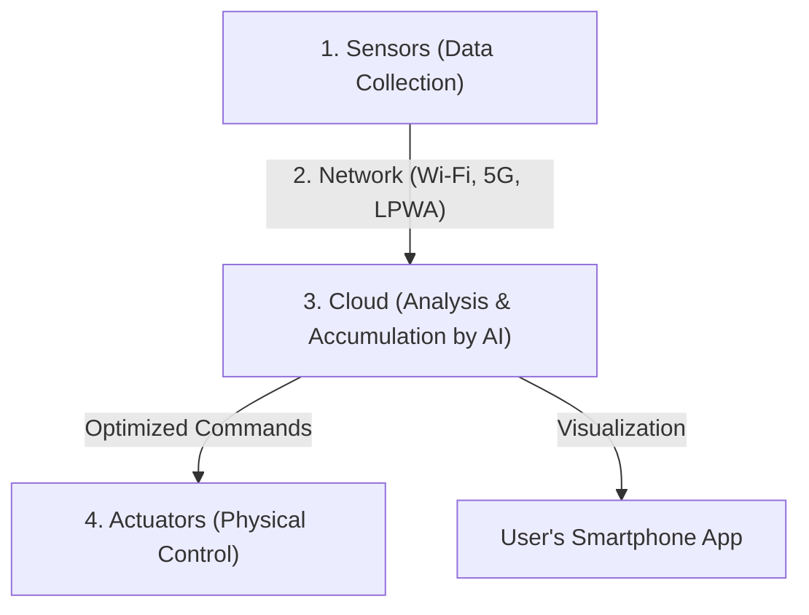

## 1. What is IoT (Internet of Things)?

In the past, devices connected to the internet were primarily "human-operated IT equipment" such as personal computers, smartphones, and servers.
However, currently, all kinds of "things" in the world are beginning to be connected to the internet, from home appliances like TVs and air conditioners to automobiles, streetlights, factory production lines, and even soil sensors for agriculture.

The mechanism by which all things are connected to a network and exchange information with each other in this way is called the "**IoT (Internet of Things)**".

## 2. The "Four Layers" that Make Up IoT

An IoT system consists of not just "things connecting to the internet," but a series of cycles from analyzing collected data to feeding it back to the real world. Generally, it is divided into the following four layers.

### ① Devices and Sensors (Collection)
They play the role of "eyes" and "ears," converting all physical data in the real world into digital data.
- Temperature sensors, humidity sensors, GPS (location information), acceleration sensors, cameras (video), microphones (audio), etc.
- Microcomputers (small computers) built into things collect these data.

### ② Network and Communication (Transmission)
This is the "nervous system" that transmits collected data to the cloud (server).
- **Wi-Fi** at home for smart appliances.
- **Bluetooth** via smartphones for smartwatches.
- For outdoor agricultural sensors, **LPWA** (such as LoRaWAN) capable of low power consumption and long-distance communication, or high-speed, large-capacity **5G**, are used.

### ③ Cloud and Data Processing (Accumulation and Analysis)
This is the "brain" that receives, stores, and analyzes massive amounts of data (big data) sent from all over the world.
- Rather than simply aggregating data, it uses **AI (Machine Learning)** to find hidden patterns in the data and derive things like "signs of failure" or "optimal temperature settings".

### ④ Applications and Actuators (Feedback)
This is the "muscle" that displays analyzed results in an easy-to-understand way for humans, or physically moves "things" in the real world again.
- Checking graphs on a smartphone app.
- Commands from the cloud to "lower the air conditioner temperature" or "perform an emergency stop on factory machinery (physical movement by an actuator)".

## 3. Use Cases Where IoT is Active

IoT has already permeated every part of our lives and industries.

- **Smart Homes**: Realizes a comfortable living environment, such as voice commands like "Alexa, turn off the lights" or automatically turning on the air conditioner when you get close to home based on smartphone location information.
- **Smart Factories (Industry 4.0)**: Attaching sensors to all machines in a factory to prevent production lines from stopping by "replacing parts before they break (predictive maintenance)" based on minute changes in motor vibration and temperature.
- **Smart Agriculture**: Monitoring the moisture content and sunlight hours of soil in fields 24 hours a day with sensors, automatically activating sprinklers when crops will grow most deliciously, and predicting harvest times with AI.

## 4. IoT Security Risks

With the rapid spread of IoT, "**security**" has become an extremely critical issue.
While powerful security software is installed on PCs and smartphones, many inexpensive IoT devices (such as surveillance cameras and smart plugs) have insufficient security measures to cut costs.

Incidents (such as the Mirai botnet) have actually occurred where IoT cameras exposed to the internet with default passwords (like `admin` / `password`) were hacked from around the world and used as stepping stones for DDoS attacks (attacks that send massive amounts of traffic to target servers to bring them down).
We must not forget that "things connecting to the internet" means that while it becomes convenient, it also comes with the risk that "**hackers will be able to physically interfere with the real world (such as unlocking doors without permission or making cars run out of control)**".

## 5. Conclusion

IoT is a bridge that seamlessly connects the real world (physical space) and the digital world (cyber space).
Through the combination of three elements: the miniaturization and cost reduction of sensor technology, the evolution of communication infrastructure like 5G, and the development of AI technology in the cloud, IoT will become even more advanced and optimize society as a whole at a level we are not even aware of.
