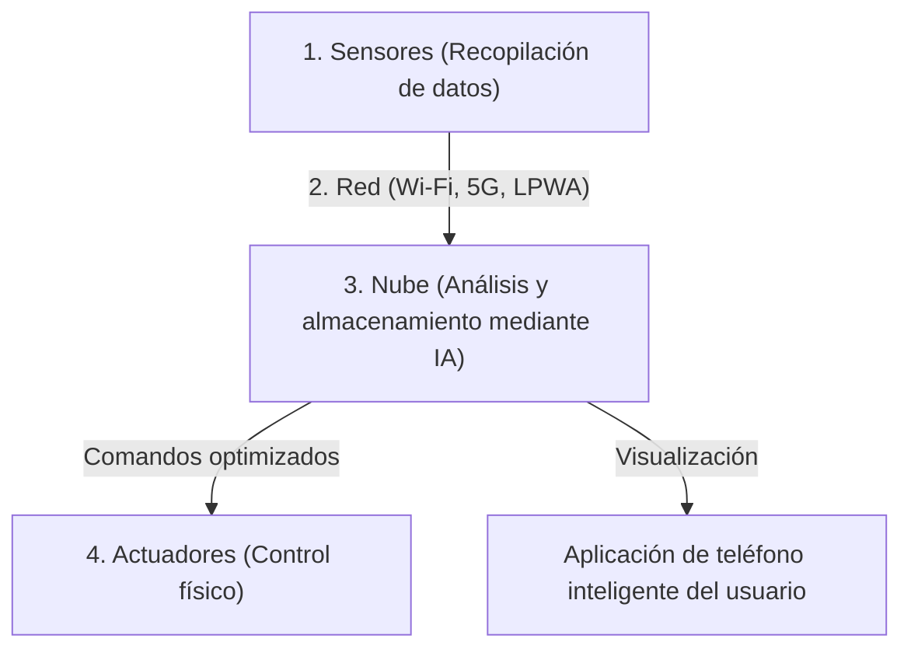

## 1. ¿Qué es el IoT (Internet de las Cosas)?

Hasta ahora, los dispositivos conectados a Internet han sido principalmente "equipos de TI operados por humanos", como computadoras personales, teléfonos inteligentes o servidores.
Sin embargo, en la actualidad, todo tipo de "cosas (Things)" en el mundo, desde electrodomésticos como televisores y aires acondicionados, hasta automóviles, farolas, líneas de producción en fábricas e incluso sensores de suelo agrícolas, están comenzando a conectarse a Internet.

Este sistema en el que todas las cosas se conectan a una red e intercambian información entre sí se denomina "**IoT (Internet of Things: Internet de las Cosas)**".

## 2. Las "4 capas" que componen el IoT

El sistema IoT no consiste simplemente en "conectar cosas a Internet", sino que está formado por un ciclo continuo que va desde el análisis de los datos recopilados hasta la retroalimentación en el mundo real. En general, se divide en las siguientes 4 capas:

### ① Dispositivos y sensores (Recopilación)
Actúan como los "ojos" y los "oídos" que convierten todos los datos físicos del mundo real en datos digitales.
- Sensores de temperatura, sensores de humedad, GPS (información de ubicación), acelerómetros, cámaras (video), micrófonos (audio), etc.
- Microcontroladores (pequeñas computadoras) integrados en las cosas recopilan estos datos.

### ② Red y comunicaciones (Transmisión)
Actúa como los "nervios" que transmiten los datos recopilados a la nube (servidores).
- En el caso de electrodomésticos inteligentes, el **Wi-Fi** de casa.
- En el caso de los relojes inteligentes, el **Bluetooth** a través de un teléfono inteligente.
- Para sensores agrícolas en exteriores se utilizan redes **LPWA** (como LoRaWAN), que permiten comunicaciones de largo alcance con bajo consumo de energía, o el **5G** de alta velocidad y gran capacidad.

### ③ Nube y procesamiento de datos (Almacenamiento y análisis)
Actúa como el "cerebro" que recibe, almacena y analiza cantidades masivas de datos (Big Data) enviados desde todo el mundo.
- No solo realiza simples agregaciones, sino que utiliza la **IA (aprendizaje automático)** para encontrar patrones ocultos en los datos y deducir "signos de averías" o la "configuración de temperatura óptima".

### ④ Aplicaciones y actuadores (Retroalimentación)
Actúa como los "músculos" que muestran los resultados analizados de forma clara para los humanos, o mueven las "cosas" nuevamente en el mundo real.
- Revisar gráficos en una aplicación de teléfono inteligente.
- Comandos desde la nube como "bajar la temperatura del aire acondicionado" o "realizar una parada de emergencia de una máquina de la fábrica (movimiento físico mediante actuadores)", entre otros.

## 3. Casos de uso donde el IoT destaca

El IoT ya ha penetrado en todos los rincones de nuestras vidas y de la industria.

- **Hogar inteligente (Smart Home)**: Logra un entorno de vida cómodo, como "apagar las luces" mediante instrucciones de voz con Alexa, o "encender automáticamente el aire acondicionado al acercarse a casa" según la información de ubicación del teléfono inteligente.
- **Fábrica inteligente (Smart Factory / Industria 4.0)**: Evita la parada de las líneas de producción instalando sensores en todas las máquinas de la fábrica y "reemplazando las piezas antes de que se rompan (mantenimiento predictivo)" basado en vibraciones de motores o cambios mínimos de temperatura.
- **Agricultura inteligente (Smart Agriculture)**: Monitorea el contenido de humedad del suelo de los campos y las horas de luz solar las 24 horas del día con sensores, activa automáticamente los aspersores en el momento en que los cultivos crecen más sabrosos, y la IA predice el momento de la cosecha.

## 4. Riesgos de seguridad del IoT

Con la rápida difusión del IoT, la "**seguridad**" se ha convertido en un desafío extremadamente importante.
Si bien las computadoras personales y los teléfonos inteligentes tienen un software de seguridad potente, muchos dispositivos IoT económicos (como cámaras de vigilancia o enchufes inteligentes) carecen de medidas de seguridad suficientes para reducir costos.

Realmente han ocurrido incidentes (como la botnet Mirai) en los que cámaras IoT expuestas a Internet con contraseñas predeterminadas (`admin` / `password`, etc.) han sido hackeadas desde todo el mundo y utilizadas como trampolines para ataques DDoS (ataques que envían grandes cantidades de tráfico al servidor de un objetivo para derribarlo).
No debemos olvidar que "conectar cosas a Internet" significa que al mismo tiempo que se vuelve conveniente, se corre el riesgo de que "**los hackers puedan interferir físicamente en el mundo real (como abrir cerraduras sin permiso, hacer que los autos se salgan de control, etc.)**".

## 5. Conclusión

El IoT es el puente que conecta perfectamente el mundo real (espacio físico) y el mundo digital (espacio cibernético).
A través de la combinación de tres elementos (la miniaturización y el abaratamiento de la tecnología de sensores, la evolución de infraestructuras de comunicación como el 5G, y el desarrollo de tecnologías de IA en la nube), el IoT será aún más avanzado a partir de ahora, optimizando a toda la sociedad a un nivel en el que ni siquiera nos daremos cuenta.
