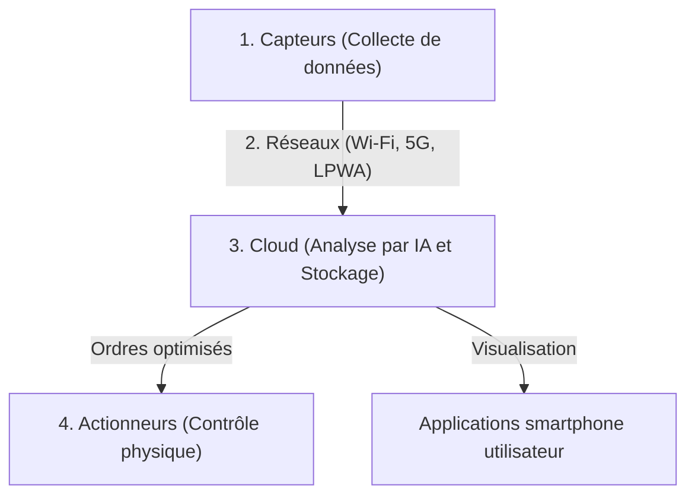

## 1. Qu'est-ce que l'IoT (Internet des objets) ?

Jusqu'à présent, les appareils connectés à Internet étaient principalement des « équipements informatiques manipulés par des personnes », tels que les ordinateurs, les smartphones ou les serveurs.
Cependant, aujourd'hui, toutes sortes d'« objets » (Things) de notre quotidien commencent à être connectés à Internet, allant des appareils électroménagers comme les téléviseurs et les climatiseurs, aux voitures, aux lampadaires, aux chaînes de production des usines, et même aux capteurs de sol utilisés en agriculture.

Ce système où tous les objets sont connectés à un réseau et s'échangent des informations est appelé l'« **IoT (Internet of Things : Internet des objets)** ».

## 2. Les « 4 couches » qui composent l'IoT

Le système IoT ne consiste pas seulement à « connecter des objets à Internet », mais il est constitué d'un cycle complet allant de la collecte de données à leur analyse, jusqu'au retour d'informations vers le monde réel. En général, il est divisé en quatre couches (layers) suivantes.

### ① Appareils et capteurs (Collecte)
Ils jouent le rôle des « yeux » et des « oreilles » qui convertissent toutes les données physiques du monde réel en données numériques.
- Capteurs de température, capteurs d'humidité, GPS (localisation), accéléromètres, caméras (vidéo), microphones (audio), etc.
- Des microcontrôleurs (petits ordinateurs) intégrés aux objets collectent ces données.

### ② Réseaux et communications (Transmission)
C'est le rôle des « nerfs » qui transmettent les données collectées vers le cloud (serveur).
- Pour les appareils électroménagers intelligents, c'est le **Wi-Fi** de la maison.
- Pour les montres connectées, c'est le **Bluetooth** via un smartphone.
- Pour les capteurs agricoles en extérieur, on utilise le **LPWA** (comme LoRaWAN) permettant une communication à longue portée avec une faible consommation d'énergie, ou la **5G** offrant une grande capacité à haute vitesse.

### ③ Cloud et traitement des données (Stockage et analyse)
C'est le rôle du « cerveau » qui reçoit, stocke et analyse la quantité massive de données (Big Data) envoyée du monde entier.
- Au-delà du simple regroupement de données, l'**IA (Apprentissage automatique)** est utilisée pour trouver des modèles cachés dans les données afin de déduire des « signes précurseurs de panne » ou « le réglage de température optimal ».

### ④ Applications et actionneurs (Rétroaction)
C'est le rôle des « muscles » qui présentent les résultats analysés de manière compréhensible pour les humains ou qui actionnent à nouveau les « objets » du monde réel.
- Vérifier un graphique sur l'application de son smartphone.
- Exécuter des ordres depuis le cloud comme « baisser la température du climatiseur » ou « arrêter d'urgence la machine de l'usine (action physique par un actionneur) », etc.

## 3. Cas d'utilisation où l'IoT est actif

L'IoT a déjà infiltré tous les aspects de notre vie et de notre industrie.

- **Maison intelligente** : Elle permet un environnement de vie confortable avec des commandes vocales telles que « Alexa, éteins la lumière » ou des automatisations comme « allumer automatiquement le climatiseur en s'approchant de la maison » basées sur la localisation du smartphone.
- **Usine intelligente (Industrie 4.0)** : Des capteurs sont installés sur toutes les machines de l'usine pour « remplacer les pièces avant qu'elles ne se cassent (maintenance prédictive) » à partir des vibrations des moteurs et des légères variations de température, évitant ainsi l'arrêt de la chaîne de production.
- **Agriculture intelligente** : Les capteurs surveillent 24 heures sur 24 l'humidité du sol des champs et l'ensoleillement, et activent automatiquement les arroseurs au moment où les cultures poussent le plus délicieusement, tandis que l'IA prédit la période de récolte.

## 4. Risques de sécurité de l'IoT

Avec la diffusion rapide de l'IoT, la « **sécurité** » est devenue un enjeu extrêmement important.
Alors que les ordinateurs et les smartphones sont équipés de logiciels de sécurité puissants, les appareils IoT bon marché (comme les caméras de surveillance ou les prises intelligentes) manquent souvent de mesures de sécurité adéquates pour réduire les coûts.

Il y a eu des cas réels (comme le botnet Mirai) où des caméras IoT exposées à Internet avec leurs mots de passe par défaut (`admin` / `password`, etc.) ont été piratées du monde entier et utilisées comme tremplin pour des attaques DDoS (attaques qui envoient une quantité massive de trafic au serveur cible pour le faire tomber).
Il ne faut pas oublier que si « les objets se connectent à Internet » apporte de la commodité, cela s'accompagne également du risque que « **les pirates informatiques puissent interférer physiquement avec le monde réel (ouvrir des serrures sans permission, faire perdre le contrôle d'une voiture, etc.)** ».

## 5. Conclusion

L'IoT est le pont qui relie de manière transparente le monde réel (espace physique) et le monde numérique (espace cybernétique).
Grâce à la combinaison de trois facteurs : la miniaturisation et la baisse des prix de la technologie des capteurs, l'évolution des infrastructures de communication comme la 5G, et le développement de la technologie de l'IA dans le cloud, l'IoT deviendra de plus en plus sophistiqué et optimisera l'ensemble de la société à un niveau dont nous n'aurons même pas conscience.
