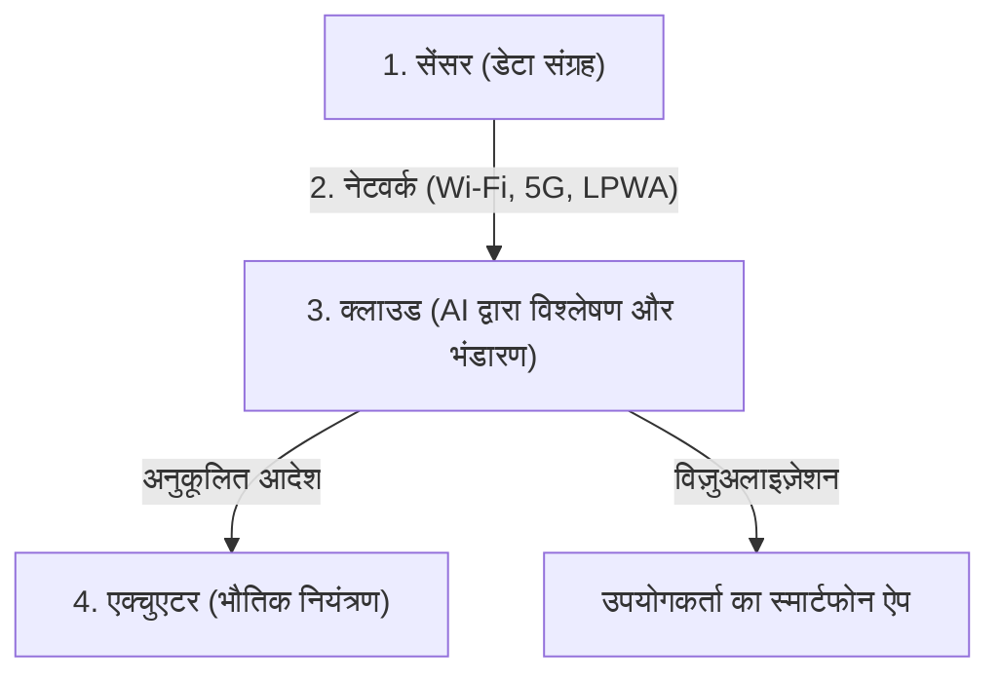

## 1. IoT (इंटरनेट ऑफ थिंग्स) क्या है?

अब तक, इंटरनेट से जुड़े उपकरणों का मतलब मुख्य रूप से कंप्यूटर, स्मार्टफोन या सर्वर जैसे "इंसानों द्वारा संचालित आईटी उपकरण" होता था।
हालाँकि, अब दुनिया की हर "चीज़ (Things)", जैसे टीवी और एयर कंडीशनर जैसे घरेलू उपकरण, कारें, स्ट्रीट लाइट, फैक्ट्री उत्पादन लाइनें, और यहाँ तक कि कृषि के लिए इस्तेमाल होने वाले मिट्टी के सेंसर भी, इंटरनेट से जुड़ना शुरू हो गए हैं।

इस तरह, वह प्रणाली जिसमें सभी चीजें एक नेटवर्क से जुड़ती हैं और एक-दूसरे के साथ सूचनाओं का आदान-प्रदान करती हैं, "**IoT (Internet of Things: इंटरनेट ऑफ थिंग्स)**" कहलाती है।

## 2. IoT बनाने वाली "4 परतें"

IoT सिस्टम का मतलब केवल "इंटरनेट से जुड़ी चीजों" से नहीं है, बल्कि यह एकत्रित डेटा का विश्लेषण करने और इसे वास्तविक दुनिया में वापस फीड करने का एक पूरा चक्र है। आमतौर पर, इसे निम्नलिखित 4 परतों (लेयर्स) में विभाजित किया जाता है।

### ① डिवाइस और सेंसर (संग्रह)
ये "आंखों" और "कानों" के रूप में कार्य करते हैं जो वास्तविक दुनिया के सभी भौतिक डेटा को डिजिटल डेटा में बदलते हैं।
- तापमान सेंसर, आर्द्रता सेंसर, GPS (लोकेशन की जानकारी), एक्सेलेरोमीटर, कैमरे (वीडियो), माइक्रोफोन (ऑडियो), आदि।
- चीजों (Things) में बने माइक्रोकंट्रोलर (छोटे कंप्यूटर) इन डेटा को एकत्र करते हैं।

### ② नेटवर्क और संचार (संचरण)
यह "नसों" के रूप में कार्य करता है जो एकत्रित डेटा को क्लाउड (सर्वर) पर भेजता है।
- स्मार्ट घरेलू उपकरणों के लिए घर का **Wi-Fi**।
- स्मार्टवॉच के लिए स्मार्टफोन के माध्यम से **Bluetooth**।
- **LPWA** (जैसे LoRaWAN), जो कम बिजली की खपत के साथ लंबी दूरी तक संचार कर सकता है, या उच्च गति, बड़ी क्षमता वाला **5G** बाहरी कृषि सेंसर आदि के लिए उपयोग किया जाता है।

### ③ क्लाउड और डेटा प्रोसेसिंग (भंडारण और विश्लेषण)
यह "मस्तिष्क" के रूप में कार्य करता है जो दुनिया भर से भेजे गए भारी मात्रा में डेटा (बड़े डेटा) को प्राप्त करता है, संग्रहीत करता है और उसका विश्लेषण करता है।
- सरल एकत्रीकरण के अलावा, यह डेटा में छिपे पैटर्न को खोजने के लिए **AI (मशीन लर्निंग)** का उपयोग करता है और "विफलता के संकेत" या "इष्टतम तापमान सेटिंग्स" जैसी चीजें निकालता है।

### ④ एप्लिकेशन और एक्चुएटर (फीडबैक)
यह "मांसपेशियों" के रूप में कार्य करता है जो विश्लेषण किए गए परिणामों को मनुष्यों के लिए समझने में आसान तरीके से प्रदर्शित करता है या वास्तविक दुनिया में "चीजों" को फिर से संचालित करता है।
- स्मार्टफोन ऐप पर ग्राफ़ की जाँच करना।
- क्लाउड से आदेश जैसे "एयर कंडीशनर का तापमान कम करें" या "फैक्ट्री मशीन को तुरंत रोकें (एक्चुएटर के कारण भौतिक क्रिया)", आदि।

## 3. यूज़ केस जहाँ IoT सक्रिय है

IoT पहले ही हमारे जीवन और उद्योगों के हर हिस्से में प्रवेश कर चुका है।

- **स्मार्ट होम**: यह "एलेक्सा, लाइट बंद करो" जैसे वॉयस निर्देशों के माध्यम से, या स्मार्टफोन की लोकेशन जानकारी के आधार पर "जब आप घर के करीब आते हैं तो स्वचालित रूप से एयर कंडीशनर चालू करें" जैसे कार्यों से एक आरामदायक जीवन का माहौल बनाता है।
- **स्मार्ट फैक्ट्री (इंडस्ट्री 4.0)**: कारखानों में सभी मशीनों पर सेंसर लगाए जाते हैं, और मोटर के कंपन या तापमान में सूक्ष्म परिवर्तनों से "टूटने से पहले पुर्जों को बदलना (भविष्य कहनेवाला रखरखाव)" द्वारा उत्पादन लाइन को रुकने से रोका जाता है।
- **स्मार्ट कृषि**: 24 घंटे सेंसर के साथ खेत की मिट्टी की नमी की मात्रा और धूप के घंटों की निगरानी की जाती है, और स्वचालित रूप से स्प्रिंकलर को ऐसे समय में सक्रिय किया जाता है जब फसलें सबसे अच्छी तरह बढ़ती हैं, और AI फसल कटाई के समय की भविष्यवाणी करता है।

## 4. IoT सुरक्षा जोखिम

IoT के तेजी से प्रसार के साथ, "**सुरक्षा**" एक अत्यंत महत्वपूर्ण चुनौती बन गई है।
कंप्यूटर और स्मार्टफोन में शक्तिशाली सुरक्षा सॉफ़्टवेयर स्थापित होते हैं, लेकिन सस्ते IoT उपकरणों (जैसे निगरानी कैमरे और स्मार्ट प्लग) में अक्सर लागत कम करने के लिए अपर्याप्त सुरक्षा उपाय होते हैं।

वास्तव में ऐसी घटनाएँ हुई हैं (जैसे मिराई बॉटनेट) जहाँ अपने डिफ़ॉल्ट पासवर्ड (जैसे `admin` / `password`) के साथ इंटरनेट के संपर्क में आए IoT कैमरों को दुनिया भर से हैक किया गया और DDoS हमलों (लक्षित सर्वर पर भारी मात्रा में ट्रैफ़िक भेजना और इसे डाउन करना) के लिए लॉन्चपैड के रूप में उपयोग किया गया।
हमें यह नहीं भूलना चाहिए कि "चीजें इंटरनेट से जुड़ी हैं" का अर्थ है कि हालांकि यह सुविधाजनक है, यह इस जोखिम के साथ आता है कि "**हैकर्स वास्तविक दुनिया में भौतिक रूप से हस्तक्षेप करने (जैसे बिना अनुमति ताले खोलना, कारों को बेकाबू करना, आदि) में सक्षम होंगे**।"

## 5. निष्कर्ष

IoT एक पुल है जो वास्तविक दुनिया (भौतिक स्थान) और डिजिटल दुनिया (साइबर स्पेस) को सहजता से जोड़ता है।
सेंसर तकनीक का लघुकरण और कम कीमत, 5G जैसे संचार बुनियादी ढांचे का विकास, और क्लाउड पर AI तकनीक की प्रगति जैसे 3 तत्वों के संयोजन से, IoT भविष्य में और भी अधिक उन्नत हो जाएगा और पूरे समाज को एक ऐसे स्तर पर अनुकूलित करेगा जिसके बारे में हम सचेत भी नहीं होंगे।
