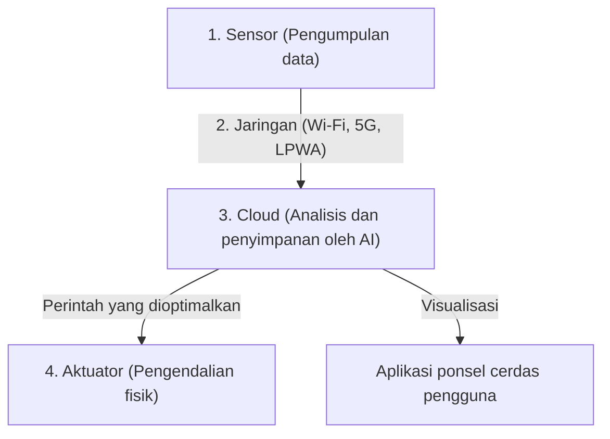

## 1. Apa itu IoT (Internet of Things)?

Selama ini, perangkat yang terhubung ke internet sebagian besar adalah "perangkat TI yang dioperasikan manusia" seperti komputer pribadi, ponsel cerdas, atau server.
Namun saat ini, segala macam "benda (Things)" di dunia mulai terhubung ke internet, mulai dari peralatan rumah tangga seperti televisi dan AC, mobil, lampu jalan, lini produksi pabrik, bahkan hingga sensor tanah untuk pertanian.

Sistem di mana segala macam benda terhubung ke jaringan dan saling bertukar informasi seperti ini disebut "**IoT (Internet of Things)**".

## 2. "Empat Lapisan" yang Membentuk IoT

Sistem IoT tidak sekadar "menghubungkan benda ke internet", tetapi terdiri dari serangkaian siklus mulai dari mengumpulkan data, menganalisisnya, hingga memberikan umpan balik ke dunia nyata. Secara umum, sistem ini dibagi menjadi empat lapisan (layer) berikut:

### ① Perangkat dan Sensor (Pengumpulan)
Berperan sebagai "mata" atau "telinga" yang mengubah segala jenis data fisik di dunia nyata menjadi data digital.
- Sensor suhu, sensor kelembapan, GPS (informasi lokasi), sensor akselerasi, kamera (video), mikrofon (audio), dll.
- Mikrokontroler (komputer kecil) yang tertanam pada benda-benda tersebut mengumpulkan data-data ini.

### ② Jaringan dan Komunikasi (Transmisi)
Berperan sebagai "saraf" yang mengirimkan data yang dikumpulkan ke cloud (server).
- **Wi-Fi** rumah jika itu peralatan rumah tangga pintar.
- **Bluetooth** yang melalui ponsel cerdas jika itu jam tangan pintar.
- Untuk sensor pertanian di luar ruangan, **LPWA** (seperti LoRaWAN) yang berdaya rendah dengan jangkauan komunikasi jarak jauh, atau **5G** yang berkecepatan tinggi dan berkapasitas besar sering digunakan.

### ③ Cloud dan Pemrosesan Data (Penyimpanan dan Analisis)
Berperan sebagai "otak" yang menerima, menyimpan, dan menganalisis data dalam jumlah besar (big data) yang dikirim dari seluruh dunia.
- Tidak sekadar agregasi sederhana, namun menggunakan **AI (Pembelajaran Mesin)** untuk menemukan pola tersembunyi dalam data dan menyimpulkan hal-hal seperti "tanda-tanda kerusakan" atau "pengaturan suhu yang optimal".

### ④ Aplikasi dan Aktuator (Umpan Balik)
Berperan sebagai "otot" yang menampilkan hasil analisis dengan cara yang mudah dimengerti manusia, atau kembali menggerakkan "benda" di dunia nyata.
- Mengecek grafik pada aplikasi ponsel cerdas.
- Melalui perintah dari cloud, "menurunkan suhu AC", "melakukan penghentian darurat pada mesin pabrik (tindakan fisik oleh aktuator)", dll.

## 3. Contoh Penggunaan di Mana IoT Berperan Aktif

IoT telah menyusup ke seluruh aspek kehidupan dan industri kita.

- **Rumah Pintar (Smart Home)**: Mewujudkan lingkungan hidup yang nyaman, seperti melalui perintah suara "Alexa, matikan lampu", atau "menyalakan AC secara otomatis saat mendekati rumah" berdasarkan informasi lokasi dari ponsel cerdas.
- **Pabrik Pintar (Smart Factory / Industri 4.0)**: Memasang sensor pada semua mesin di pabrik untuk "mengganti suku cadang sebelum rusak (perawatan prediktif)" berdasarkan perubahan sekecil apa pun pada getaran motor dan suhu, sehingga mencegah terhentinya lini produksi.
- **Pertanian Pintar (Smart Agriculture)**: Memantau kadar air tanah dan durasi sinar matahari di ladang menggunakan sensor selama 24 jam, secara otomatis menyalakan alat penyiram (sprinkler) pada waktu yang paling tepat agar tanaman tumbuh paling lezat, dan membiarkan AI memprediksi waktu panen.

## 4. Risiko Keamanan IoT

Seiring dengan penyebaran IoT yang cepat, "**keamanan**" telah menjadi masalah yang sangat kritis.
Meskipun komputer pribadi dan ponsel cerdas memiliki perangkat lunak keamanan yang kuat, tidak sedikit perangkat IoT murah (seperti kamera pengawas dan steker pintar) yang tidak memiliki perlindungan keamanan yang memadai demi menekan biaya.

Telah terjadi insiden nyata (seperti botnet Mirai) di mana kamera IoT yang dibiarkan terekspos ke internet dengan kata sandi bawaan pabrik (seperti `admin` / `password`) diretas dari seluruh dunia, dan dijadikan batu loncatan untuk melancarkan serangan DDoS (serangan yang mengirimkan lalu lintas dalam jumlah masif ke server target untuk menumbangkannya).
Kita tidak boleh lupa bahwa "menghubungkan benda ke internet" berarti meningkatkan kenyamanan, tetapi di saat yang sama, hal itu datang berdampingan dengan risiko bahwa "**peretas dapat melakukan intervensi fisik di dunia nyata (seperti membuka kunci sembarangan atau membuat mobil kehilangan kendali)**".

## 5. Kesimpulan

IoT adalah jembatan yang menghubungkan dunia nyata (ruang fisik) dan dunia digital (ruang siber) secara mulus.
Perpaduan tiga faktor—miniaturisasi dan penurunan harga teknologi sensor, evolusi infrastruktur komunikasi seperti 5G, serta perkembangan teknologi AI di cloud—akan membuat IoT semakin canggih dan mengoptimalkan seluruh masyarakat pada tingkat yang bahkan tidak kita sadari.
