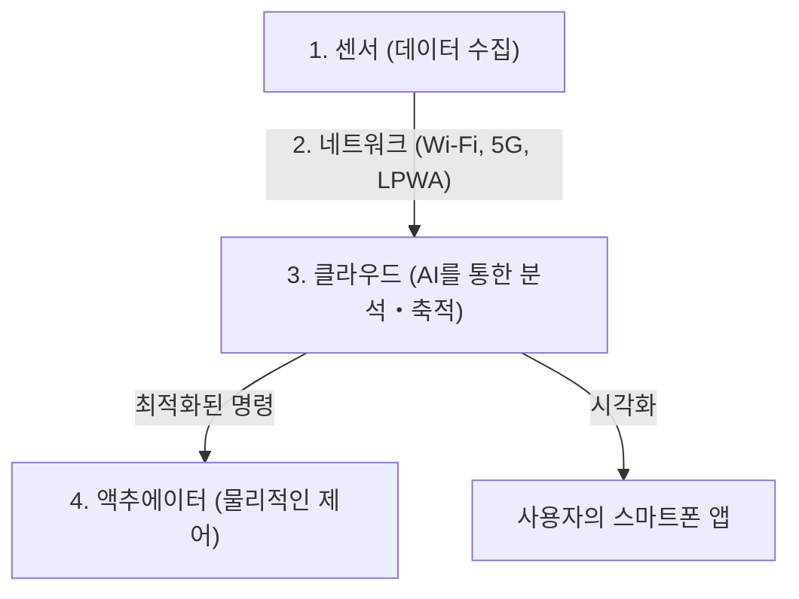

## 1. IoT(사물인터넷)란 무엇인가?

지금까지 인터넷에 연결된 기기라고 하면, PC나 스마트폰, 혹은 서버와 같은 '사람이 조작하는 IT 기기'가 중심이었습니다.
하지만 현재, TV나 에어컨 등의 가전, 자동차, 가로등, 공장의 제조 라인, 나아가 농업용 토양 센서에 이르기까지 세상의 모든 '사물(Things)'이 인터넷에 연결되기 시작했습니다.

이처럼 모든 사물이 네트워크에 연결되어 서로 정보를 교환하는 구조를 '**IoT(Internet of Things: 사물인터넷)**'라고 부릅니다.

## 2. IoT를 구성하는 '4가지 계층'

IoT 시스템은 단순히 '사물이 인터넷에 연결된다'는 것뿐만 아니라, 수집한 데이터를 분석하여 현실 세계에 피드백하기까지의 일련의 사이클로 구성되어 있습니다. 일반적으로 다음의 4가지 레이어(계층)로 나뉩니다.

### ① 디바이스・센서 (수집)
현실 세계의 모든 물리적 데이터를 디지털 데이터로 변환하는 '눈'과 '귀'의 역할을 합니다.
- 온도 센서, 습도 센서, GPS(위치 정보), 가속도 센서, 카메라(영상), 마이크(음성) 등.
- 사물에 내장된 마이컴(소형 컴퓨터)이 이러한 데이터를 수집합니다.

### ② 네트워크・통신 (전달)
수집한 데이터를 클라우드(서버)로 전송하는 '신경'의 역할입니다.
- 스마트 가전이라면 집의 **Wi-Fi**.
- 스마트워치라면 스마트폰을 경유하는 **Bluetooth**.
- 야외의 농업 센서 등에는 저소비 전력으로 장거리 통신이 가능한 **LPWA**(LoRaWAN 등)나, 초고속 대용량의 **5G** 가 사용됩니다.

### ③ 클라우드・데이터 처리 (축적・분석)
전 세계에서 보내오는 방대한 데이터(빅데이터)를 수신하고, 저장하며, 분석하는 '뇌'의 역할입니다.
- 단순한 집계뿐만 아니라, **AI(기계학습)** 를 이용하여 데이터에 숨겨진 패턴을 찾아내고 '고장 징후'나 '최적의 온도 설정' 등을 도출해 냅니다.

### ④ 애플리케이션・액추에이터 (피드백)
분석된 결과를 사람이 알기 쉽게 표시하거나, 다시 현실 세계의 '사물'을 움직이는 '근육'의 역할입니다.
- 스마트폰 앱으로 그래프를 확인한다.
- 클라우드의 명령으로 '에어컨의 온도를 내린다', '공장의 기계를 긴급 정지시킨다(액추에이터에 의한 물리적인 동작)' 등.

## 3. IoT가 활약하는 유스케이스

IoT는 이미 우리의 생활과 산업 곳곳에 스며들어 있습니다.

- **스마트 홈**: "알렉사, 불 꺼줘"라는 음성 지시나, 스마트폰의 위치 정보를 바탕으로 "집에 가까워지면 자동으로 에어컨을 켠다"와 같은 쾌적한 생활 환경을 실현합니다.
- **스마트 팩토리(인더스트리 4.0)**: 공장의 모든 기계에 센서를 부착하여, 모터의 진동이나 온도의 미세한 변화로부터 "고장 나기 전에 부품을 교체한다(예지 보전)"으로써 생산 라인의 중단을 방지합니다.
- **스마트 농업**: 밭의 토양 수분량이나 일조 시간을 센서로 24시간 모니터링하여, 농작물이 가장 맛있게 자라는 타이밍에 자동으로 스프링클러를 작동시키거나 AI가 수확 시기를 예측합니다.

## 4. IoT의 보안 리스크

IoT의 급속한 보급과 함께 '**보안**'이 매우 중요한 과제가 되고 있습니다.
PC나 스마트폰에는 강력한 보안 소프트웨어가 설치되어 있지만, 저렴한 IoT 디바이스(감시 카메라나 스마트 플러그 등)는 비용 절감을 위해 보안 대책이 불충분한 경우가 적지 않습니다.

초기 비밀번호(`admin` / `password` 등)인 채로 인터넷에 노출되어 있는 IoT 카메라가 전 세계로부터 해킹당해, DDoS 공격(타깃 서버에 대량의 통신을 보내 다운시키는 공격)의 발판으로 사용되는 사건(Mirai 봇넷 등)이 실제로 발생하고 있습니다.
"사물이 인터넷에 연결된다"는 것은, 편리해지는 동시에 "**해커가 현실 세계에 물리적인 간섭(문을 마음대로 열거나, 자동차를 폭주시키는 등)을 할 수 있게 된다**"는 리스크와 맞닿아 있다는 사실을 잊어서는 안 됩니다.

## 5. 요약

IoT는 현실 세계(피지컬 공간)와 디지털 세계(사이버 공간)를 매끄럽게 연결하는 가교입니다.
센서 기술의 소형화・저가격화, 5G와 같은 통신 인프라의 진화, 그리고 클라우드 상의 AI 기술 발전이라는 3가지 요소가 결합됨으로써, IoT는 앞으로 더욱 고도화되어 우리가 의식하지 못하는 수준에서 사회 전체를 최적화해 나갈 것입니다.
