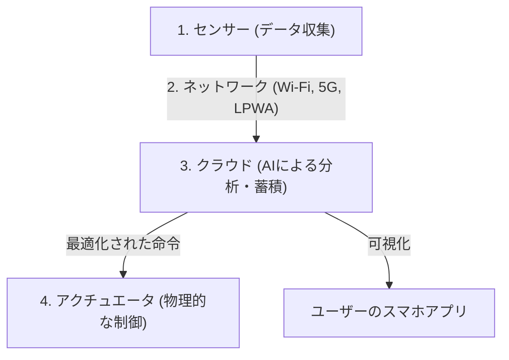

## 1. IoT（モノのインターネット）とは何か？

これまで、インターネットに繋がっているデバイスといえば、パソコンやスマートフォン、あるいはサーバーといった「人が操作するIT機器」が中心でした。
しかし現在、テレビやエアコンなどの家電、自動車、街灯、工場の製造ライン、さらには農業用の土壌センサーに至るまで、世の中のあらゆる「モノ（Things）」がインターネットに接続され始めています。

このように、あらゆるモノがネットワークに繋がり、互いに情報を交換し合う仕組みを「**IoT（Internet of Things：モノのインターネット）**」と呼びます。

## 2. IoTを構成する「4つの階層」

IoTのシステムは、単に「モノがネットに繋がる」だけでなく、収集したデータを分析し、現実世界にフィードバックするまでの一連のサイクルで構成されています。一般的に、以下の4つのレイヤー（階層）に分けられます。

### ① デバイス・センサー（収集）
現実世界のあらゆる物理的データをデジタルデータに変換する「目」や「耳」の役割を果たします。
- 温度センサー、湿度センサー、GPS（位置情報）、加速度センサー、カメラ（映像）、マイク（音声）など。
- モノに組み込まれたマイコン（小型コンピュータ）が、これらのデータを収集します。

### ② ネットワーク・通信（伝達）
集めたデータを、クラウド（サーバー）へ送信する「神経」の役割です。
- スマート家電なら家の**Wi-Fi**。
- スマートウォッチならスマホを経由する**Bluetooth**。
- 屋外の農業センサーなどには、低消費電力で長距離通信ができる**LPWA**（LoRaWANなど）や、高速大容量の**5G**が使われます。

### ③ クラウド・データ処理（蓄積・分析）
世界中から送られてくる膨大なデータ（ビッグデータ）を受け取り、保存し、分析する「脳」の役割です。
- 単純な集計だけでなく、**AI（機械学習）**を用いてデータに潜むパターンを見つけ出し、「故障の予兆」や「最適な温度設定」などを導き出します。

### ④ アプリケーション・アクチュエータ（フィードバック）
分析された結果を人間にわかりやすく表示したり、再び現実世界の「モノ」を動かしたりする「筋肉」の役割です。
- スマホのアプリでグラフを確認する。
- クラウドからの命令で「エアコンの温度を下げる」「工場の機械を緊急停止させる（アクチュエータによる物理的な動作）」など。

## 3. IoTが活躍するユースケース

IoTはすでに私たちの生活や産業の至る所に浸透しています。

- **スマートホーム**: 「アレクサ、電気を消して」という音声指示や、スマホの位置情報を元に「家に近づいたら自動でエアコンをつける」といった快適な生活環境を実現します。
- **スマートファクトリー（インダストリー4.0）**: 工場のすべての機械にセンサーを取り付け、モーターの振動や温度の微細な変化から「壊れる前に部品を交換する（予知保全）」ことで、生産ラインの停止を防ぎます。
- **スマート農業**: 畑の土壌の水分量や日照時間をセンサーで24時間監視し、農作物が最も美味しく育つタイミングで自動的にスプリンクラーを作動させたり、収穫時期をAIが予測したりします。

## 4. IoTのセキュリティリスク

IoTの急速な普及に伴い、「**セキュリティ**」が極めて重大な課題となっています。
パソコンやスマホには強力なセキュリティソフトが入っていますが、安価なIoTデバイス（監視カメラやスマートプラグなど）は、コスト削減のためにセキュリティ対策が不十分なものが少なくありません。

初期パスワード（`admin` / `password`など）のままインターネットに晒されているIoTカメラが世界中からハッキングされ、DDoS攻撃（ターゲットのサーバーに大量の通信を送りつけてダウンさせる攻撃）の踏み台にされる事件（Miraiボットネットなど）が実際に起きています。
「モノがネットに繋がる」ということは、便利になると同時に「**ハッカーが現実世界に物理的な干渉（鍵を勝手に開ける、車を暴走させるなど）をできるようになる**」というリスクと隣り合わせであることを忘れてはなりません。

## 5. まとめ

IoTは、現実世界（フィジカル空間）とデジタル世界（サイバー空間）をシームレスに繋ぐ架け橋です。
センサー技術の小型化・低価格化、5Gのような通信インフラの進化、そしてクラウド上のAI技術の発展という3つの要素が掛け合わさることで、IoTはこれからさらに高度化し、私たちが意識しないレベルで社会全体を最適化していくでしょう。
