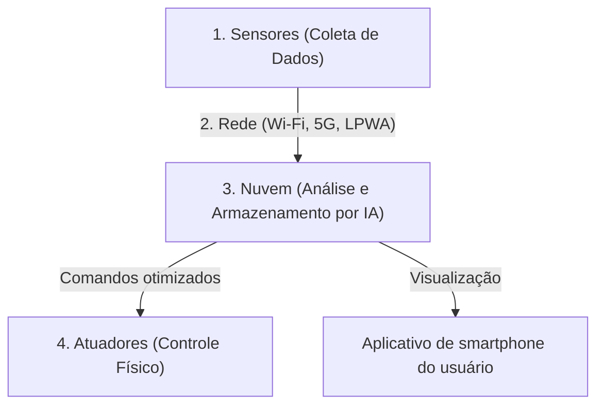

## 1. O que é a IoT (Internet das Coisas)?

Até agora, quando pensávamos em dispositivos conectados à internet, pensávamos principalmente em "equipamentos de TI operados por pessoas", como computadores, smartphones e servidores.
No entanto, atualmente, todas as "coisas (Things)" do mundo estão começando a se conectar à internet, desde eletrodomésticos como televisões e ares-condicionados, carros, postes de luz, linhas de produção em fábricas, até sensores de solo para agricultura.

Esse sistema, onde todas as coisas estão conectadas a uma rede e trocam informações entre si, é chamado de "**IoT (Internet of Things: Internet das Coisas)**".

## 2. As "4 Camadas" que Compõem a IoT

O sistema de IoT não consiste apenas em "conectar coisas à internet", mas sim em um ciclo completo de coleta de dados, análise e feedback para o mundo real. Geralmente, ele é dividido nas seguintes 4 camadas (layers).

### ① Dispositivos e Sensores (Coleta)
Atuam como os "olhos" e "ouvidos" que convertem todos os dados físicos do mundo real em dados digitais.
- Sensores de temperatura, sensores de umidade, GPS (informação de localização), sensores de aceleração, câmeras (vídeo), microfones (áudio), etc.
- Microcontroladores (pequenos computadores) embutidos nas coisas coletam esses dados.

### ② Rede e Comunicação (Transmissão)
Atua como os "nervos" que enviam os dados coletados para a nuvem (servidor).
- **Wi-Fi** doméstico para eletrodomésticos inteligentes.
- **Bluetooth** via smartphone para smartwatches.
- **LPWA** (como LoRaWAN), que permite comunicação de longo alcance com baixo consumo de energia, ou **5G**, de alta velocidade e grande capacidade, para sensores agrícolas externos.

### ③ Nuvem e Processamento de Dados (Armazenamento e Análise)
Atua como o "cérebro" que recebe, armazena e analisa a enorme quantidade de dados (big data) enviados de todo o mundo.
- Em vez de uma simples tabulação, a **IA (Aprendizado de Máquina)** é usada para encontrar padrões ocultos nos dados e deduzir "sinais de falha" ou a "configuração ideal de temperatura".

### ④ Aplicativos e Atuadores (Feedback)
Atuam como os "músculos" que exibem os resultados analisados de forma compreensível para os humanos ou movimentam novamente as "coisas" do mundo real.
- Verificar gráficos em um aplicativo de smartphone.
- Comandos da nuvem, como "diminuir a temperatura do ar-condicionado" ou "parada de emergência de máquinas na fábrica (ação física por atuadores)", etc.

## 3. Casos de Uso Onde a IoT se Destaca

A IoT já permeia todas as partes da nossa vida e da indústria.

- **Casa Inteligente (Smart Home)**: Proporciona um ambiente de vida confortável através de comandos de voz como "Alexa, apague a luz" ou configurações como "ligar o ar-condicionado automaticamente quando se aproximar de casa" com base nas informações de localização do smartphone.
- **Fábrica Inteligente (Indústria 4.0)**: Instala sensores em todas as máquinas da fábrica e, a partir de vibrações de motores ou pequenas mudanças de temperatura, realiza a "troca de peças antes de quebrar (manutenção preditiva)", prevenindo paradas na linha de produção.
- **Agricultura Inteligente (Smart Agriculture)**: Monitora o nível de umidade e as horas de sol no solo 24 horas por dia através de sensores, ativando automaticamente os aspersores no momento ideal para o cultivo dos produtos agrícolas, e a IA prevê o momento da colheita.

## 4. Riscos de Segurança da IoT

Com a rápida adoção da IoT, a "**segurança**" tornou-se uma questão extremamente crítica.
Enquanto computadores e smartphones possuem um forte software de segurança, muitos dispositivos IoT baratos (como câmeras de vigilância e tomadas inteligentes) têm medidas de segurança insuficientes para reduzir custos.

Existem incidentes reais (como a botnet Mirai) em que câmeras IoT, expostas à internet com senhas iniciais (como `admin` / `password`), foram hackeadas globalmente e usadas como trampolins para ataques DDoS (ataques que sobrecarregam e derrubam o servidor alvo enviando uma grande quantidade de tráfego).
Não devemos esquecer que o fato de "as coisas estarem conectadas à internet" significa que é mais conveniente, mas ao mesmo tempo acarreta o risco de que "**hackers possam interferir fisicamente no mundo real (como abrir fechaduras sem permissão, descontrolar carros, etc.)**".

## 5. Conclusão

A IoT é uma ponte que conecta perfeitamente o mundo real (espaço físico) e o mundo digital (espaço cibernético).
Com a combinação de três elementos – a miniaturização e redução de preços da tecnologia de sensores, a evolução de infraestruturas de comunicação como o 5G e o desenvolvimento da tecnologia de IA na nuvem – a IoT se tornará ainda mais avançada, otimizando toda a sociedade a um nível que nem sequer perceberemos.
