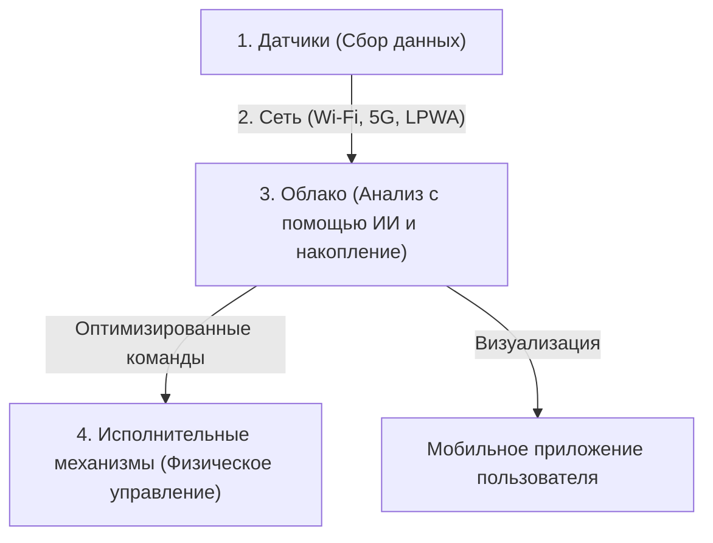

## 1. Что такое IoT (Интернет вещей)?

До сих пор к интернету в основном подключались устройства вроде компьютеров, смартфонов или серверов — «IT-оборудование, управляемое людьми».
Однако сегодня в мире всевозможные «вещи» (Things) — телевизоры, кондиционеры и другая бытовая техника, автомобили, уличные фонари, производственные линии на заводах и даже почвенные датчики для сельского хозяйства — начинают подключаться к интернету.

Такая система, в которой любые вещи подключены к сети и обмениваются информацией друг с другом, называется «**IoT (Internet of Things: Интернет вещей)**».

## 2. «4 уровня», составляющие IoT

Система IoT — это не просто «подключение вещей к сети», она состоит из непрерывного цикла: от сбора данных до их анализа и возврата в реальный мир. Как правило, её делят на следующие 4 уровня (слоя).

### ① Устройства и датчики (Сбор)
Они играют роль «глаз» и «ушей», преобразуя любые физические данные реального мира в цифровой формат.
- Датчики температуры, влажности, GPS (геолокация), акселерометры, камеры (видео), микрофоны (аудио) и т.д.
- Микроконтроллеры (миниатюрные компьютеры), встроенные в вещи, собирают эти данные.

### ② Сети и связь (Передача)
Это «нервная система», передающая собранные данные в облако (на серверы).
- Для умной бытовой техники используется домашний **Wi-Fi**.
- Для умных часов — **Bluetooth** с подключением через смартфон.
- Для уличных сельскохозяйственных датчиков применяются энергоэффективные сети дальнего радиуса действия **LPWA** (например, LoRaWAN) или высокоскоростные сети высокой емкости **5G**.

### ③ Облако и обработка данных (Накопление и анализ)
Это «мозг», который принимает, хранит и анализирует огромные объемы данных (биг-дата), поступающих со всего мира.
- Помимо простых подсчетов, используется **ИИ (машинное обучение)** для выявления скрытых закономерностей в данных, что позволяет предсказывать «признаки поломки» или определять «оптимальные настройки температуры».

### ④ Приложения и исполнительные механизмы (Обратная связь)
Это «мышцы», которые в понятном виде отображают результаты анализа для человека или заставляют «вещи» в реальном мире снова действовать.
- Просмотр графиков в приложении на смартфоне.
- Команды из облака, например, «понизить температуру кондиционера» или «экстренно остановить заводской станок (физическое действие с помощью исполнительного механизма)».

## 3. Сценарии использования IoT

IoT уже проник во все сферы нашей жизни и промышленности.

- **Умный дом**: Обеспечивает комфортную среду для жизни — от голосовых команд вроде «Алекса, выключи свет» до автоматического включения кондиционера при приближении к дому на основе данных геолокации смартфона.
- **Умный завод (Индустрия 4.0)**: Установка датчиков на всех заводских станках позволяет «заменять детали до их поломки (предиктивное обслуживание)» благодаря мельчайшим изменениям температуры или вибрации двигателей, что предотвращает остановку производственных линий.
- **Умное сельское хозяйство**: Датчики круглосуточно отслеживают уровень влажности почвы и время инсоляции на полях, автоматически включая спринклеры в наиболее подходящий момент для роста растений, а ИИ прогнозирует время сбора урожая.

## 4. Риски безопасности IoT

С быстрым распространением IoT «**безопасность**» стала крайне серьезной проблемой.
На компьютерах и смартфонах установлено мощное программное обеспечение для обеспечения безопасности, однако многие дешевые IoT-устройства (камеры видеонаблюдения, умные розетки и т.д.) ради снижения стоимости часто имеют недостаточные меры защиты.

В реальности уже происходили инциденты, когда выставленные в интернет IoT-камеры со стандартными паролями (`admin` / `password` и т.д.) взламывались по всему миру и использовались как плацдарм для DDoS-атак (атак, направленных на вывод из строя целевых серверов путем отправки огромного количества запросов), таких как ботнет Mirai.
Не следует забывать, что «подключение вещей к сети» означает не только удобство, но и риск того, что «**хакеры получат возможность физически вмешиваться в реальный мир (например, самовольно открывать замки или заставлять автомобили выходить из-под контроля)**».

## 5. Заключение

IoT — это мост, бесшовно соединяющий реальный мир (физическое пространство) и цифровой мир (киберпространство).
Сочетание трех факторов — миниатюризации и удешевления сенсорных технологий, эволюции телекоммуникационной инфраструктуры, такой как 5G, и развития технологий ИИ в облаке — приведет к дальнейшему совершенствованию IoT, которое будет оптимизировать общество в целом на таком уровне, о котором мы даже не будем задумываться.
