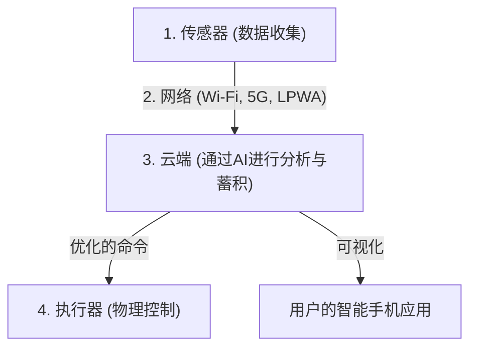

## 1. IoT（物联网）是什么？

一直以来，连接到互联网的设备主要是个人电脑、智能手机或服务器等“由人操作的IT设备”。
但是现在，从电视和空调等家电、汽车、路灯、工厂的生产线，甚至农业用的土壤传感器，世间的各种“事物（Things）”都开始连接到互联网。

像这样，所有事物都连接到网络并相互交换信息的机制被称为“ **IoT（Internet of Things：物联网）** ”。

## 2. 构成IoT的“4个层级”

IoT系统不仅是“事物连接到网络”，而是由收集数据、分析数据并将其反馈到现实世界的一系列循环组成的。一般来说，可以分为以下4个层级（Layer）。

### ① 设备与传感器（收集）
扮演将现实世界中所有物理数据转化为数字数据的“眼睛”和“耳朵”的角色。
- 温度传感器、湿度传感器、GPS（位置信息）、加速度传感器、摄像头（影像）、麦克风（声音）等。
- 嵌入在事物中的微控制器（小型计算机）负责收集这些数据。

### ② 网络与通信（传递）
扮演将收集到的数据发送到云端（服务器）的“神经”角色。
- 如果是智能家电，那就是家里的 **Wi-Fi** 。
- 如果是智能手表，就是经过智能手机的 **Bluetooth** 。
- 对于户外的农业传感器等，会使用低功耗且能长距离通信的 **LPWA** （如LoRaWAN等）以及高速大容量的 **5G** 。

### ③ 云端与数据处理（蓄积与分析）
扮演接收、保存并分析来自世界各地的庞大数据（大数据）的“大脑”角色。
- 不仅是单纯的汇总，还使用 **AI（机器学习）** 来发现隐藏在数据中的模式，推导出“故障的前兆”或“最佳的温度设定”等。

### ④ 应用程序与执行器（反馈）
扮演将分析结果以易于人类理解的方式显示出来，或再次驱动现实世界中的“事物”的“肌肉”角色。
- 通过智能手机应用查看图表。
- 接收来自云端的命令，如“调低空调温度”、“紧急停止工厂的机械（通过执行器进行的物理动作）”等。

## 3. IoT大显身手的使用场景

IoT已经渗透到我们生活和产业的各个角落。

- **智能家居**: “Alexa，关灯”这样的语音指令，或者基于智能手机的位置信息实现“快到家时自动打开空调”等舒适的生活环境。
- **智能工厂（工业4.0）**: 为工厂的所有机械安装传感器，通过电机振动和温度的微小变化，在“发生故障前更换零件（预测性维护）”，从而防止生产线停机。
- **智能农业**: 使用传感器24小时监控农田土壤的水分含量和日照时间，在农作物生长最美味的时机自动启动喷水器，或者由AI预测收获时期。

## 4. IoT的安全风险

随着IoT的快速普及，“ **安全** ”已成为极其重大的课题。
个人电脑和智能手机上安装有强大的安全软件，但廉价的IoT设备（监控摄像头或智能插座等），为了降低成本而导致安全措施不足的情况不在少数。

一直保留初始密码（如 `admin` / `password` 等）暴露在互联网上的IoT摄像头被世界各地的黑客攻击，并成为DDoS攻击（向目标服务器发送大量通信导致其宕机的攻击）跳板的事件（如Mirai僵尸网络等）实际上已经发生过。
我们绝不能忘记，“事物连接到网络”意味着在变得便利的同时，也伴随着“ **黑客能够对现实世界进行物理干涉（擅自开锁、让汽车失控等）** ”的风险。

## 5. 总结

IoT是无缝连接现实世界（物理空间）与数字世界（网络空间）的桥梁。
传感器技术的小型化与低价格化、如5G这样的通信基础设施的演进，以及云端AI技术的发展，这三个要素交织在一起，将使IoT在未来更加高度化，并在我们意识不到的层面上优化整个社会。
