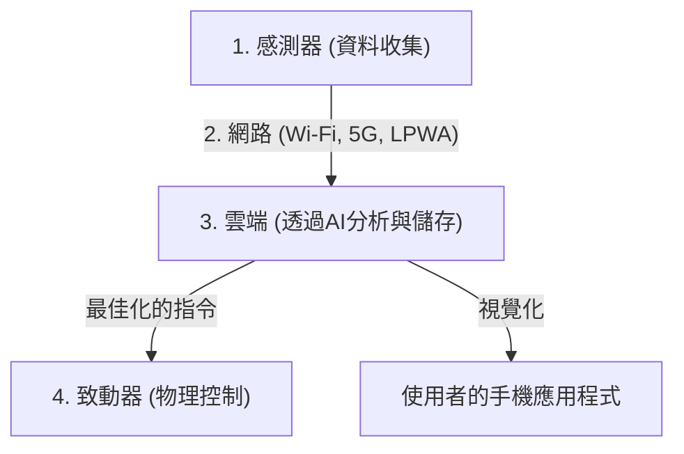

## 1. IoT（物聯網）是什麼？

一直以來，連接到網際網路的裝置，主要以電腦、智慧型手機或伺服器等「由人操作的IT設備」為主。
然而現在，從電視和冷氣等家電、汽車、路燈、工廠的生產線，甚至農業用的土壤感測器，世界上所有的「事物（Things）」都開始連接到網際網路。

像這樣，讓所有事物連接到網路並互相交換資訊的機制，我們稱之為「 **IoT（Internet of Things：物聯網）** 」。

## 2. 構成IoT的「4個階層」

IoT系統不只是「事物連上網路」，而是由收集資料、進行分析，到回饋給現實世界的一連串循環所構成。一般來說，可以分為以下4個層級（階層）。

### ① 裝置與感測器（收集）
扮演將現實世界中所有物理資料轉換為數位資料的「眼睛」和「耳朵」的角色。
- 溫度感測器、濕度感測器、GPS（位置資訊）、加速度感測器、攝影機（影像）、麥克風（聲音）等。
- 內建在事物中的微控制器（小型電腦）負責收集這些資料。

### ② 網路與通訊（傳遞）
扮演將收集到的資料發送到雲端（伺服器）的「神經」角色。
- 智慧家電會使用家中的 **Wi-Fi** 。
- 智慧型手錶會使用透過手機的 **Bluetooth** 。
- 戶外的農業感測器等，則會使用低功耗且能長距離通訊的 **LPWA** （如LoRaWAN等）或高速大容量的 **5G** 。

### ③ 雲端與資料處理（儲存與分析）
扮演接收、保存並分析從世界各地傳來龐大資料（大數據）的「大腦」角色。
- 不只是單純的統計，還會運用 **AI（機器學習）** 找出隱藏在資料中的模式，推導出「故障的預兆」或「最佳的溫度設定」等結果。

### ④ 應用程式與致動器（回饋）
扮演將分析結果以人類容易理解的方式顯示，或是再次驅動現實世界中「事物」的「肌肉」角色。
- 在手機應用程式上確認圖表。
- 來自雲端的指令，例如「調低冷氣溫度」、「緊急停止工廠的機械（透過致動器進行物理動作）」等。

## 3. IoT大顯身手的使用案例

IoT已經滲透到我們生活和產業的各個角落。

- **智慧家庭** ：透過「Alexa，把燈關掉」等語音指令，或是根據手機的位置資訊實現「靠近家時自動打開冷氣」等舒適的生活環境。
- **智慧工廠（工業4.0）** ：在工廠所有的機械上安裝感測器，從馬達震動或溫度的微小變化中，在「損壞前更換零件（預測性維護）」，以防止生產線停擺。
- **智慧農業** ：利用感測器24小時監控農田土壤的水分和日照時間，在農作物能長得最美味的時機自動啟動灑水器，或由AI預測收成時間。

## 4. IoT的資安風險

隨著IoT的迅速普及，「 **資訊安全** 」已成為極其重大的課題。
雖然電腦和手機都裝有強大的防毒軟體，但許多廉價的IoT裝置（如監視攝影機和智慧插座等），為了降低成本，往往在資安對策上做得很不充分。

實際上曾發生過，使用預設密碼（如 `admin` / `password` 等）且直接暴露在網際網路上的IoT攝影機遭世界各地的駭客入侵，並被當作DDoS攻擊（向目標伺服器發送大量通訊使其癱瘓的攻擊）跳板的事件（如Mirai殭屍網路等）。
我們不能忘記，「事物連上網路」在帶來便利的同時，也伴隨著「 **駭客將能夠對現實世界進行物理干涉（如擅自開鎖、使車輛失控等）** 」的風險。

## 5. 總結

IoT是無縫連接現實世界（物理空間）與數位世界（網路空間）的橋樑。
隨著感測器技術的微型化與平價化、如5G等通訊基礎設施的進化，以及雲端上AI技術的發展，這三個要素的結合將使IoT在未來更加高度化，並在我們沒有察覺的情況下，將整個社會最佳化。
