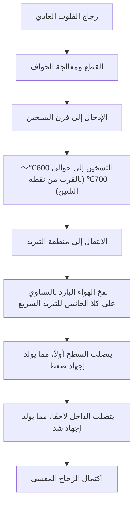
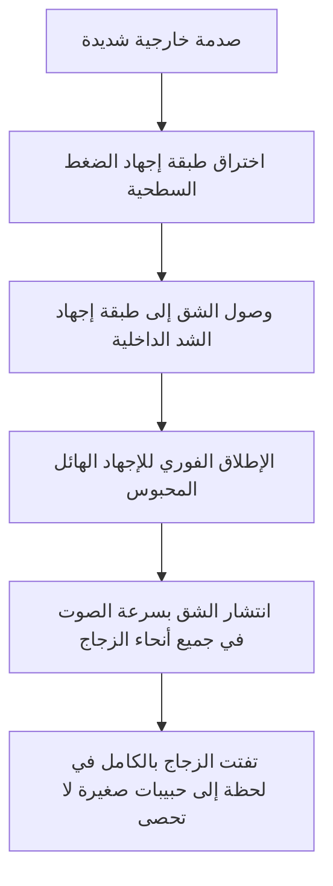

# ما هو الزجاج المقسى؟

الهواتف الذكية التي نلمسها يوميًا، والنوافذ الجانبية للسيارات، والأبواب الزجاجية الكبيرة في المكاتب. ما يجمع بين هذه الأشياء هو استخدام 'الزجاج المقسى' (Tempered Glass). يتميز الزجاج المقسى بقوة تفوق الزجاج العادي (زجاج الفلوت) بـ 3 إلى 5 مرات. ومع ذلك، فإن قيمته الحقيقية لا تكمن فقط في كونه 'يصعب كسره'. بل تكمن في 'التصميم الآمن' الذي يجعله يتفتت إلى حبيبات صغيرة بدلاً من شظايا حادة كالشفرات في حال انكساره.

في هذا المقال، سنتعمق في شرح سبب قوة الزجاج المقسى، وعملية التصنيع التي يمر بها، ولماذا يتفتت عند انكساره، من منظور الآليات الفيزيائية وهندسة المواد.

## 1. الاختلاف عن زجاج الفلوت العادي

أولاً، دعونا نفهم الزجاج العادي (زجاج الفلوت). يُصنع زجاج الفلوت بواسطة 'عملية الفلوت' حيث يُطفو الزجاج المصهور فوق القصدير المصهور لتشكيل لوح أملس. يتميز هذا الزجاج بشفافية عالية وسطح أملس، ولكنه ليس قوياً جداً ضد الصدمات الفيزيائية والتغيرات الحرارية.

عندما ينكسر زجاج الفلوت، تنتشر الشقوق بحرية، مما يؤدي إلى شظايا حادة وخطيرة للغاية (كسور حادة الزوايا). يحدث هذا لأن الإجهاد الداخلي متساوٍ، وتتركز طاقة الكسر في طرف الشق لتتقدم دفعة واحدة.

من ناحية أخرى، الزجاج المقسى هو زجاج فلوت تمت معالجته بعملية حرارية (أو كيميائية) خاصة. لا يتغير مظهره ونفاذيته للضوء تقريبًا، لكن داخله يحبس 'عاصفة من الإجهاد' غير مرئية.

## 2. عملية تصنيع الزجاج المقسى: التسخين بدرجة حرارة عالية والتبريد السريع

يكمن سر قوة الزجاج المقسى في عملية تصنيعه. دعونا نلقي نظرة على عملية 'التقسية بالتبريد الهوائي' الأكثر شيوعاً.

### مرحلة التسخين
يتم تسخين الزجاج إلى حوالي 600 درجة مئوية إلى 700 درجة مئوية، وهي قريبة من نقطة التليين. عند هذه الدرجة، لا يكون الزجاج قد ذاب بعد، ولكن الجزيئات الداخلية تصبح أكثر قابلية للحركة قليلاً، ويدخل في حالة يتم فيها تحرير الإجهاد (حالة اللزوجة المرنة).

### مرحلة التبريد السريع (السقي)
ينتقل الزجاج المسخن إلى منطقة التبريد، حيث يُنفخ الهواء البارد عالي الضغط بقوة وبالتساوي من كلا الجانبين. هذا 'التبريد السريع' هو المفتاح السحري.

1. **تصلب السطح**: يتم تبريد سطح الزجاج الذي يلامس الهواء البارد مباشرة بسرعة ويتصلب.
2. **انكماش الداخل**: حتى بعد تصلب السطح، يظل الجزء الداخلي من الزجاج ساخنًا ويحافظ على حالة التمدد. ومع ذلك، مع مرور الوقت، يبدأ الجزء الداخلي في البرودة والانكماش تدريجياً.
3. **تثبيت الإجهاد**: عندما يحاول الجزء الداخلي الانكماش، يقوم السطح المتصلب بالفعل بسحبه للوراء. ونتيجة لذلك، يتم تثبيت 'قوة دفع نحو الداخل' (إجهاد ضغط) على سطح الزجاج، و'قوة سحب نحو الخارج' (إجهاد شد) في الداخل بشكل دائم.

## 3. التوازن المثالي بين إجهاد الضغط وإجهاد الشد

تعتمد قوة الزجاج المقسى على هذا التوازن بين **'إجهاد الضغط السطحي'** و**'إجهاد الشد الداخلي'**.

كمادة، الزجاج قوي جداً ضد 'قوة الدفع' (الضغط)، ولكنه ضعيف ضد 'قوة السحب' (الشد). عندما يصطدم جسم بزجاج عادي وينحني، يتولد 'إجهاد شد' على السطح المقابل للصدمة، ومن هناك تبدأ الشقوق وينكسر الزجاج.

ومع ذلك، في حالة الزجاج المقسى، يكون السطح تحت 'إجهاد ضغط' قوي مسبقًا. حتى لو تلقى صدمة خارجية وانحنى الزجاج، مما يولد قوة تحاول سحب السطح، فإن إجهاد الضغط الموجود أصلاً يلغي تلك القوة. بمعنى آخر، ما لم يتجاوز إجهاد الشد الناتج عن الصدمة إجهاد الضغط السطحي، فلن تحدث شقوق في الزجاج.

هذا هو السبب في أن الزجاج المقسى يمتلك قوة تفوق الزجاج العادي بـ 3 إلى 5 مرات.

## 4. آلية الأمان عند الكسر (الكسر الحبيبي)

الميزة الأخرى الكبرى والأهم للزجاج المقسى هي 'طريقة انكساره'.

داخل الزجاج المقسى، يتم حبس 'إجهاد شد' هائل. هذا يشبه تثبيت زنبرك ممتد إلى أقصى حد. ماذا يحدث إذا حدث شق في الزجاج لأي سبب كان (كأن يخترق جسم حاد جداً طبقة إجهاد الضغط السطحية، أو تأثير قوي على الحافة) واختل توازن هذا الإجهاد؟

في اللحظة التي يصل فيها الشق إلى طبقة إجهاد الشد الداخلية، يتم إطلاق الطاقة المحبوسة دفعة واحدة. بسبب إطلاق هذه الطاقة، ينتشر الشق بسرعة آلاف الأمتار في الثانية عبر الزجاج بالكامل، ويحطمه إلى قطع صغيرة في ثوانٍ.

الشظايا الناتجة في هذه اللحظة تصبح حبيبات صغيرة مكعبة أو مستديرة الشكل (تفتت حبيبي). يحدث هذا لأن الإجهاد الداخلي يتقاطع بشكل شبكي، وتتوزع الطاقة وتُطلق بشكل دقيق. نظرًا لأن هذه الشظايا الصغيرة لا تمتلك حواف حادة كالزجاج العادي، فإن خطر التعرض لجروح خطيرة يقل بشكل كبير حتى لو اصطدمت بجسم الإنسان. هذا هو السبب في إلزام استخدام الزجاج المقسى في نوافذ السيارات وأبواب غرف الاستحمام.

## 5. نقاط الضعف والمحاذير للزجاج المقسى

حتى الزجاج المقسى الذي يبدو مثالياً له بعض نقاط الضعف.

1. **ضعيف أمام الصدمات على الحواف (الأطراف)**: بينما السطح قوي جدًا، فإن الحواف المقطوعة غير مستقرة هيكليًا من حيث توازن الإجهاد، وإذا تعرضت لصدمة هناك، فمن السهل أن يتفتت الزجاج بالكامل.
2. **غير قابل للتشكيل**: بعد إجراء المعالجة بالتقسية، من المستحيل قطع الزجاج أو حفر ثقوب فيه. نظرًا لأن إحداث أي خدش صغير يخل بتوازن الإجهاد ويؤدي إلى كسر متفجر، يجب إجراء جميع عمليات القطع أو الحفر قبل المعالجة الحرارية.
3. **الكسر التلقائي (الانفجار التلقائي)**: في حالات نادرة جداً، بسبب شائبة تسمى كبريتيد النيكل (NiS) الموجودة في المواد الخام للزجاج، يمكن أن ينكسر الزجاج فجأة دون أي صدمة. يرجع ذلك إلى أن NiS يتمدد في الحجم مع مرور الوقت وتغيرات درجة الحرارة، مما يعمل كمحفز يخل بتوازن الإجهاد الداخلي. لمنع ذلك، يتم اتخاذ تدابير مثل إجراء اختبار النقع الحراري (اختبار إعادة التسخين) بعد التصنيع لكسر القطع المعيبة مسبقًا.

## 6. الخلاصة

الزجاج المقسى ليس مجرد زجاج صُنع ليكون سميكًا وقويًا. بل هو بلورة لهندسة مواد متقدمة للغاية، تستخدم طاقة الحرارة لحبس 'القوة' داخل الزجاج نفسه، وتلغي الصدمات الخارجية بواسطة تلك القوة، وتحمي البشر من خلال تحطيم نفسه إلى قطع صغيرة في حالة الطوارئ.

الجمع بين 'عدم الكسر' و'الكسر بأمان'. هذه الآلية للزجاج المقسى تستمر في حماية حياتنا بهدوء وبقوة. في الجيل القادم من الشاشات ومواد البناء، ستتطور تكنولوجيا التحكم في الإجهاد هذه بشكل أكبر، مما يؤدي إلى تطوير مواد زجاجية أرق وأقوى وأكثر أمانًا.
