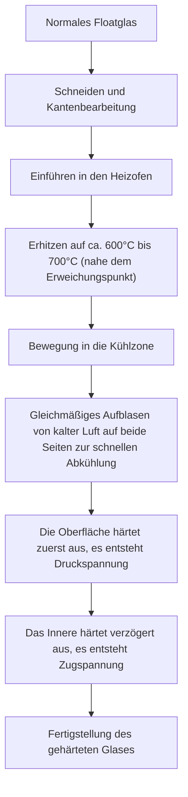
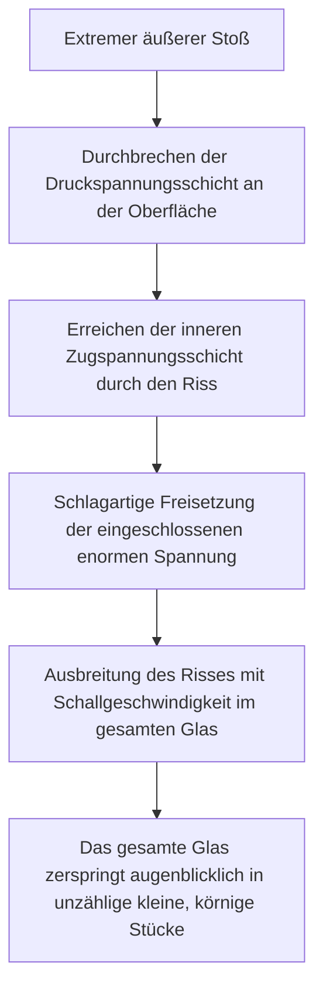

# Was ist gehärtetes Glas?

Smartphones, die wir täglich berühren, die Seitenfenster von Autos und die großen Glastüren in Büros. Was sie alle gemeinsam haben, ist die Verwendung von "gehärtetem Glas" (Tempered Glass). Gehärtetes Glas ist 3- bis 5-mal fester als normales Glas (Floatglas). Sein wahrer Wert liegt jedoch nicht nur darin, dass es "schwer zu brechen" ist. Es verfügt über ein "Sicherheitsdesign", bei dem es im unwahrscheinlichen Fall eines Bruchs nicht in scharfe, messerartige Scherben zerspringt, sondern in feine, körnige Stücke zerfällt.

In diesem Artikel werden wir aus der Perspektive der physikalischen Mechanismen und der Materialwissenschaft tiefgehend erklären, warum gehärtetes Glas so stark ist, durch welchen Herstellungsprozess es entsteht und warum es beim Zerbrechen in kleine Stücke zerspringt.

## 1. Der Unterschied zu normalem Floatglas

Lassen Sie uns zunächst normales Glas (Floatglas) verstehen. Floatglas wird durch das "Floatverfahren" hergestellt, bei dem geschmolzenes Glas auf geschmolzenem Zinn schwimmt, um eine flache Plattenform zu bilden. Dieses Glas ist hochtransparent und glatt, aber nicht sehr widerstandsfähig gegen physische Stöße oder Temperaturschwankungen.

Wenn Floatglas bricht, breiten sich die Risse frei aus, was zu sehr scharfen und gefährlichen Scherben (scharfkantiger Bruch) führt. Dies liegt daran, dass die innere Spannung gleichmäßig verteilt ist und sich die Bruchenergie an der Spitze des Risses konzentriert und mit einem Mal fortschreitet.

Andererseits ist gehärtetes Glas dieses Floatglas, das durch eine spezielle Wärmebehandlung (oder chemische Behandlung) verarbeitet wurde. Obwohl sich Aussehen und Lichtdurchlässigkeit kaum verändern, ist in seinem Inneren ein unsichtbarer "Sturm der Spannungen" eingeschlossen.

## 2. Der Herstellungsprozess von gehärtetem Glas: Erhitzen auf hohe Temperaturen und schnelles Abkühlen

Das Geheimnis der Stärke von gehärtetem Glas liegt in seinem Herstellungsprozess. Schauen wir uns den Prozess der am häufigsten verwendeten "Luftabschreckungs-Härtung" an.

### Erhitzungsprozess
Das Glas wird auf etwa 600°C bis 700°C nahe seinem Erweichungspunkt erhitzt. Bei dieser Temperatur ist das Glas noch nicht geschmolzen, aber die Moleküle im Inneren können sich etwas leichter bewegen und es befindet sich in einem spannungsfreien Zustand (viskoelastischer Zustand).

### Abschreckprozess (Quenchen)
Das erhitzte Glas wird in die Kühlzone bewegt, wo Hochdruck-Kaltluft gleichmäßig und stark auf beide Seiten geblasen wird. Diese "schnelle Abkühlung" ist der magische Schlüssel.

1. **Aushärten der Oberfläche**: Die Oberfläche des Glases, die direkt mit der kalten Luft in Berührung kommt, kühlt schnell ab und erstarrt.
2. **Schrumpfen des Inneren**: Auch nachdem die Oberfläche erstarrt ist, bleibt das Innere des Glases heiß und ausgedehnt. Mit zeitlicher Verzögerung kühlt jedoch auch das Innere allmählich ab und versucht zu schrumpfen.
3. **Fixierung der Spannung**: Wenn das Innere versucht zu schrumpfen, zieht die bereits erstarrte Oberfläche dagegen. Infolgedessen wird in der Oberfläche des Glases eine "nach innen drückende Kraft (Druckspannung)" und im Inneren eine "nach außen ziehende Kraft (Zugspannung)" dauerhaft fixiert.

## 3. Die perfekte Balance zwischen Druck- und Zugspannung

Die Festigkeit von gehärtetem Glas beruht auf der Balance zwischen dieser **"Druckspannung an der Oberfläche"** und der **"Zugspannung im Inneren"**.

Das Material Glas hat die Eigenschaft, sehr stark gegen "drückende Kräfte (Druck)" zu sein, aber schwach gegen "ziehende Kräfte (Zug)". Wenn normales Glas von einem Objekt getroffen wird und sich biegt, entsteht auf der Oberfläche gegenüber dem Aufprall eine "Zugspannung", von der aus ein Riss entsteht und das Glas bricht.

Bei gehärtetem Glas liegt jedoch im Vorfeld eine starke "Druckspannung" auf der Oberfläche. Selbst wenn das Glas durch einen äußeren Stoß gebogen wird und eine Kraft wirkt, die versucht, die Oberfläche zu dehnen, wird diese durch die ursprünglich vorhandene Druckspannung aufgehoben. Das heißt, solange die durch den Stoß verursachte Zugspannung die Druckspannung der Oberfläche nicht übersteigt, wird das Glas nicht reißen.

Dies ist der Grund, warum gehärtetes Glas 3- bis 5-mal fester ist als normales Glas.

## 4. Der Sicherheitsmechanismus beim Zerbrechen (körniger Bruch)

Ein weiteres und das größte Merkmal von gehärtetem Glas ist die "Art und Weise, wie es bricht".

Im Inneren von gehärtetem Glas ist eine enorme "Zugspannung" eingeschlossen. Es ist so, als ob man eine Feder bis zum Limit dehnt und sie in diesem Zustand fixiert. Was passiert, wenn das Glas aus irgendeinem Grund reißt (z.B. wenn ein sehr scharfer Gegenstand die Druckspannungsschicht der Oberfläche durchbricht oder durch einen starken Stoß auf die Kante) und das Gleichgewicht dieser Spannung gestört wird?

In dem Moment, in dem der Riss die innere Zugspannungsschicht erreicht, wird die eingeschlossene Energie schlagartig freigesetzt. Durch diese Energiefreisetzung breitet sich der Riss mit einer Geschwindigkeit von mehreren tausend Metern pro Sekunde über das gesamte Glas aus und zerschmettert das Glas augenblicklich in winzige Stücke.

Die dabei entstehenden Scherben werden zu würfel- oder abgerundeten feinen Körnern (körniger Bruch). Das liegt daran, dass sich die inneren Spannungen netzartig kreuzen und die Energie in feinen Teilen verteilt freigesetzt wird. Da diese feinen Scherben keine scharfen Kanten wie normales Glas haben, wird das Risiko schwerer Schnittverletzungen beim Auftreffen auf den menschlichen Körper drastisch reduziert. Aus diesem Grund ist gehärtetes Glas für Autofenster und Duschkabinentüren vorgeschrieben.

## 5. Schwächen und Vorsichtsmaßnahmen bei gehärtetem Glas

Auch das scheinbar perfekte gehärtete Glas hat einige Schwächen.

1. **Anfällig für Stöße auf die Kanten**: Obwohl die Oberfläche sehr stark ist, ist die Spannungsbalance an den geschnittenen Kanten strukturell instabil, und wenn hier ein Stoß ausgeübt wird, kann das Ganze leicht zersplittern.
2. **Kann nicht bearbeitet werden**: Nach dem Härteprozess darf das Glas unter keinen Umständen mehr geschnitten oder gebohrt werden. Da selbst der kleinste Kratzer das Spannungsgleichgewicht stört und zu einer explosiven Zerstörung führt, müssen alle Schnitte und Bohrungen vor der Wärmebehandlung durchgeführt werden.
3. **Spontanbruch (natürliche Explosion)**: Sehr selten kann das Glas aufgrund einer Verunreinigung namens Nickelsulfid (NiS), die in den Rohstoffen des Glases enthalten ist, plötzlich ohne jeglichen Stoß brechen. NiS hat die Eigenschaft, sich mit der Zeit oder bei Temperaturänderungen auszudehnen, was das innere Spannungsgleichgewicht stört. Um dies zu verhindern, wird manchmal nach der Herstellung ein Heat-Soak-Test (Wiedererwärmungstest) durchgeführt, um defekte Produkte im Voraus zu zerstören.

## 6. Zusammenfassung

Gehärtetes Glas ist nicht einfach nur dickes und massives Glas. Es ist das Ergebnis hochgradiger Materialtechnik, bei der Energie in Form von Wärme genutzt wird, um eine "Kraft" im Inneren des Glases selbst einzuschließen, äußere Stöße durch diese Kraft auszugleichen und im Notfall Menschen zu schützen, indem es in winzige Stücke zerfällt.

"Nicht brechen" und "sicher brechen". Der Mechanismus von gehärtetem Glas, der diese beiden Eigenschaften vereint, schützt unser Leben still und stark. Bei Displays und Baumaterialien der nächsten Generation wird sich diese Technologie der Spannungskontrolle weiterentwickeln und zu dünneren, stärkeren und sichereren Glasmaterialien führen.
