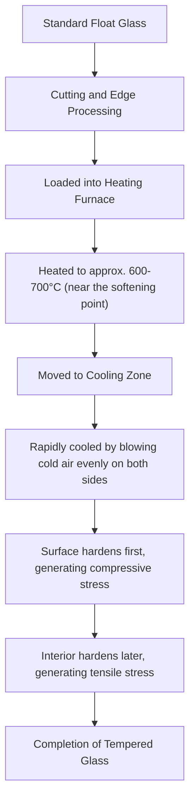
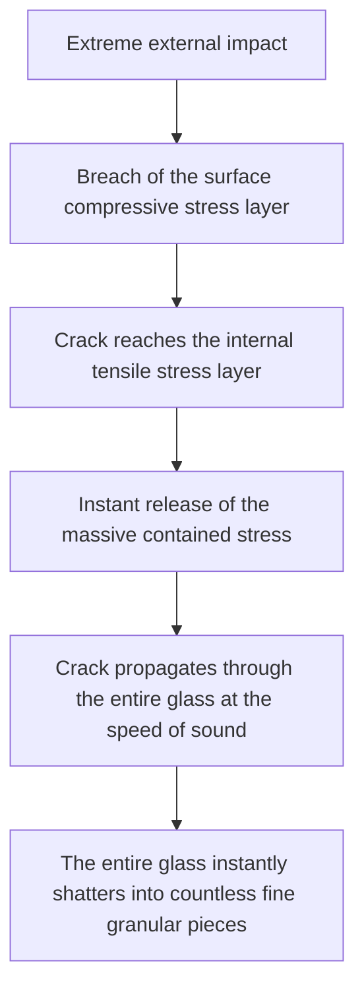

# What is Tempered Glass?

The smartphones we touch daily, the side windows of cars, and large glass doors in offices. A common element used in all of these is "Tempered Glass". Tempered glass boasts 3 to 5 times the strength of standard glass (float glass). However, its true value lies not simply in being "hard to break". In the unlikely event that it does break, it features a "safety design" where it shatters into fine granular pieces instead of sharp, knife-like shards.

In this article, we will delve deep into why tempered glass is strong, the manufacturing process it goes through, and why it shatters into pieces when broken, explaining it from the perspectives of physical mechanisms and materials engineering.

## 1. Differences from Standard Float Glass

First, let's understand standard glass (float glass). Float glass is made using the "float process," where molten glass is floated on top of molten tin to form a smooth, flat sheet. While this glass has high transparency and is smooth, it is not very resilient against physical impacts and thermal changes.

When float glass breaks, cracks spread freely, resulting in very sharp and dangerous shards (acute-angled fragmentation). This is because the internal stress is uniform, and the fracture energy concentrates at the crack tips, propagating all at once.

On the other hand, tempered glass is created by applying a special thermal (or chemical) treatment to this float glass. Although its appearance and light transmittance remain largely unchanged, an invisible "storm of stress" is contained within it.

## 2. The Manufacturing Process of Tempered Glass: High-Temperature Heating and Rapid Cooling

The secret to the strength of tempered glass lies in its manufacturing process. Let's look at the process of the most common "air quenching method".

### Heating Process
The glass is heated to approximately 600°C to 700°C, close to its softening point. At this temperature, the glass has not yet melted, but its internal molecules become slightly more mobile, entering a state where stress is relieved (viscoelastic state).

### Rapid Cooling Process (Quenching)
The heated glass moves to a cooling zone, where high-pressure cold air is blown evenly and powerfully against both sides. This "rapid cooling" is the magic key.

1. **Surface Hardening**: The glass surface directly exposed to the cold air cools and solidifies rapidly.
2. **Internal Contraction**: Even after the surface has solidified, the interior of the glass remains hot and maintains an expanded state. However, with a time delay, the interior also begins to cool gradually and attempts to contract.
3. **Fixation of Stress**: As the interior tries to contract, the already solidified surface pulls back against it. As a result, a "force pushing inward (compressive stress)" is permanently fixed on the surface of the glass, while a "force pulling outward (tensile stress)" is permanently fixed within the interior.

## 3. The Exquisite Balance of Compressive Stress and Tensile Stress

The strength of tempered glass is built upon the balance between this **"surface compressive stress"** and **"internal tensile stress"**.

Glass as a material is actually very strong against "pushing forces (compression)" but weak against "pulling forces (tension)". When an object hits standard glass and causes it to bend, "tensile stress" is generated on the surface opposite the impact, leading to cracks and breakage.

However, in the case of tempered glass, a powerful "compressive stress" is already applied to the surface beforehand. Even if the glass is subjected to external impact and bends, generating a force that tries to pull the surface, the pre-existing compressive stress cancels it out. In other words, as long as the tensile stress from the impact does not exceed the compressive stress on the surface, the glass will not crack.

This is the reason why tempered glass has 3 to 5 times the strength of standard glass.

## 4. The Safety Mechanism Upon Breaking (Granular Fragmentation)

Another, and perhaps the greatest feature of tempered glass is "how it breaks".

A massive "tensile stress" is sealed within tempered glass. This is like a spring that has been stretched to its limit and fixed in place. What happens if, for some reason (such as a very sharp object piercing the surface compressive stress layer, or a strong impact on the edge), a crack forms in the glass and this stress balance collapses?

The moment a crack reaches the internal tensile stress layer, the contained energy is released all at once. Due to this energy release, the crack spreads across the entire glass at a speed of several thousand meters per second, instantly shattering the glass into pieces.

The shards generated at this time become fine, dice-like or rounded granular pieces (granular fragmentation). This is because the internal stresses cross each other in a mesh-like pattern, causing the energy to be finely dispersed and released. These fine pieces lack the sharp blades of standard glass, drastically reducing the risk of severe cuts even if they strike a human body. This is why tempered glass is mandated for car windows and shower room doors.

## 5. Weaknesses and Precautions of Tempered Glass

Even the seemingly perfect tempered glass has some weaknesses.

1. **Vulnerability to Edge Impacts**: While the surface is extremely strong tempered glass, the cut edges have a structurally unstable stress balance. If an impact is applied here, the entire piece can easily shatter.
2. **Inability to be Processed**: Once the tempering process has been performed, the glass can absolutely not be cut or drilled. Even a slight scratch will disrupt the stress balance and cause it to break explosively, so all cutting and drilling must be done before the heat treatment.
3. **Spontaneous Breakage (Spontaneous Explosion)**: Although very rare, tempered glass can suddenly break without any impact due to an impurity called nickel sulfide (NiS) contained in the raw materials of the glass. NiS has the property of expanding in volume over time and with temperature changes, triggering a collapse of the internal stress balance. To prevent this, a heat soak test (reheating test) is sometimes conducted after manufacturing to break defective products beforehand.

## 6. Conclusion

Tempered glass is not simply glass that is made thick and sturdy. It utilizes the energy of heat to contain "force" within the glass itself, using that force to counteract external impacts, and in the worst-case scenario, shattering itself into pieces to protect humans. It is the crystallization of highly advanced materials engineering.

"Not breaking" and "breaking safely." The mechanism of tempered glass, which achieves both of these, continues to quietly and powerfully protect our lives. In next-generation displays and building materials, this stress control technology will undoubtedly evolve further, developing into thinner, stronger, and safer glass materials.
